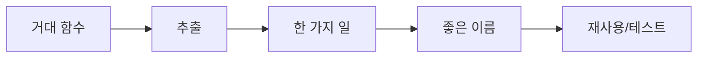

# 함수 작게 만들기

> Clean Code 101 시리즈 (3/10)

<!-- a-grade-intro:begin -->

**핵심 질문**: 함수는 얼마나 작아야 충분히 작은가요?

> "한 가지 일만 한다"가 보일 때까지입니다. 그 한 가지는 이름이 말합니다.

<!-- a-grade-intro:end -->

## 이 글에서 배울 것

- 작은 함수의 4가지 효과
- 함수 추출 절차(Extract Function)
- 부수효과를 줄이는 패턴
- 명령(Command)과 질의(Query) 분리
- 인자 객체로 시그니처 단순화

## 왜 중요한가

작은 함수는 이름으로 자신을 설명합니다. 큰 함수는 주석을 요구하고, 주석은 거짓이 됩니다.

> 함수가 작아지면 이름이 일을 한다.

## 개념 한눈에 보기



추출이 이름을 가능케 하고 이름이 재사용을 만듭니다.

## 핵심 용어 정리

- **SRP (단일 책임)**: 한 가지 변경 이유.
- **Extract Function**: 코드 블록을 함수로 빼기.
- **Command-Query Separation**: 일을 하는 함수와 정보를 주는 함수를 분리.
- **Pure function**: 같은 입력에 같은 출력, 부수효과 없음.
- **Parameter Object**: 인자를 묶어 객체로.

## Before/After

**Before**

```python
def checkout(cart, user, addr, coupon):
    # 60 lines: validate + price + tax + ship + log + email + save
    ...
```

**After**

```python
def checkout(cart, user, addr, coupon):
    items = validate_cart(cart, user)
    total = price_with_tax(items, addr)
    order = save_order(user, items, total, coupon)
    notify_user(user, order)
    return order
```

본문이 목차가 됩니다.

## 실습: 안전하게 함수 추출

### 1단계 — 부분 추출

```python
# 1_extract.py
def total(items):
    s = 0
    for it in items:
        s += it.price * it.qty
    return s
```

루프부터 추출 후보입니다.

### 2단계 — 의도 이름

```python
# 2_intent.py
def line_total(item): return item.price * item.qty
def total(items): return sum(line_total(it) for it in items)
```

이름이 코드를 줄입니다.

### 3단계 — 명령/질의 분리

```python
# 3_cqs.py
class Account:
    def withdraw(self, amount):  # 명령
        self.balance -= amount
    def is_overdrawn(self):      # 질의
        return self.balance < 0
```

질의는 부수효과가 없어야 합니다.

### 4단계 — 인자 객체

```python
# 4_param_obj.py
from dataclasses import dataclass
@dataclass
class Range: lo: int; hi: int
def in_range(value, r: Range): return r.lo <= value <= r.hi
```

3개 넘는 인자는 객체 후보.

### 5단계 — 순수 함수로

```python
# 5_pure.py
def discount(price: int, rate: float) -> int:
    return int(price * (1 - rate))
```

순수 함수는 테스트가 한 줄.

## 이 코드에서 주목할 점

- 본문이 목차처럼 읽힙니다.
- 이름이 주석을 대체합니다.
- 명령/질의 분리가 디버깅을 줄입니다.

## 자주 하는 실수 5가지

1. **거대 함수를 변수로만 정리.** 이름은 안 생김.
2. **추출 후 인자 폭증.** 객체로 묶으세요.
3. **질의가 mutate함.** 가장 흔한 버그 원천.
4. **테스트 없이 추출.** 회귀 위험.
5. **너무 잘게 쪼갬.** 1줄 함수만 100개 = 가독성 0.

## 실무에서는 이렇게 쓰입니다

좋은 팀은 함수 길이/인자 수/cyclomatic complexity를 lint로 가드. 큰 함수에는 자동 코멘트로 추출 후보 표시.

## 시니어 엔지니어는 이렇게 생각합니다

- 본문이 목차가 되도록 쓴다.
- 이름이 주석을 대체한다.
- 질의는 절대 mutate하지 않는다.
- 인자 3개를 넘으면 객체를 의심한다.
- 순수 함수가 테스트의 친구다.

## 체크리스트

- [ ] 함수가 한 가지 일만 하는가?
- [ ] 본문이 목차처럼 읽히는가?
- [ ] 인자 ≤ 3?
- [ ] 질의는 부수효과가 없나?
- [ ] 추출 전후 테스트가 있는가?

## 연습 문제

1. 본인 함수 1개를 본문이 목차가 되도록 다시 써 보세요.
2. 인자 4개 이상 함수를 객체로 묶어 보세요.
3. 명령/질의 분리 위반 1건을 고쳐 보세요.

## 정리 및 다음 단계

작은 함수가 이름과 테스트를 가능케 합니다. 다음 글에서는 큰 함수를 만드는 주범 — 조건문 — 을 줄이는 법을 봅니다.

<!-- toc:begin -->
- [Clean Code란 무엇인가?](./01-what-is-clean-code.md)
- [이름 짓기](./02-naming.md)
- **함수 작게 만들기 (현재 글)**
- 조건문 줄이기 (예정)
- 중복 제거 (예정)
- 오류 처리 (예정)
- 주석과 문서화 (예정)
- 테스트 가능한 코드 (예정)
- 리팩토링 기초 (예정)
- 좋은 코드 리뷰 기준 (예정)
<!-- toc:end -->

## 참고 자료

- [Clean Code (Ch. 3 Functions)](https://www.oreilly.com/library/view/clean-code-a/9780136083238/)
- [Refactoring — Extract Function](https://refactoring.com/catalog/extractFunction.html)
- [Martin Fowler — Command Query Separation](https://martinfowler.com/bliki/CommandQuerySeparation.html)
- [Refactoring — Introduce Parameter Object](https://refactoring.com/catalog/introduceParameterObject.html)

Tags: Computer Science, CleanCode, Functions, SRP, Refactoring, Readability
