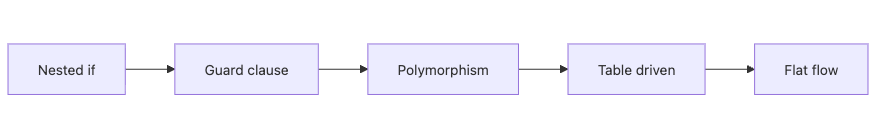

# 조건문 줄이기

조건문은 작은 기능을 빠르게 만들 때는 편하지만, 책임이 섞이기 시작하면 가장 먼저 복잡도를 폭발시키는 지점이 됩니다.

이 글은 Clean Code 101 시리즈의 4번째 글입니다.

여기서는 중첩된 if를 평평하게 만들고, 분기 자체를 다른 구조로 옮기는 방법을 정리하겠습니다.

---

## 이 글에서 다룰 문제

- 가드 절과 조기 반환은 어떤 상황에서 가장 효과적일까요?
- 부정형 조건과 이중 부정은 왜 읽기 어렵게 만들까요?
- if/else 체인은 언제 다형성으로 바꾸는 편이 좋을까요?
- 전략 패턴은 어떤 종류의 분기를 분리하는 데 유용할까요?
- 테이블 주도 방식은 정책 분기를 어떻게 단순화할까요?

> 조건문 깊이는 곧 인지 부담이며, 깊이를 하나만 줄여도 읽기 쉬움은 생각보다 크게 올라갑니다.

## 왜 중요한가

깊은 조건문은 단순히 보기 불편한 수준에서 끝나지 않습니다. 예외 처리, 상태 확인, 타입 분기, 정책 분기가 한 함수 안에 쌓이면 어느 분기가 왜 필요한지 설명하기도 어려워집니다.

실무에서는 권한 처리, 가격 정책, 라우팅 규칙처럼 분기가 많은 영역에서 이런 문제가 자주 보입니다. 이때 핵심은 if를 예쁘게 쓰는 것이 아니라, 분기 책임을 더 적절한 구조로 옮기는 것입니다.

## 한눈에 보는 개념



*조건문 단순화의 흐름: 가드 절, 다형성, 테이블 방식이 분기 깊이를 줄여 핵심 흐름을 드러냅니다.*

도구가 늘어날수록 분기 수는 줄고, 흐름은 더 평평해집니다.

## 핵심 용어

- **Guard Clause**: 예외 상황을 함수 초반에 바로 반환하는 방식입니다.
- **Early Return**: 더 깊이 들어가지 않고 빠르게 함수를 종료하는 방식입니다.
- **Polymorphism**: 타입별 동작을 조건문 대신 각 클래스에 나누는 방식입니다.
- **Strategy Pattern**: 알고리즘 선택을 외부에서 주입하는 패턴입니다.
- **Table-driven**: 분기 규칙을 데이터 구조로 표현하는 방식입니다.

## Before/After

**Before**

```python
def price(user, item):
    if user is not None:
        if user.is_active:
            if item is not None:
                if item.in_stock:
                    return item.price * (0.9 if user.is_member else 1.0)
                else:
                    return None
            else:
                return None
        else:
            return None
    else:
        return None
```

**After**

```python
def price(user, item):
    if user is None or not user.is_active: return None
    if item is None or not item.in_stock: return None
    rate = 0.9 if user.is_member else 1.0
    return item.price * rate
```

깊이가 4에서 1로 줄면, 동일한 정책도 훨씬 덜 피곤하게 읽힙니다. 조건문 정리는 가독성을 가장 빠르게 끌어올리는 방법 중 하나입니다.

## 실전 적용: 분기를 줄이는 다섯 단계

### Step 1 — Flatten with guard clauses

```python
# 1_guard.py
def total(items):
    if not items:
        return 0
    return sum(it.price for it in items)
```

비정상 입력이나 예외 케이스는 초반에 바로 반환하는 편이 좋습니다. 정상 흐름을 가운데에 남겨 두어야 본문이 읽힙니다.

### Step 2 — Flip negative conditions

```python
# 2_positive.py
# Before: if not user.is_inactive: ...
# After:
def can_login(user):
    if not user.is_active:
        return False
    return user.email_verified
```

부정형 조건은 생각을 한 번 더 꺾게 만듭니다. 특히 이중 부정은 거의 항상 더 나쁜 이름이나 더 나쁜 구조의 신호입니다.

### Step 3 — Remove branches with polymorphism

```python
# 3_poly.py
class Shape:
    def area(self): ...
class Circle(Shape):
    def __init__(self, r): self.r = r
    def area(self): return 3.14 * self.r * self.r
class Square(Shape):
    def __init__(self, a): self.a = a
    def area(self): return self.a * self.a

def total_area(shapes): return sum(s.area() for s in shapes)
```

타입 분기가 반복되면, 각 타입이 자기 동작을 맡아야 할 때가 많습니다.

### Step 4 — Strategy pattern

```python
# 4_strategy.py
def percent_off(price, rate): return price * (1 - rate)
def fixed_off(price, amount): return max(0, price - amount)

DISCOUNTS = {"member": lambda p: percent_off(p, 0.1),
             "coupon10": lambda p: fixed_off(p, 10)}

def apply(price, kind): return DISCOUNTS[kind](price)
```

정책의 종류가 외부 입력에 따라 바뀐다면, 전략이나 딕셔너리 조회가 if/elif보다 더 단순하고 확장에도 유리합니다.

### Step 5 — Table-driven

```python
# 5_table.py
GRADES = [(90, "A"), (80, "B"), (70, "C"), (0, "F")]
def grade(score):
    return next(g for s, g in GRADES if score >= s)
```

분기가 사실상 데이터라면, 데이터 구조로 올리는 편이 맞습니다. 정책 테이블은 코드보다 변경이 덜 위험한 경우가 많습니다.

## 검증 방법

```bash
radon cc app/pricing.py -s
python -m pytest -q tests/test_pricing.py
```

**기대 결과**

- 중첩을 줄인 뒤 복잡도와 테스트 안정성이 함께 확인됩니다.
- 분기 정책을 테이블로 옮겨도 결과가 같아야 합니다.

## 실패하기 쉬운 지점

- 가드 절로 바꾸면서 예외 순서가 달라집니다.
- 타입 분기를 감춘 채 이름만 더 예쁘게 바꿉니다.

## 이 코드에서 먼저 봐야 할 점

- 가드 절은 들여쓰기를 줄입니다.
- 다형성은 조건문 자체를 없애 줍니다.
- 테이블은 정책을 데이터로 표현하게 만듭니다.

## 자주 하는 실수 5가지

1. **가드 절 없이 계속 중첩하기.** else 블록만 쌓입니다.
2. **부정형 조건을 유지하기.** 이중 부정이 쉽게 스며듭니다.
3. **타입마다 분기하기.** `isinstance`가 코드 전체에 퍼집니다.
4. **상태를 가진 전략 만들기.** 테스트가 어려워집니다.
5. **순서 의존 테이블 만들기.** 우선순위가 깨지기 쉽습니다.

## 실무에서는 이렇게 보입니다

가격 정책, 권한 체크, 라우팅 규칙처럼 분기가 사실상 데이터에 가까운 영역은 전략과 테이블로 옮길수록 관리가 쉬워집니다. 새로운 규칙을 추가할 때 기존 조건문을 뜯어고치지 않아도 되기 때문입니다.

## 시니어 엔지니어는 이렇게 생각합니다

- 깊이가 3을 넘으면 설계 냄새로 봅니다.
- if/elif가 5개 이상이면 다형성이나 테이블을 의심합니다.
- 외부 입력에 따라 바뀌는 정책은 데이터로 옮깁니다.
- 부정형 조건은 한 번에 긍정형으로 뒤집습니다.
- 전략은 가능한 한 상태 없이 유지합니다.

## 체크리스트

- [ ] 함수 깊이가 3 이하인가?
- [ ] 가드 절이 먼저 배치되어 있는가?
- [ ] 부정형 조건을 뒤집었는가?
- [ ] 타입 분기를 다형성으로 바꿀 수 있는가?
- [ ] 정책 분기를 테이블/전략으로 표현할 수 있는가?

## 연습 문제

1. 깊이 4 이상의 분기를 하나 찾아 평평하게 만들어 보세요.
2. 5개 이상 분기가 있는 if/elif 체인을 테이블로 바꿔 보세요.
3. `isinstance` 기반 분기 하나를 다형성으로 바꿔 보세요.

## 정리 및 다음 단계

조건문이 줄어들수록 코드의 핵심 흐름은 더 또렷해집니다. 다음 글에서는 또 하나의 큰 적인 중복을 어떻게 다뤄야 하는지 살펴보겠습니다.

<!-- toc:begin -->
- [Clean Code란 무엇인가?](./01-what-is-clean-code.md)
- [이름 짓기](./02-naming.md)
- [함수 작게 만들기](./03-small-functions.md)
- **조건문 줄이기 (현재 글)**
- 중복 제거 (예정)
- 오류 처리 (예정)
- 주석과 문서화 (예정)
- 테스트 가능한 코드 (예정)
- 리팩토링 기초 (예정)
- 좋은 코드 리뷰 기준 (예정)
<!-- toc:end -->

## 참고 자료

- [Refactoring — Replace Nested Conditional with Guard Clauses](https://refactoring.com/catalog/replaceNestedConditionalWithGuardClauses.html)
- [Refactoring — Replace Conditional with Polymorphism](https://refactoring.com/catalog/replaceConditionalWithPolymorphism.html)
- [Strategy Pattern (Refactoring Guru)](https://refactoring.guru/design-patterns/strategy)
- [Clean Code (Ch. 3 Functions, Ch. 6 Objects)](https://www.oreilly.com/library/view/clean-code-a/9780136083238/)
Tags: Computer Science, CleanCode, Conditionals, GuardClauses, Refactoring, Readability
