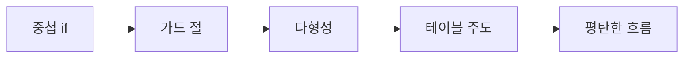

# 조건문 줄이기

> Clean Code 101 시리즈 (4/10)


## 이 글에서 다룰 문제

중첩된 조건문은 가장 흔한 복잡도의 원인입니다. 깊이가 1만 줄어도 가독성이 두 배가 됩니다.

> 깊이는 곧 인지 부담이다.

## 개념 한눈에 보기



가드 → 다형성 → 테이블, 도구가 늘수록 분기는 줄어듭니다.

## Before/After

**Before**

```python
def price(user, item):
    if user is not None:
        if user.is_active:
            if item is not None:
                if item.in_stock:
                    return item.price * (0.9 if user.is_member else 1.0)
                else:
                    return None
            else:
                return None
        else:
            return None
    else:
        return None
```

**After**

```python
def price(user, item):
    if user is None or not user.is_active: return None
    if item is None or not item.in_stock: return None
    rate = 0.9 if user.is_member else 1.0
    return item.price * rate
```

깊이가 4에서 1로 줄었습니다.

## 실습: 분기를 줄이는 5단계

### 1단계 — 가드 절로 평탄화

```python
# 1_guard.py
def total(items):
    if not items:
        return 0
    return sum(it.price for it in items)
```

빈 입력은 즉시 반환합니다.

### 2단계 — 부정 조건 뒤집기

```python
# 2_positive.py
# Before: if not user.is_inactive: ...
# After:
def can_login(user):
    if not user.is_active:
        return False
    return user.email_verified
```

이중 부정은 항상 피합니다.

### 3단계 — 다형성으로 분기 제거

```python
# 3_poly.py
class Shape:
    def area(self): ...
class Circle(Shape):
    def __init__(self, r): self.r = r
    def area(self): return 3.14 * self.r * self.r
class Square(Shape):
    def __init__(self, a): self.a = a
    def area(self): return self.a * self.a

def total_area(shapes): return sum(s.area() for s in shapes)
```

타입 분기를 클래스가 흡수합니다.

### 4단계 — 전략 패턴

```python
# 4_strategy.py
def percent_off(price, rate): return price * (1 - rate)
def fixed_off(price, amount): return max(0, price - amount)

DISCOUNTS = {"member": lambda p: percent_off(p, 0.1),
             "coupon10": lambda p: fixed_off(p, 10)}

def apply(price, kind): return DISCOUNTS[kind](price)
```

분기 대신 dict 조회.

### 5단계 — 테이블 주도

```python
# 5_table.py
GRADES = [(90, "A"), (80, "B"), (70, "C"), (0, "F")]
def grade(score):
    return next(g for s, g in GRADES if score >= s)
```

if/elif 사슬이 자료구조가 됩니다.

## 이 코드에서 주목할 점

- 가드 절이 본문 들여쓰기를 깎습니다.
- 다형성은 if문 자체를 없앱니다.
- 테이블은 데이터로 정책을 표현합니다.

## 자주 하는 실수 5가지

1. **가드 없이 깊이 들어감.** else가 늘어납니다.
2. **부정 조건을 그대로 사용.** 이중 부정 발생.
3. **타입 검사로 분기.** isinstance 남발.
4. **전략에 상태를 둠.** 테스트가 어려워집니다.
5. **테이블 정렬에 의존.** 우선순위가 깨지기 쉽습니다.

## 실무에서는 이렇게 쓰입니다

요금 계산, 권한 체크, 라우팅처럼 분기가 데이터에 가까운 영역은 모두 테이블/전략 후보입니다. 정책 변경이 코드 수정 없이 가능해집니다.

## 체크리스트

- [ ] 함수 깊이 ≤ 3?
- [ ] 가드 절을 먼저 두었나?
- [ ] 부정 조건을 양수로 바꿨나?
- [ ] 타입 분기는 다형성 후보인가?
- [ ] 정책 분기는 테이블/전략 후보인가?

## 정리 및 다음 단계

조건은 줄일수록 코드가 명확해집니다. 다음 글에서는 분기 다음으로 흔한 적인 중복을 다룹니다.

<!-- toc:begin -->
- [Clean Code란 무엇인가?](./01-what-is-clean-code.md)
- [이름 짓기](./02-naming.md)
- [함수 작게 만들기](./03-small-functions.md)
- **조건문 줄이기 (현재 글)**
- 중복 제거 (예정)
- 오류 처리 (예정)
- 주석과 문서화 (예정)
- 테스트 가능한 코드 (예정)
- 리팩토링 기초 (예정)
- 좋은 코드 리뷰 기준 (예정)
<!-- toc:end -->

## 참고 자료

- [Refactoring — Replace Nested Conditional with Guard Clauses](https://refactoring.com/catalog/replaceNestedConditionalWithGuardClauses.html)
- [Refactoring — Replace Conditional with Polymorphism](https://refactoring.com/catalog/replaceConditionalWithPolymorphism.html)
- [Strategy Pattern (Refactoring Guru)](https://refactoring.guru/design-patterns/strategy)
- [Clean Code (Ch. 3 Functions, Ch. 6 Objects)](https://www.oreilly.com/library/view/clean-code-a/9780136083238/)

Tags: Computer Science, CleanCode, Conditionals, GuardClauses, Refactoring, Readability
