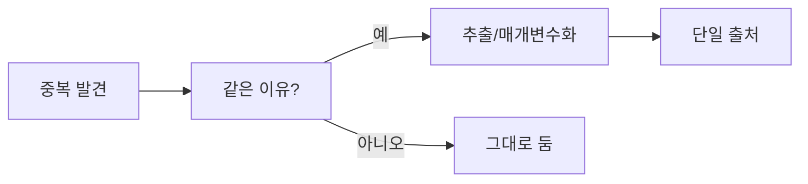

# 중복 제거

> Clean Code 101 시리즈 (5/10)


## 이 글에서 다룰 문제

중복은 버그를 한 번에 여러 곳으로 퍼뜨립니다. 한 군데를 고치고 다른 군데를 놓치기 쉽기 때문입니다.

> 같은 지식이 두 군데 살면, 둘은 곧 어긋난다.

## 전체 흐름


핵심은 모양이 아니라 변경 이유입니다. 같은 이유로 바뀌는 코드만 함께 묶어야 합니다.

## Before/After

**Before**

```python
def email_admin(msg):
    print(f"[admin] {msg}")
def email_user(msg):
    print(f"[user] {msg}")
def email_guest(msg):
    print(f"[guest] {msg}")
```

**After**

```python
def email(role, msg):
    print(f"[{role}] {msg}")
```

달라지는 부분만 인자로 올리면 중복을 자연스럽게 줄일 수 있습니다.

## 중복을 안전하게 제거하기

### 1단계 — 두 번째 발생까지 기다리기

```python
# 예시 파일: 1_rule_of_three.py
# 같은 패턴이 세 번쯤 반복될 때 추출을 검토합니다.
def calc_a(x): return x * 1.1
def calc_b(x): return x * 1.2
# 세 번째 사례가 생기면 그때 통합 여부를 결정합니다.
```

너무 이른 추출은 오히려 잘못된 결합을 만들 수 있습니다.

### 2단계 — 함수 추출

```python
# 예시 파일: 2_extract.py
def with_tax(price, rate): return int(price * (1 + rate))
def krw(price): return with_tax(price, 0.1)
def jpy(price): return with_tax(price, 0.08)
```

여기서는 세율처럼 달라지는 요소만 인자로 뽑아내면 됩니다.

### 3단계 — 매개변수화

```python
# 예시 파일: 3_param.py
def greet(name, lang="ko"):
    msgs = {"ko": "안녕하세요", "en": "Hello"}
    return f"{msgs[lang]}, {name}"
```

단순한 정책 차이는 분기보다 조회 테이블로 표현하는 편이 낫습니다.

### 4단계 — 데이터 중복 제거

```python
# 예시 파일: 4_data.py
PLANS = {
    "free":  {"price": 0,  "limit": 100},
    "pro":   {"price": 10, "limit": 1000},
    "team":  {"price": 30, "limit": 10000},
}
def quota(plan): return PLANS[plan]["limit"]
```

여러 함수에 흩어진 규칙을 데이터 한곳에 모을 수 있습니다.

### 5단계 — 잘못된 추출 되돌리기

```python
# 예시 파일: 5_unfold.py
# 두 호출자만 공유하는데 인자가 여섯 개까지 늘어난 함수라면
# 다시 두 함수로 펼치는 편이 더 나을 수 있습니다 (Inline Function).
```

추상화가 오히려 읽는 부담을 키우면 되돌릴 줄도 알아야 합니다.

## 이 코드에서 주목할 점

- 변하는 부분만 인자로 분리해야 호출부가 단순해집니다.
- 데이터 구조가 분기를 흡수하면 정책 변경이 쉬워집니다.
- 추상화는 분명한 이득이 있을 때만 도입해야 오래 갑니다.

## 자주 하는 실수 5가지

1. **첫 중복에서 추출.** 우연한 중복일 가능성이 큽니다.
2. **모양만 같고 의미가 다른 코드 통합.** 결합이 늘어납니다.
3. **인자가 5개 넘는 추출.** 추상화 실패 신호.
4. **테스트 없이 추출.** 회귀 위험.
5. **데이터 중복 무시.** 코드보다 더 위험합니다.

## 실무에서는 이렇게 쓰입니다

API 라우트, 폼 검증, 가격 정책처럼 정책이 많은 영역은 대부분 데이터 중심으로 옮길 수 있습니다. 이렇게 해 두면 새 정책을 추가할 때도 수정 범위를 작게 유지할 수 있습니다.

## 체크리스트

- [ ] 같은 이유로 함께 변하는 코드인가?
- [ ] 변하는 부분이 명확한가?
- [ ] 인자 수가 합리적인가?
- [ ] 데이터로 표현할 수 있나?
- [ ] 통합이 호출부를 단순화하는가?

## 정리 및 다음 단계

DRY의 핵심은 중복된 문장을 없애는 일이 아니라 변경 이유를 한곳에 모으는 일입니다. 다음 글에서는 또 다른 복잡도의 근원인 오류 처리를 정리해 보겠습니다.

<!-- toc:begin -->
- [Clean Code란 무엇인가?](./01-what-is-clean-code.md)
- [이름 짓기](./02-naming.md)
- [함수 작게 만들기](./03-small-functions.md)
- [조건문 줄이기](./04-simplifying-conditionals.md)
- **중복 제거 (현재 글)**
- 오류 처리 (예정)
- 주석과 문서화 (예정)
- 테스트 가능한 코드 (예정)
- 리팩토링 기초 (예정)
- 좋은 코드 리뷰 기준 (예정)
<!-- toc:end -->

## 참고 자료

- [The Pragmatic Programmer — DRY](https://pragprog.com/titles/tpp20/the-pragmatic-programmer-20th-anniversary-edition/)
- [Sandi Metz — The Wrong Abstraction](https://sandimetz.com/blog/2016/1/20/the-wrong-abstraction)
- [Refactoring — Extract Function](https://refactoring.com/catalog/extractFunction.html)
- [Refactoring — Inline Function](https://refactoring.com/catalog/inlineFunction.html)

Tags: Computer Science, CleanCode, DRY, Duplication, Refactoring, Abstraction
