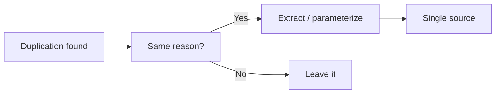

# 중복 제거

중복은 보이면 바로 없애야 할 것처럼 느껴지지만, 실제로는 그렇게 단순하지 않습니다. 이 글은 Clean Code 101 시리즈의 5번째 글입니다. 여기서는 DRY가 정말 뜻하는 것이 무엇인지, 그리고 어떤 중복은 남겨 두고 어떤 중복만 제거해야 하는지 분명하게 정리하겠습니다.

## 이 글에서 다룰 문제

- DRY의 진짜 의미는 무엇일까요?
- 우연히 닮은 중복과 본질적인 중복은 어떻게 구분할까요?
- 추출과 매개변수화는 어떤 순서로 적용해야 할까요?
- 데이터 중복은 어떻게 테이블로 옮길 수 있을까요?
- 너무 이른 추상화는 왜 더 비싼 결합을 만들까요?

> 같은 지식이 두 곳에 살기 시작하면 언젠가는 서로 다른 방향으로 어긋납니다.

## 왜 중요한가

중복은 버그를 복제합니다. 한 곳을 고치고 다른 곳을 놓치는 순간, 시스템에는 서로 다른 진실이 생깁니다. 그래서 DRY는 코드 줄 수를 줄이라는 조언이 아니라, 지식의 출처를 하나로 유지하라는 원칙에 가깝습니다.

다만 겉모양이 비슷하다고 해서 모두 합치면 안 됩니다. 변경 이유가 다른 코드를 억지로 묶으면, 중복 제거 대신 잘못된 결합만 커집니다. 핵심은 “왜 함께 바뀌는가”를 먼저 보는 일입니다.

## 한눈에 보는 개념



같은 이유로 바뀌는 중복만 추출해야, 하나의 진실한 출처가 생깁니다.

## 핵심 용어

- **DRY**: 지식의 출처를 하나로 유지하라는 원칙입니다.
- **Coincidental duplication**: 우연히 비슷하게 보일 뿐, 바뀌는 이유는 다른 중복입니다.
- **Extract Function/Class**: 공통 부분을 함수나 클래스로 올리는 방식입니다.
- **Parameterize**: 달라지는 부분을 인자로 표현하는 방식입니다.
- **Premature abstraction**: 너무 일찍 추상화해서 생기는 불필요한 결합입니다.

## Before/After

**Before**

```python
def email_admin(msg):
    print(f"[admin] {msg}")
def email_user(msg):
    print(f"[user] {msg}")
def email_guest(msg):
    print(f"[guest] {msg}")
```

**After**

```python
def email(role, msg):
    print(f"[{role}] {msg}")
```

차이는 역할 이름뿐이고, 변경 이유도 같습니다. 이런 경우에는 공통 부분을 하나로 올리는 편이 맞습니다.

## 실전 적용: 안전하게 중복 없애기

### Step 1 — Wait for the third occurrence

```python
# 1_rule_of_three.py
# Extract only after the same pattern shows up three times.
def calc_a(x): return x * 1.1
def calc_b(x): return x * 1.2
# When the third arrives, decide whether to unify.
```

첫 번째, 두 번째 중복에서는 아직 섣불리 추상화하지 않는 편이 좋습니다. 세 번째가 나타날 때쯤이면 정말 같은 문제인지 더 분명하게 보입니다.

### Step 2 — Extract function

```python
# 2_extract.py
def with_tax(price, rate): return int(price * (1 + rate))
def krw(price): return with_tax(price, 0.1)
def jpy(price): return with_tax(price, 0.08)
```

달라지는 부분이 분명할 때만 인자로 뽑아야 합니다. 공통과 차이를 구분하지 못한 추상화는 오래 버티지 못합니다.

### Step 3 — Parameterize

```python
# 3_param.py
def greet(name, lang="en"):
    msgs = {"en": "Hello", "ko": "안녕하세요"}
    return f"{msgs[lang]}, {name}"
```

분기 대신 조회로 바꿀 수 있다면 구조는 더 단순해집니다. 매개변수화는 중복 제거와 조건문 제거를 동시에 돕기도 합니다.

### Step 4 — Remove data duplication

```python
# 4_data.py
PLANS = {
    "free": {"price": 0,  "limit": 100},
    "pro":  {"price": 10, "limit": 1000},
    "team": {"price": 30, "limit": 10000},
}
def quota(plan): return PLANS[plan]["limit"]
```

데이터 중복은 코드 중복보다 더 위험할 때가 많습니다. 정책을 여러 함수에 흩뿌리지 말고 하나의 데이터 구조로 모으는 편이 안전합니다.

### Step 5 — Undo a wrong extraction

```python
# 5_unfold.py
# A function shared by only two callers but with six arguments
# is usually better inlined back into two simple functions
# (Inline Function).
```

한 번 추출했다고 끝이 아닙니다. 추상화가 이득보다 부담을 더 만든다면 다시 되돌리는 것도 좋은 리팩토링입니다.

## 이 코드에서 먼저 봐야 할 점

- 달라지는 부분만 인자로 올려야 합니다.
- 데이터 구조가 분기와 중복을 흡수할 수 있습니다.
- 추상화는 필요가 분명할 때만 생겨야 합니다.

## 자주 하는 실수 5가지

1. **첫 번째 중복에서 바로 추출하기.** 우연한 유사성일 가능성이 큽니다.
2. **비슷해 보인다는 이유로 합치기.** 의미가 다른 코드가 억지로 묶입니다.
3. **인자가 다섯 개를 넘는 추출 만들기.** 실패한 추상화 신호일 수 있습니다.
4. **테스트 없이 합치기.** 회귀 위험이 커집니다.
5. **데이터 중복을 무시하기.** 코드 중복보다 더 오래 숨어 있을 수 있습니다.

## 실무에서는 이렇게 보입니다

API 정책, 폼 검증 규칙, 요금제 정보처럼 사실상 데이터인 영역은 구조체나 테이블로 올릴수록 변경이 쉬워집니다. 새 정책을 추가할 때 기존 if 체인을 계속 건드리지 않아도 되기 때문입니다.

## 시니어 엔지니어는 이렇게 생각합니다

- 겉모양보다 변경 이유를 먼저 봅니다.
- 세 번째 반복이 나타날 때까지 기다립니다.
- 추상화의 비용, 즉 결합을 항상 함께 계산합니다.
- 데이터 중복을 먼저 제거합니다.
- 잘못된 추출은 자존심 없이 되돌립니다.

## 체크리스트

- [ ] 이 중복은 같은 이유로 바뀌는가?
- [ ] 달라지는 부분이 분명한가?
- [ ] 인자 수가 과하지 않은가?
- [ ] 데이터 구조로 표현할 수 있는가?
- [ ] 합친 뒤 호출 지점이 더 단순해졌는가?

## 연습 문제

1. 우연한 중복 하나를 찾아 왜 그대로 두는지 적어 보세요.
2. 본질적인 중복 하나를 함수로 추출해 보세요.
3. if/elif 정책 체인 하나를 데이터 구조로 옮겨 보세요.

## 정리 및 다음 단계

DRY는 코드 줄 수가 아니라 변화의 출처를 하나로 유지하는 원칙입니다. 다음 글에서는 또 다른 부패 지점인 오류 처리를 정리합니다.

<!-- toc:begin -->
- [Clean Code란 무엇인가?](./01-what-is-clean-code.md)
- [이름 짓기](./02-naming.md)
- [함수 작게 만들기](./03-small-functions.md)
- [조건문 줄이기](./04-simplifying-conditionals.md)
- **중복 제거 (현재 글)**
- 오류 처리 (예정)
- 주석과 문서화 (예정)
- 테스트 가능한 코드 (예정)
- 리팩토링 기초 (예정)
- 좋은 코드 리뷰 기준 (예정)
<!-- toc:end -->

## 참고 자료

- [The Pragmatic Programmer — DRY](https://pragprog.com/titles/tpp20/the-pragmatic-programmer-20th-anniversary-edition/)
- [Sandi Metz — The Wrong Abstraction](https://sandimetz.com/blog/2016/1/20/the-wrong-abstraction)
- [Refactoring — Extract Function](https://refactoring.com/catalog/extractFunction.html)
- [Refactoring — Inline Function](https://refactoring.com/catalog/inlineFunction.html)

Tags: Computer Science, CleanCode, DRY, Duplication, Refactoring, Abstraction
