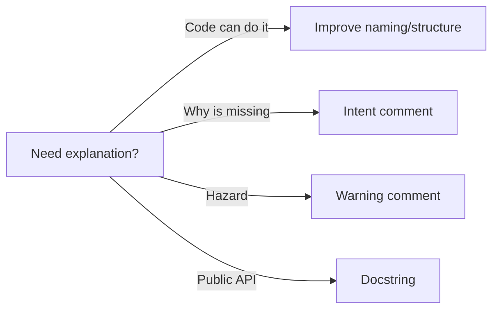

# 주석과 문서화

주석은 친절해 보이지만, 잘못 쓰이면 가장 빨리 낡는 설명이 됩니다. 이 글은 Clean Code 101 시리즈의 7번째 글입니다. 여기서는 코드가 스스로 설명해야 하는 부분과, 주석이나 문서가 꼭 맡아야 하는 부분을 구분해 보겠습니다.

## 이 글에서 다룰 문제

- 언제 주석을 쓰지 않는 편이 더 좋을까요?
- 의도 주석과 경고 주석은 어떤 차이가 있을까요?
- Python docstring은 어떤 규칙으로 쓰는 편이 좋을까요?
- 공개 API는 무엇까지 문서화해야 할까요?
- TODO와 FIXME는 어떻게 관리해야 추적 가능할까요?

> 좋은 주석은 코드가 보여 줄 수 없는 "왜"만 설명하고, "무엇"은 코드 자체가 드러내게 해야 합니다.

## 왜 중요한가

주석은 쉽게 거짓말합니다. 코드는 수정되지만 주석은 그대로 남는 경우가 많기 때문입니다. 그래서 설명이 필요하다고 느껴질 때는 먼저 코드 구조와 이름을 고쳐서 설명량 자체를 줄일 수 있는지 봐야 합니다.

그렇다고 문서화가 불필요한 것은 아닙니다. 공개 API의 계약, 외부 시스템의 이상한 동작 배경, 호출자가 다칠 수 있는 경고는 코드만으로 충분히 표현되지 않는 경우가 많습니다. 핵심은 주석이 맡아야 할 역할을 좁고 분명하게 유지하는 것입니다.

## 한눈에 보는 개념



무언가를 설명해야 한다면, 먼저 코드를 고칠 수 있는지 보고 그다음에만 주석을 써야 합니다.

## 핵심 용어

- **Self-documenting code**: 이름과 구조만으로 의도가 드러나는 코드입니다.
- **Intent comment**: 코드가 왜 존재하는지 설명하는 주석입니다.
- **Docstring**: 함수나 클래스에 붙는 사용 계약 문서입니다.
- **TODO/FIXME**: 미래 작업을 남기는 표식이며, 추적 가능해야 합니다.
- **API doc**: 공개 인터페이스의 계약과 사용법입니다.

## Before/After

**Before**

```python
# increment i by one
i = i + 1

# user list
def gu(): ...
```

**After**

```python
def get_active_users(): ...
```

설명 없는 주석 두 줄보다 좋은 이름 하나가 더 낫습니다. 주석을 지우는 가장 좋은 방법은 코드를 더 잘 쓰는 것입니다.

## 실전 적용: 유용한 문서화 다섯 단계

### Step 1 — Intent comment

```python
# 1_intent.py
# The payment gateway sometimes returns 200 with an error in the body,
# so we read body.status instead of the HTTP status code.
def is_paid(resp):
    return resp.json().get("status") == "PAID"
```

이런 주석은 코드가 표현하기 어려운 배경을 담습니다. 외부 시스템의 이상한 계약처럼 "왜 이렇게 했는지"가 핵심일 때 의미가 있습니다.

### Step 2 — Warning comment

```python
# 2_warning.py
# WARNING: this function performs IO. Do not call inside a transaction.
def upload_invoice(path): ...
```

호출자가 실제로 다칠 수 있는 위험은 코드 옆에서 바로 경고해야 합니다. 경고 주석은 친절함이 아니라 안전장치입니다.

### Step 3 — Docstring

```python
# 3_doc.py
def discount(price: int, rate: float) -> int:
    """Return the price after applying a discount.

    Args:
        price: Integer price in cents.
        rate: Discount rate in [0, 1].

    Returns:
        Rounded integer price.

    Raises:
        ValueError: When rate is out of range.
    """
    if not 0 <= rate <= 1:
        raise ValueError("rate out of range")
    return int(price * (1 - rate))
```

공개 함수는 호출 계약을 분명히 남길 가치가 있습니다. 입력, 반환, 예외가 보이면 사용하는 사람의 추측 비용이 크게 줄어듭니다.

### Step 4 — README header

```markdown
<!-- 4_readme.md -->
# checkout-service

Payment domain service that responds within 5 seconds.

- Run: `make run`
- Test: `make test`
- Env vars: `GATEWAY_URL`, `SECRET_KEY`
```

새 기여자가 30초 안에 프로젝트를 이해할 수 있어야 좋은 README입니다. 첫 문단과 실행 방법이 가장 먼저 보이는 것이 중요합니다.

### Step 5 — TODO with an owner

```python
# 5_todo.py
# TODO(yeongseon, 2026-06-01): replace simple retry with exponential backoff.
def retry_simple(): ...
```

TODO는 언젠가 할 일이 아니라, 누가 언제까지 볼 것인지가 분명한 작업이어야 합니다. 익명 TODO는 거의 항상 영구 부채가 됩니다.

## 이 코드에서 먼저 봐야 할 점

- 코드는 "무엇"을, 주석은 "왜"를 설명합니다.
- docstring은 사용 계약을 분명하게 만듭니다.
- TODO는 추적 가능해야 합니다.

## 자주 하는 실수 5가지

1. **코드를 그대로 반복하는 주석 쓰기.** 정보가 없는 소음입니다.
2. **낡은 주석 방치하기.** 가장 위험한 거짓말이 됩니다.
3. **익명 TODO 남기기.** 끝나지 않는 부채가 됩니다.
4. **모든 함수에 형식적인 docstring 붙이기.** 정보량이 0이면 가치도 없습니다.
5. **주석에 비밀값이나 로컬 경로 남기기.** 보안과 이식성을 해칩니다.

## 실무에서는 이렇게 보입니다

좋은 팀은 공개 API에 docstring을 요구하고, 내부 코드에는 의도 주석만 제한적으로 허용합니다. TODO에는 이슈 링크나 담당자를 붙여서 코드와 작업 추적이 연결되도록 관리합니다.

## 시니어 엔지니어는 이렇게 생각합니다

- 주석을 쓰기 전에 이름과 구조를 먼저 고칩니다.
- "왜"만 주석으로 남깁니다.
- 공개 API의 계약은 분명히 적습니다.
- TODO에는 담당자와 날짜를 붙입니다.
- 코드 수정 시 낡은 주석도 함께 갱신합니다.

## 체크리스트

- [ ] 코드만으로 충분히 설명되는가?
- [ ] 주석이 "왜"를 설명하는가?
- [ ] 공개 함수에 docstring이 있는가?
- [ ] TODO에 담당자와 날짜가 있는가?
- [ ] 기존 주석이 아직도 정확한가?

## 연습 문제

1. 소음 주석 세 개를 지우고 이름을 더 좋게 바꿔 보세요.
2. 공개 함수 하나에 docstring을 추가해 보세요.
3. TODO 하나에 이슈 링크와 날짜를 붙여 보세요.

## 정리 및 다음 단계

좋은 주석은 적고 정확합니다. 다음 글에서는 코드베이스의 운명을 크게 좌우하는 테스트 가능성, 즉 테스트 가능한 코드를 다룹니다.

<!-- toc:begin -->
- [Clean Code란 무엇인가?](./01-what-is-clean-code.md)
- [이름 짓기](./02-naming.md)
- [함수 작게 만들기](./03-small-functions.md)
- [조건문 줄이기](./04-simplifying-conditionals.md)
- [중복 제거](./05-removing-duplication.md)
- [오류 처리](./06-error-handling.md)
- **주석과 문서화 (현재 글)**
- 테스트 가능한 코드 (예정)
- 리팩토링 기초 (예정)
- 좋은 코드 리뷰 기준 (예정)
<!-- toc:end -->

## 참고 자료

- [Clean Code (Ch. 4 Comments)](https://www.oreilly.com/library/view/clean-code-a/9780136083238/)
- [PEP 257 — Docstring Conventions](https://peps.python.org/pep-0257/)
- [Google Python Style Guide — Comments](https://google.github.io/styleguide/pyguide.html#38-comments-and-docstrings)
- [Write the Docs — Documentation Guide](https://www.writethedocs.org/guide/)

Tags: Computer Science, CleanCode, Comments, Documentation, Docstring, Readability
