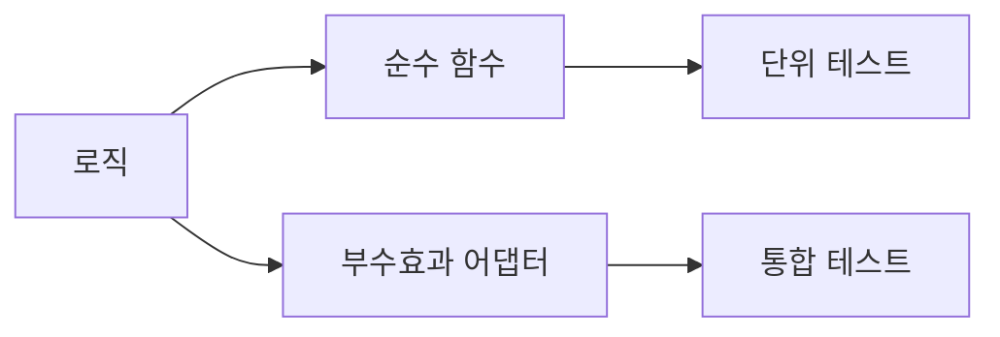

# 테스트 가능한 코드

의존성 주입, 순수 함수, 테스트 이음새, 페이크로 테스트 가능한 코드를 만드는 법.

이 글은 Clean Code 101 시리즈의 8번째 글입니다.

> Clean Code 101 시리즈 (8/10)


## 이 글에서 다룰 문제

테스트가 어렵다는 말은 대개 코드 구조가 이미 복잡하다는 뜻입니다. 그래서 테스트 가능성은 설계 품질을 보여 주는 좋은 척도입니다.

> 테스트 가능성은 결과가 아니라 설계의 결과다.

## 전체 흐름


핵심 로직은 순수하게 두고, 바깥 의존성은 얇은 어댑터로 밀어내는 것이 기본 전략입니다.

## Before/After

**Before**

```python
import datetime, requests
def is_business_hour():
    now = datetime.datetime.now()
    return 9 <= now.hour < 18

def fetch_user(uid):
    return requests.get(f"https://api/users/{uid}").json()
```

**After**

```python
def is_business_hour(now):
    return 9 <= now.hour < 18

def fetch_user(uid, http):
    return http.get(f"/users/{uid}").json()
```

시간과 HTTP 호출을 함수 바깥에서 주입하면 테스트가 훨씬 쉬워집니다.

## 테스트 가능성 5단계

### 1단계 — 순수 추출

```python
# 예시 파일: 1_pure.py
def total(items):
    return sum(it.price * it.qty for it in items)
```

입출력이 없는 계산은 가능한 한 순수 함수로 두는 편이 좋습니다.

### 2단계 — 시간 의존성 주입

```python
# 예시 파일: 2_clock.py
from datetime import datetime
def is_overdue(due, now=None):
    now = now or datetime.now()
    return now > due
```

테스트에서는 `now`를 고정해 시간을 통제할 수 있습니다.

### 3단계 — Fake 객체

```python
# 예시 파일: 3_fake.py
class FakeRepo:
    def __init__(self): self.users = {}
    def save(self, u): self.users[u.id] = u
    def get(self, uid): return self.users.get(uid)

def register(repo, user):
    repo.save(user); return user
```

실제 DB 없이도 도메인 로직을 충분히 검증할 수 있습니다.

### 4단계 — 호출 기록(Spy)

```python
# 예시 파일: 4_spy.py
class EmailSpy:
    def __init__(self): self.sent = []
    def send(self, to, body): self.sent.append((to, body))

def notify(email, user):
    email.send(user.email, "welcome")
```

이런 Spy 객체로 호출 횟수와 인자를 검증할 수 있습니다.

### 5단계 — 외부 호출 격리

```python
# 예시 파일: 5_adapter.py
class HttpClient:
    def get(self, path): ...

def fetch_user(uid, http: HttpClient):
    return http.get(f"/users/{uid}").json()
```

외부 시스템 호출은 어댑터 계층으로 모아 두는 편이 테스트와 변경 모두에 유리합니다.

## 이 코드에서 주목할 점

- 핵심 로직은 IO 세부사항을 알지 않아야 합니다.
- 시간과 난수처럼 흔들리는 값은 주입해야 테스트가 안정적입니다.
- 가짜 구현을 쓰면 테스트를 빠르고 독립적으로 돌릴 수 있습니다.

## 자주 하는 실수 5가지

1. **`datetime.now()`를 함수 안에서 직접 호출.** 시간이 흐르면 테스트도 깨집니다.
2. **DB/네트워크와 도메인 로직 결합.** 단위 테스트가 사라집니다.
3. **mock 라이브러리에만 의존.** 단단한 결합이 숨겨집니다.
4. **테스트만을 위한 public 메서드.** 캡슐화 파괴.
5. **글로벌 싱글톤 의존.** 격리가 어렵습니다.

## 실무에서는 이렇게 쓰입니다

좋은 팀은 포트-어댑터나 헥사고날 구조로 도메인 핵심을 IO에서 분리합니다. 그래서 단위 테스트 수가 많아도 짧은 시간 안에 반복 실행할 수 있습니다.

## 체크리스트

- [ ] 핵심 로직이 순수한가?
- [ ] 외부 의존성이 인자로 들어오나?
- [ ] 시간/난수가 주입되나?
- [ ] Fake로 IO 없이 테스트가 가능한가?
- [ ] 단위 테스트가 1초 내 도는가?

## 정리 및 다음 단계

테스트 가능성은 설계 상태를 비추는 거울과 같습니다. 다음 글에서는 이렇게 만든 안전망 위에서 코드를 바꾸는 방법, 즉 리팩토링 기초를 살펴보겠습니다.

<!-- toc:begin -->
- [Clean Code란 무엇인가?](./01-what-is-clean-code.md)
- [이름 짓기](./02-naming.md)
- [함수 작게 만들기](./03-small-functions.md)
- [조건문 줄이기](./04-simplifying-conditionals.md)
- [중복 제거](./05-removing-duplication.md)
- [오류 처리](./06-error-handling.md)
- [주석과 문서화](./07-comments-and-docs.md)
- **테스트 가능한 코드 (현재 글)**
- 리팩토링 기초 (예정)
- 좋은 코드 리뷰 기준 (예정)
<!-- toc:end -->

## 참고 자료

- [Working Effectively with Legacy Code (M. Feathers)](https://www.oreilly.com/library/view/working-effectively-with/0131177052/)
- [Hexagonal Architecture (Alistair Cockburn)](https://alistair.cockburn.us/hexagonal-architecture/)
- [Mocks Aren't Stubs (Martin Fowler)](https://martinfowler.com/articles/mocksArentStubs.html)
- [Pytest — Fixtures](https://docs.pytest.org/en/stable/how-to/fixtures.html)

Tags: Computer Science, CleanCode, Testability, Testing, DependencyInjection, Refactoring
