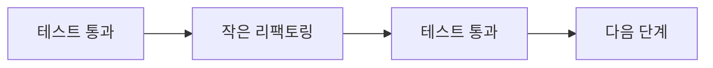

# 리팩토링 기초

> Clean Code 101 시리즈 (9/10)


## 이 글에서 다룰 문제

리팩토링은 새로 쓰는 것이 아닙니다. 외부 동작을 보존한 채 내부 구조를 개선하는 일입니다.

> 리팩토링은 다음 변경의 비용을 낮추는 투자다.

## 개념 한눈에 보기



녹색-녹색 사이의 작은 걸음.

## Before/After

**Before**

```python
def order_total(o):
    s = 0
    for it in o.items:
        s += it.price * it.qty
    if o.coupon: s -= 10
    if o.member: s = s * 0.9
    return s
```

**After**

```python
def subtotal(items): return sum(i.price * i.qty for i in items)
def with_coupon(s, coupon): return s - 10 if coupon else s
def with_member(s, member): return s * 0.9 if member else s

def order_total(o):
    s = subtotal(o.items)
    s = with_coupon(s, o.coupon)
    s = with_member(s, o.member)
    return s
```

작은 단계로 의미를 분리합니다.

## 실습: 안전한 리팩토링 5단계

### 1단계 — 특성화 테스트로 안전망

```python
# 1_characterize.py
def test_legacy_total():
    o = make_order(items=[(100, 2)], coupon=True, member=True)
    assert order_total(o) == 171  # 현재 동작을 그대로 잡아둠
```

이해보다 캡처가 먼저.

### 2단계 — Extract Function

```python
# 2_extract.py
def subtotal(items): return sum(i.price * i.qty for i in items)
```

작은 의미 단위로 잘라냅니다.

### 3단계 — Rename

```python
# 3_rename.py
# 이름이 의도를 드러내도록 점진적으로 교체.
def items_subtotal(items): ...
```

IDE 리팩토링 기능을 활용합니다.

### 4단계 — Inline & Move

```python
# 4_move.py
# 잘못된 위치의 함수를 적절한 모듈/클래스로 이동.
class OrderPricing:
    def total(self, order): ...
```

응집도를 끌어올립니다.

### 5단계 — Two hats 지키기

```python
# 5_two_hats.py
# 같은 PR에서 기능 추가 + 리팩토링을 섞지 않습니다.
# PR-1: 리팩토링 (동작 보존)
# PR-2: 기능 추가 (새 동작)
```

리뷰가 가능한 변경을 만듭니다.

## 이 코드에서 주목할 점

- 매 단계 후 테스트가 녹색입니다.
- 변경의 폭이 항상 작습니다.
- 이름이 의도를 드러냅니다.

## 자주 하는 실수 5가지

1. **테스트 없이 시작.** 회귀가 사고로 옵니다.
2. **큰 단계로 한 번에.** 되돌리기 불가.
3. **기능과 섞기.** 리뷰가 불가능.
4. **이름은 그대로 두고 구조만 변경.** 절반의 가치만 얻음.
5. **취향의 리팩토링.** "다음 변경"을 더 쉽게 만들지 않음.

## 실무에서는 이렇게 쓰입니다

좋은 팀은 새 기능 PR마다 "리팩토링 PR 한 개를 먼저 머지"하는 규칙을 둡니다. 기능 PR이 작아지고 리뷰가 빨라집니다.

## 체크리스트

- [ ] 시작 전 테스트가 녹색인가?
- [ ] 단계가 충분히 작은가?
- [ ] 기능 추가와 섞이지 않았나?
- [ ] 이름이 의도를 드러내는가?
- [ ] 다음 변경이 더 쉬워졌나?

## 정리 및 다음 단계

리팩토링은 다음 변경의 비용을 낮추는 투자입니다. 마지막 글에서는 — 좋은 코드 리뷰 기준 — 으로 시리즈를 마무리합니다.

<!-- toc:begin -->
- [Clean Code란 무엇인가?](./01-what-is-clean-code.md)
- [이름 짓기](./02-naming.md)
- [함수 작게 만들기](./03-small-functions.md)
- [조건문 줄이기](./04-simplifying-conditionals.md)
- [중복 제거](./05-removing-duplication.md)
- [오류 처리](./06-error-handling.md)
- [주석과 문서화](./07-comments-and-docs.md)
- [테스트 가능한 코드](./08-testable-code.md)
- **리팩토링 기초 (현재 글)**
- 좋은 코드 리뷰 기준 (예정)
<!-- toc:end -->

## 참고 자료

- [Refactoring (Martin Fowler)](https://martinfowler.com/books/refactoring.html)
- [Refactoring Catalog](https://refactoring.com/catalog/)
- [Working Effectively with Legacy Code (M. Feathers)](https://www.oreilly.com/library/view/working-effectively-with/0131177052/)
- [The Mikado Method](https://mikadomethod.info/)

Tags: Computer Science, CleanCode, Refactoring, Patterns, LegacyCode, Quality
