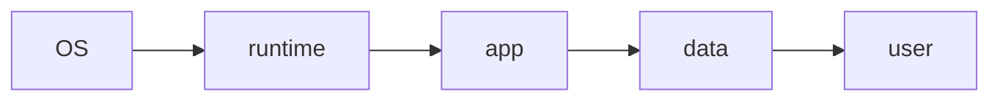

# IaaS, PaaS, SaaS

> Cloud Computing 101 series (2/10)

<!-- a-grade-intro:begin -->

**Core question**: EC2, Heroku, and Notion are all "cloud" — *why do they feel completely different*?

> *Cloud service models split work between you and the provider — IaaS, PaaS, SaaS — depending on how much of the OS, runtime, and app you manage yourself.*

This is post 2 in the Cloud Computing 101 series.

<!-- a-grade-intro:end -->

## What You Will Learn

- IaaS, PaaS, SaaS definitions
- The shared-responsibility diagram
- Five selection criteria
- Where serverless fits
- Five common pitfalls

## Why It Matters

Pick the wrong model and you waste both *cost* and *speed*. Each stage of an organization fits a different abstraction level.

## Concept at a Glance



## Key Terms

- **IaaS**: VMs, disks, and networks only.
- **PaaS**: also runs your runtime and deploys your code.
- **SaaS**: a finished application.
- **FaaS**: function-level execution (serverless).
- **Managed**: the provider runs it for you.

## Before/After

**Before**: do everything yourself — server, OS, app.

**After**: you ship code, the platform handles the rest.

## Hands-on: A PaaS Example with a Tiny Flask App

### Step 1 — App code

```python
# app.py
from flask import Flask
app = Flask(__name__)

@app.route("/")
def home():
    return {"hello": "cloud"}
```

### Step 2 — Dependencies

```text
flask==3.0.0
gunicorn==21.2.0
```

### Step 3 — Process file

```text
# Procfile
web: gunicorn app:app
```

### Step 4 — Deploy (PaaS is this short)

```bash
git init
git add .
git commit -m "init"
# example: heroku create && git push heroku main
```

### Step 5 — IaaS comparison

```python
# On IaaS you would also need to:
# - provision a VM
# - install OS packages
# - configure a reverse proxy
# - install a log shipper
print("PaaS = git push, IaaS = the four steps above by hand")
```

## What to Notice in This Code

- PaaS deployment is one Procfile line.
- On IaaS, every step is your responsibility.
- SaaS removes the code itself from your scope.

## Five Common Mistakes

1. **Treating a PaaS like a VM.**
2. **Going IaaS without enough operations headcount.**
3. **Ignoring data lock-in when adopting SaaS.**
4. **Underestimating cold starts on FaaS.**
5. **Mixing models without a clear responsibility boundary.**

## How This Shows Up in Production

Early-stage startups run on PaaS like Heroku or Render. As they grow they move workloads to IaaS such as AWS with EKS, while keeping office tools on SaaS.

## How a Senior Engineer Thinks

- Self-host only what you do *better* than the provider.
- The PaaS-to-IaaS jump is a cost-vs-control decision.
- SaaS includes vendor risk in the price.
- FaaS is great for event-driven workloads.
- Abstraction = freedom *and* lock-in.

## Checklist

- [ ] Each workload mapped to the right model.
- [ ] Vendor lock-in evaluated.
- [ ] Cost simulated, not just listed.
- [ ] Operational headcount lined up.

## Practice Problems

1. Compare hosting a database on IaaS vs PaaS.
2. Name one workload that is a *bad fit* for FaaS.
3. Why is data export a non-negotiable SaaS requirement?

## Wrap-up and Next Steps

Once you pick a model, the next question is *where it runs*. The next post covers Regions and Availability Zones.

<!-- toc:begin -->
- [What is Cloud Computing?](./01-what-is-cloud-computing.md)
- **IaaS, PaaS, SaaS (current)**
- Region and Availability Zone (upcoming)
- Compute (upcoming)
- Storage (upcoming)
- Network (upcoming)
- Identity and Security (upcoming)
- Monitoring (upcoming)
- Cost Management (upcoming)
- Cloud Architecture Basics (upcoming)
<!-- toc:end -->

## References

- [NIST SP 800-145 — service models](https://csrc.nist.gov/publications/detail/sp/800-145/final)
- [AWS — types of cloud computing](https://aws.amazon.com/types-of-cloud-computing/)
- [Heroku — platform overview](https://devcenter.heroku.com/categories/platform)
- [Vercel — serverless functions](https://vercel.com/docs/functions)

Tags: Cloud, IaaS, PaaS, SaaS, Architecture
