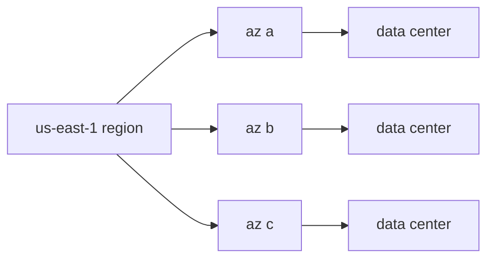

# Region and Availability Zone

> Cloud Computing 101 series (3/10)

<!-- a-grade-intro:begin -->

**Core question**: Why does the same AWS service stay alive when one region fails for some teams but go down for others?

> *A region is a geographic location, an AZ is a physically isolated cluster of data centers — distributing across AZs is the foundation of high availability.*

This is post 3 in the Cloud Computing 101 series.

<!-- a-grade-intro:end -->

## What You Will Learn

- Region vs AZ vs Edge
- What Multi-AZ really means
- When to consider Multi-Region
- Latency vs availability tradeoffs
- Five common pitfalls

## Why It Matters

If everything sits in one AZ, a single data center fire takes down your service. Distribution is the *prerequisite* for availability.

## Concept at a Glance



## Key Terms

- **Region**: a continent- or city-scale location.
- **AZ**: a physically isolated data center cluster inside a region.
- **Edge**: the last hop of a CDN.
- **RTT**: round-trip time, proportional to physical distance.
- **Failover**: switching workloads between AZs or regions.

## Before/After

**Before**: an EC2 instance in `az a` and its RDS in `az a` too.

**After**: EC2 across `a/b/c`, RDS in Multi-AZ mode.

## Hands-on: List AZs with Python

### Step 1 — Client

```python
import boto3
ec2 = boto3.client("ec2", region_name="us-east-1")
```

### Step 2 — Available zones

```python
def list_azs():
    res = ec2.describe_availability_zones()
    return [z["ZoneName"] for z in res["AvailabilityZones"]]

print(list_azs())
```

### Step 3 — Available regions

```python
def list_regions():
    res = boto3.client("ec2").describe_regions()
    return [r["RegionName"] for r in res["Regions"]]

print(list_regions())
```

### Step 4 — Estimate RTT (back-of-envelope)

```python
def estimate_rtt(km: float) -> float:
    # fiber ~200,000 km/s, plus router overhead, round trip
    return (km / 200_000) * 2 * 1000 * 1.5  # ms
```

### Step 5 — Distribute replicas

```python
def placement(azs: list[str], replicas: int) -> list[str]:
    return [azs[i % len(azs)] for i in range(replicas)]

print(placement(["a", "b", "c"], 5))
```

## What to Notice in This Code

- AZ names are mapped *per account* — your `az a` may not be mine.
- RTT has a hard physical floor.
- Round-robin spreading is dumb but effective.

## Five Common Mistakes

1. **Living in a single AZ.**
2. **Going Multi-Region only to add latency.**
3. **Never testing DB failover.**
4. **Ignoring cross-region data sync cost.**
5. **Skipping the edge cache for global users.**

## How This Shows Up in Production

Payment services run Multi-AZ, global product pages cache at the edge, and disaster recovery runs Multi-Region with periodic failover drills.

## How a Senior Engineer Thinks

- AZ distribution is the default, not a luxury.
- Multi-Region is a major cost-and-complexity decision.
- The edge is read-heavy by design.
- Practice failover on a schedule, not in panic.
- Latency vs consistency is a *business* decision.

## Checklist

- [ ] Workloads distributed across AZs.
- [ ] Failover is automated.
- [ ] RTO and RPO are defined.
- [ ] At least one disaster drill per year.

## Practice Problems

1. Two ways to sync data between Seoul and Tokyo regions — list them.
2. Why is edge caching a poor fit for highly dynamic pages?
3. Name a sane reason to deliberately use a single AZ.

## Wrap-up and Next Steps

Now that you have a place, you need things to run there. The next post covers Compute.

<!-- toc:begin -->
- [What is Cloud Computing?](./01-what-is-cloud-computing.md)
- [IaaS, PaaS, SaaS](./02-iaas-paas-saas.md)
- **Region and Availability Zone (current)**
- Compute (upcoming)
- Storage (upcoming)
- Network (upcoming)
- Identity and Security (upcoming)
- Monitoring (upcoming)
- Cost Management (upcoming)
- Cloud Architecture Basics (upcoming)
<!-- toc:end -->

## References

- [AWS — regions and AZs](https://docs.aws.amazon.com/AWSEC2/latest/UserGuide/using-regions-availability-zones.html)
- [Google Cloud — geography and regions](https://cloud.google.com/about/locations)
- [Azure — availability zones](https://learn.microsoft.com/azure/reliability/availability-zones-overview)
- [Cloudflare — what is a CDN](https://www.cloudflare.com/learning/cdn/what-is-a-cdn/)

Tags: Cloud, AWS, Region, HighAvailability, Architecture
