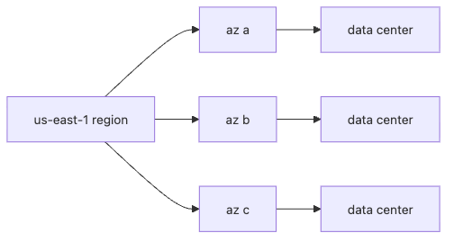

# Region and Availability Zone

Two teams can run the same service on the same cloud and get very different outage stories. One loses a single data center and keeps serving traffic. The other loses the same kind of fault and goes dark. The difference usually starts with placement, not features.

In cloud systems, choosing where something runs is not a cosmetic decision. It sets the floor for latency, shapes your failover blast radius, and determines how expensive replication will become later.

This is post 3 in the Cloud Computing 101 series.

In this post, we'll separate Regions, Availability Zones, and edge locations, then use that model to reason about Multi-AZ and Multi-Region designs.

> A Region is geography, an AZ is a failure boundary inside that geography, and most availability conversations should start with AZ distribution before they escalate to Multi-Region.

## Questions This Chapter Answers

- Region vs AZ vs Edge
- What Multi-AZ really means
- When to consider Multi-Region
- Latency vs availability tradeoffs
- Five common pitfalls

## Why It Matters

If everything sits in one AZ, a single data center fire takes down your service. Distribution is the *prerequisite* for availability.

## Concept at a Glance



*A Region contains multiple Availability Zones that separate failure boundaries*

## Key Terms

- **Region**: a continent- or city-scale location.
- **AZ**: a physically isolated data center cluster inside a region.
- **Edge**: the last hop of a CDN.
- **RTT**: round-trip time, proportional to physical distance.
- **Failover**: switching workloads between AZs or regions.

## Before/After

**Before**: an EC2 instance in `az a` and its RDS in `az a` too.

**After**: EC2 across `a/b/c`, RDS in Multi-AZ mode.

## Hands-on: List AZs with Python

### Step 1 — Client

```python
import boto3
ec2 = boto3.client("ec2", region_name="us-east-1")
```

### Step 2 — Available zones

```python
def list_azs():
    res = ec2.describe_availability_zones()
    return [z["ZoneName"] for z in res["AvailabilityZones"]]

print(list_azs())
```

### Step 3 — Available regions

```python
def list_regions():
    res = boto3.client("ec2").describe_regions()
    return [r["RegionName"] for r in res["Regions"]]

print(list_regions())
```

### Step 4 — Estimate RTT (back-of-envelope)

```python
def estimate_rtt(km: float) -> float:
    # fiber ~200,000 km/s, plus router overhead, round trip
    return (km / 200_000) * 2 * 1000 * 1.5  # ms
```

### Step 5 — Distribute replicas

```python
def placement(azs: list[str], replicas: int) -> list[str]:
    return [azs[i % len(azs)] for i in range(replicas)]

print(placement(["a", "b", "c"], 5))
```

## What to Notice in This Code

- AZ names are mapped *per account* — your `az a` may not be mine.
- RTT has a hard physical floor.
- Round-robin spreading is dumb but effective.

## How to Verify This Example

Placement concepts become easier to trust once you inspect your own account. AZ names are especially important to verify because the labels are account-mapped and should not be treated as a universal physical coordinate.

```bash
python -c 'import boto3; print([z["ZoneName"] for z in boto3.client("ec2", region_name="us-east-1").describe_availability_zones()["AvailabilityZones"]])'
python -c 'import boto3; print([r["RegionName"] for r in boto3.client("ec2").describe_regions()["Regions"]][:5])'
```

**Expected output:**

- The first command should return AZ names such as `us-east-1a`, `us-east-1b`, and `us-east-1c`.
- The second should list accessible AWS Regions.
- Seeing both outputs side by side makes the Region/AZ hierarchy much more concrete than the definition alone.

### Where teams usually get stuck

- A service is not really Multi-AZ if the database, cache, or queue still sits behind a single failure boundary.
- Multi-Region is not automatically better. Replication and operational overhead have to be worth it.
- The RTT helper is a back-of-the-envelope floor, not a production benchmark.

## Five Common Mistakes

1. **Living in a single AZ.**
2. **Going Multi-Region only to add latency.**
3. **Never testing DB failover.**
4. **Ignoring cross-region data sync cost.**
5. **Skipping the edge cache for global users.**

## How This Shows Up in Production

Payment services run Multi-AZ, global product pages cache at the edge, and disaster recovery runs Multi-Region with periodic failover drills.

## How a Senior Engineer Thinks

- AZ distribution is the default, not a luxury.
- Multi-Region is a major cost-and-complexity decision.
- The edge is read-heavy by design.
- Practice failover on a schedule, not in panic.
- Latency vs consistency is a *business* decision.

## Checklist

- [ ] Workloads distributed across AZs.
- [ ] Failover is automated.
- [ ] RTO and RPO are defined.
- [ ] At least one disaster drill per year.

## Practice Problems

1. Two ways to sync data between Seoul and Tokyo regions — list them.
2. Why is edge caching a poor fit for highly dynamic pages?
3. Name a sane reason to deliberately use a single AZ.

## Wrap-up and Next Steps

Now that you have a place, you need things to run there. The next post covers Compute.

<!-- toc:begin -->
- [What is Cloud Computing?](./01-what-is-cloud-computing.md)
- [IaaS, PaaS, SaaS](./02-iaas-paas-saas.md)
- **Region and Availability Zone (current)**
- Compute (upcoming)
- Storage (upcoming)
- Network (upcoming)
- Identity and Security (upcoming)
- Monitoring (upcoming)
- Cost Management (upcoming)
- Cloud Architecture Basics (upcoming)
<!-- toc:end -->

## References

- [AWS — regions and AZs](https://docs.aws.amazon.com/AWSEC2/latest/UserGuide/using-regions-availability-zones.html)
- [Google Cloud — geography and regions](https://cloud.google.com/about/locations)
- [Azure — availability zones](https://learn.microsoft.com/azure/reliability/availability-zones-overview)
- [Cloudflare — what is a CDN](https://www.cloudflare.com/learning/cdn/what-is-a-cdn/)

Tags: Cloud, AWS, Region, HighAvailability, Architecture
