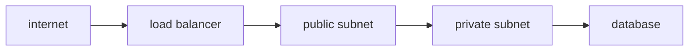

# Network

> Cloud Computing 101 series (6/10)

<!-- a-grade-intro:begin -->

**Core question**: Why do VPCs, subnets, and security groups all exist *separately*?

> *Cloud networking works in four layers — isolate (VPC), place (subnets), allow (SG/NACL), distribute (LB).*

<!-- a-grade-intro:end -->

## What You Will Learn

- VPCs vs subnets
- Security Groups vs NACLs
- Public and private subnet patterns
- Load balancer basics
- Five common pitfalls

## Why It Matters

Network design is the hardest decision to undo later. The first hour shapes the next several years.

## Concept at a Glance



## Key Terms

- **VPC**: a logically isolated virtual network.
- **Subnet**: an IP range inside a VPC, scoped to an AZ.
- **Security Group**: a stateful, instance-level firewall.
- **NACL**: a stateless, subnet-level firewall.
- **Load Balancer**: distributes traffic across targets.

## Before/After

**Before**: every server has a public IP and the attack surface explodes.

**After**: apps live in private subnets, only the ALB faces the internet.

## Hands-on: Create a Security Group

### Step 1 — Client

```python
import boto3
ec2 = boto3.client("ec2")
```

### Step 2 — Create SG

```python
def create_sg(vpc_id, name):
    res = ec2.create_security_group(
        GroupName=name, Description=name, VpcId=vpc_id,
    )
    return res["GroupId"]
```

### Step 3 — Allow inbound

```python
def allow_https(sg_id):
    ec2.authorize_security_group_ingress(
        GroupId=sg_id,
        IpPermissions=[{
            "IpProtocol": "tcp", "FromPort": 443, "ToPort": 443,
            "IpRanges": [{"CidrIp": "0.0.0.0/0"}],
        }],
    )
```

### Step 4 — DB SG references the app SG

```python
def allow_db_from_app(db_sg, app_sg):
    ec2.authorize_security_group_ingress(
        GroupId=db_sg,
        IpPermissions=[{
            "IpProtocol": "tcp", "FromPort": 5432, "ToPort": 5432,
            "UserIdGroupPairs": [{"GroupId": app_sg}],
        }],
    )
```

### Step 5 — Verify

```python
def describe(sg_id):
    return ec2.describe_security_groups(GroupIds=[sg_id])
```

## What to Notice in This Code

- DB SGs reference an SG, not a CIDR — that is the canonical pattern.
- 0.0.0.0/0 is an explicit statement of public exposure.
- SGs are stateful; NACLs are stateless.

## Five Common Mistakes

1. **Opening SSH to 0.0.0.0/0.**
2. **Putting databases in public subnets.**
3. **Confusing NACLs and SG responsibilities.**
4. **Ignoring cross-AZ traffic costs.**
5. **Forgetting to review egress rules.**

## How This Shows Up in Production

The ALB sits in public subnets. App servers live in private subnets. RDS sits in DB private subnets. A NAT Gateway handles outbound calls.

## How a Senior Engineer Thinks

- Private by default; public is the exception.
- Split SGs by role.
- Restrict egress just as explicitly as ingress.
- VPC Flow Logs are on by default.
- Plan CIDR ranges with future merges in mind.

## Checklist

- [ ] No databases in public subnets.
- [ ] SGs are split by role.
- [ ] Flow Logs are enabled.
- [ ] Egress rules are explicit.

## Practice Problems

1. List three differences between Security Groups and NACLs.
2. Explain in one sentence why public/private subnet separation helps security.
3. Give one major difference between ALB and NLB.

## Wrap-up and Next Steps

Once the wires are in, the question becomes *who* may use them. The next post covers Identity and Security.

<!-- toc:begin -->
- [What is Cloud Computing?](./01-what-is-cloud-computing.md)
- [IaaS, PaaS, SaaS](./02-iaas-paas-saas.md)
- [Region and Availability Zone](./03-region-and-availability-zone.md)
- [Compute](./04-compute.md)
- [Storage](./05-storage.md)
- **Network (current)**
- Identity and Security (upcoming)
- Monitoring (upcoming)
- Cost Management (upcoming)
- Cloud Architecture Basics (upcoming)
<!-- toc:end -->

## References

- [AWS VPC user guide](https://docs.aws.amazon.com/vpc/latest/userguide/what-is-amazon-vpc.html)
- [AWS Security Groups](https://docs.aws.amazon.com/vpc/latest/userguide/vpc-security-groups.html)
- [AWS Network ACL](https://docs.aws.amazon.com/vpc/latest/userguide/vpc-network-acls.html)
- [AWS Elastic Load Balancing](https://docs.aws.amazon.com/elasticloadbalancing/latest/userguide/what-is-load-balancing.html)

Tags: Cloud, Networking, VPC, Security, AWS
