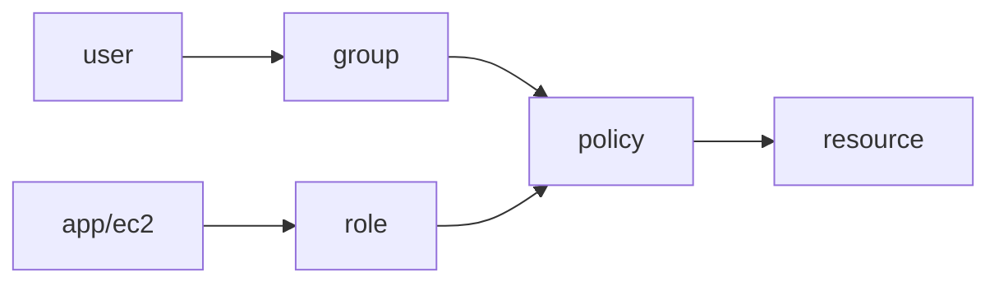

# Identity and Security

> Cloud Computing 101 series (7/10)

<!-- a-grade-intro:begin -->

**Core question**: When and how do IAM *users* and *roles* differ in practice?

> *Cloud security starts with least privilege, runs on role-based delegation, and protects data with encryption plus key management.*

This is post 7 in the Cloud Computing 101 series.

<!-- a-grade-intro:end -->

## What You Will Learn

- IAM users, groups, roles, and policies
- The least privilege principle
- MFA and key rotation
- Encrypting data with KMS
- Five common pitfalls

## Why It Matters

Most security incidents start with excessive permissions and forgotten keys. Solid IAM shrinks the blast radius of any single mistake.

## Concept at a Glance



## Key Terms

- **User**: a person or long-lived credential.
- **Group**: a bundle of users that receives policies.
- **Role**: an identity that hands out *temporary* credentials.
- **Policy**: an allow/deny rule, written as JSON.
- **KMS**: a central service for managing encryption keys.

## Before/After

**Before**: access keys hardcoded in source — eventually leaked.

**After**: an EC2 role attached to the instance, with auto-refreshed temporary tokens.

## Hands-on: Least-Privilege Policy

### Step 1 — Client

```python
import boto3, json
iam = boto3.client("iam")
```

### Step 2 — Policy document

```python
policy = {
    "Version": "2012-10-17",
    "Statement": [{
        "Effect": "Allow",
        "Action": ["s3:GetObject"],
        "Resource": "arn:aws:s3:::my-bucket/*",
    }],
}
```

### Step 3 — Create the policy

```python
def create_policy(name, doc):
    res = iam.create_policy(
        PolicyName=name, PolicyDocument=json.dumps(doc),
    )
    return res["Policy"]["Arn"]
```

### Step 4 — Create role and trust

```python
trust = {
    "Version": "2012-10-17",
    "Statement": [{
        "Effect": "Allow",
        "Principal": {"Service": "ec2.amazonaws.com"},
        "Action": "sts:AssumeRole",
    }],
}

def create_role(name):
    res = iam.create_role(
        RoleName=name, AssumeRolePolicyDocument=json.dumps(trust),
    )
    return res["Role"]["Arn"]
```

### Step 5 — Attach

```python
def attach(role_name, policy_arn):
    iam.attach_role_policy(RoleName=role_name, PolicyArn=policy_arn)
```

## What to Notice in This Code

- A role needs both a *trust* policy and a *permissions* policy.
- Keep `Resource` as narrow as possible.
- Avoid wildcards in `Action`.

## Five Common Mistakes

1. **Granting `Action: *`.**
2. **Committing access keys to git.**
3. **Doing daily work as the root account.**
4. **Skipping MFA.**
5. **Never rotating keys.**

## How This Shows Up in Production

EC2 roles access S3. KMS encrypts data at rest. AWS SSO handles staff login. MFA is required for every user.

## How a Senior Engineer Thinks

- Least privilege is the default.
- Prefer roles; user keys are the exception.
- Every key has a rotation schedule.
- Audit logging is on by default.
- Separation — `prod` and `dev` live in *different* accounts.

## Checklist

- [ ] Root account MFA enabled.
- [ ] Key rotation schedule in place.
- [ ] Roles preferred over user keys.
- [ ] CloudTrail enabled.

## Practice Problems

1. State the fundamental difference between a User and a Role in one line.
2. Write the `Resource` field of a least-privilege S3 policy in one line.
3. Give one scenario where a customer-managed KMS key is preferable to an AWS-managed one.

## Wrap-up and Next Steps

Once permissions are right, the next question is *what is actually happening*. The next post covers Monitoring.

<!-- toc:begin -->
- [What is Cloud Computing?](./01-what-is-cloud-computing.md)
- [IaaS, PaaS, SaaS](./02-iaas-paas-saas.md)
- [Region and Availability Zone](./03-region-and-availability-zone.md)
- [Compute](./04-compute.md)
- [Storage](./05-storage.md)
- [Network](./06-network.md)
- **Identity and Security (current)**
- Monitoring (upcoming)
- Cost Management (upcoming)
- Cloud Architecture Basics (upcoming)
<!-- toc:end -->

## References

- [AWS IAM user guide](https://docs.aws.amazon.com/IAM/latest/UserGuide/introduction.html)
- [IAM best practices](https://docs.aws.amazon.com/IAM/latest/UserGuide/best-practices.html)
- [AWS KMS](https://docs.aws.amazon.com/kms/latest/developerguide/overview.html)
- [AWS CloudTrail](https://docs.aws.amazon.com/awscloudtrail/latest/userguide/cloudtrail-user-guide.html)

Tags: Cloud, Security, IAM, AWS, Architecture
