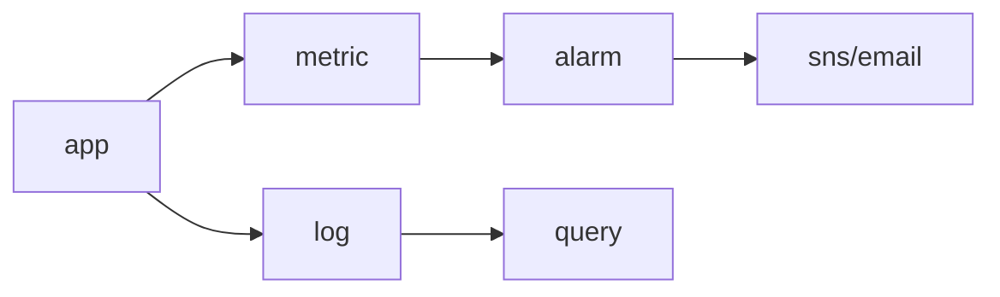

# Monitoring

> Cloud Computing 101 series (8/10)

<!-- a-grade-intro:begin -->

**Core question**: When do you reach for metrics, logs, or traces — and which tool answers each question?

> *Monitoring makes a system observable through three axes — numbers (metrics), text (logs), and flow (traces).*

This is post 8 in the Cloud Computing 101 series.

<!-- a-grade-intro:end -->

## What You Will Learn

- Metrics vs logs vs traces
- CloudWatch basics
- Alarms and notifications via SNS
- Building a dashboard
- Five common pitfalls

## Why It Matters

Without monitoring, your *customers* tell you about outages first. A single well-tuned alarm protects entire weekends.

## Concept at a Glance



## Key Terms

- **Metric**: a numeric time series (CPU, latency).
- **Log**: a text event (request, error).
- **Trace**: a distributed call flow (X-Ray).
- **Alarm**: notifies you when a threshold is crossed.
- **SLO**: a target, for example 99.9%.

## Before/After

**Before**: errors are discovered through customer complaints.

**After**: 5xx ratio above threshold pages Slack within minutes.

## Hands-on: CloudWatch Alarm

### Step 1 — Client

```python
import boto3
cw = boto3.client("cloudwatch")
sns = boto3.client("sns")
```

### Step 2 — Topic

```python
def create_topic(name):
    res = sns.create_topic(Name=name)
    return res["TopicArn"]
```

### Step 3 — Subscribe by email

```python
def subscribe(topic_arn, email):
    sns.subscribe(
        TopicArn=topic_arn, Protocol="email", Endpoint=email,
    )
```

### Step 4 — CPU alarm

```python
def cpu_alarm(name, instance_id, topic_arn):
    cw.put_metric_alarm(
        AlarmName=name,
        Namespace="AWS/EC2",
        MetricName="CPUUtilization",
        Dimensions=[{"Name": "InstanceId", "Value": instance_id}],
        Statistic="Average",
        Period=60, EvaluationPeriods=5,
        Threshold=80.0, ComparisonOperator="GreaterThanThreshold",
        AlarmActions=[topic_arn],
    )
```

### Step 5 — Custom metric

```python
def emit(value):
    cw.put_metric_data(
        Namespace="MyApp",
        MetricData=[{"MetricName": "OrdersPerMin", "Value": value}],
    )
```

## What to Notice in This Code

- `Period` and `EvaluationPeriods` together set sensitivity.
- Custom metrics let you alert on business signals.
- Topics decouple alarms from recipients.

## Five Common Mistakes

1. **Alarming on everything — alarm fatigue.**
2. **Logs without metrics.**
3. **Thresholds that are too sensitive or too dull.**
4. **Infinite log retention — costs grow forever.**
5. **Dashboards too cluttered to read at 3 a.m.**

## How This Shows Up in Production

ALB 5xx rate, RDS connections, Lambda error rate, and orders-per-minute all flow into a dashboard plus alarms plus Slack/PagerDuty.

## How a Senior Engineer Thinks

- Every alarm must be actionable.
- SLOs decide alarm thresholds.
- Logs are a question-answering tool, not a backup.
- Keep dashboards minimal.
- Run game days to verify alarms work.

## Checklist

- [ ] Alarms exist for core metrics.
- [ ] Log retention is configured.
- [ ] At least one operational dashboard.
- [ ] On-call notification path tested.

## Practice Problems

1. Explain the difference between a metric and a log in one line.
2. Write the `Period`/`EvaluationPeriods` for a "CPU 80% for 5 minutes" alarm.
3. Give one strategy to reduce alarm fatigue.

## Wrap-up and Next Steps

Once visibility is in place, you have to control the bill. The next post covers Cost Management.

<!-- toc:begin -->
- [What is Cloud Computing?](./01-what-is-cloud-computing.md)
- [IaaS, PaaS, SaaS](./02-iaas-paas-saas.md)
- [Region and Availability Zone](./03-region-and-availability-zone.md)
- [Compute](./04-compute.md)
- [Storage](./05-storage.md)
- [Network](./06-network.md)
- [Identity and Security](./07-identity-and-security.md)
- **Monitoring (current)**
- Cost Management (upcoming)
- Cloud Architecture Basics (upcoming)
<!-- toc:end -->

## References

- [AWS CloudWatch user guide](https://docs.aws.amazon.com/AmazonCloudWatch/latest/monitoring/WhatIsCloudWatch.html)
- [CloudWatch Logs Insights](https://docs.aws.amazon.com/AmazonCloudWatch/latest/logs/AnalyzingLogData.html)
- [AWS X-Ray](https://docs.aws.amazon.com/xray/latest/devguide/aws-xray.html)
- [Google SRE Book — Monitoring](https://sre.google/sre-book/monitoring-distributed-systems/)

Tags: Cloud, Monitoring, CloudWatch, AWS, Observability
