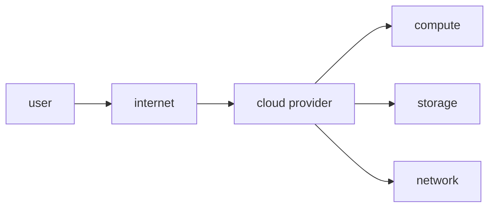

# Cloud Computing이란 무엇인가?

> Cloud Computing 101 시리즈 (1/10)


## 이 글에서 다룰 문제

*초기 비용 0* 으로 *글로벌 서비스* 를 시작할 수 있습니다. 대신 *비용 관리* 와 *책임 경계* 를 *처음부터* 알아야 합니다.

## 개념 한눈에 보기



## Before/After

**Before**: *서버 구매 → 설치 → 6주 대기*.

**After**: *콘솔에서 클릭 → 1분 안에 인스턴스* 가 뜸.

## 실습: 첫 클라우드 자원 — Python boto3로 S3 버킷 만들기

### 1단계 — 의존성 설치

```bash
pip install boto3
```

### 2단계 — 자격 증명 설정

```bash
export AWS_ACCESS_KEY_ID="..."
export AWS_SECRET_ACCESS_KEY="..."
export AWS_DEFAULT_REGION="us-east-1"
```

### 3단계 — 클라이언트

```python
import boto3

s3 = boto3.client("s3")
```

### 4단계 — 버킷 생성

```python
def create_bucket(name: str):
    s3.create_bucket(Bucket=name)
    return name
```

### 5단계 — 객체 업로드

```python
def upload(bucket: str, key: str, data: bytes):
    s3.put_object(Bucket=bucket, Key=key, Body=data)
    return f"s3://{bucket}/{key}"

print(upload("my-test-bucket-2026", "hello.txt", b"hi cloud"))
```

## 이 코드에서 주목할 점

- *환경 변수* 로 *자격 증명* 분리.
- *클라이언트* 는 *재사용*.
- *버킷명* 은 *전 세계 유일*.

## 자주 하는 실수 5가지

1. ***루트 계정* 으로 *일상 작업*.**
2. ***리전* 미지정 → *예상 외 위치* 에 자원.**
3. ***공개 버킷* 으로 *데이터 유출*.**
4. ***태그* 없음 → *비용 추적 불가*.**
5. ***리소스 정리* 안 함 → *과금 누적*.**

## 실무에서는 이렇게 쓰입니다

*스타트업* 은 *AWS Free Tier* 로 시작, *트래픽 증가* 시 *Auto Scaling*, *비용 폭증* 전 *예산 알람* 을 건다.

## 체크리스트

- [ ] *루트 계정* 보호.
- [ ] *MFA* 활성.
- [ ] *예산 알람* 설정.
- [ ] *리소스 태그* 정책.

## 정리 및 다음 단계

클라우드는 *모델* 이지 *기술* 이 아닙니다. 다음 글은 *IaaS / PaaS / SaaS* 의 *경계* 를 봅니다.

<!-- toc:begin -->
- **Cloud Computing이란 무엇인가? (현재 글)**
- IaaS, PaaS, SaaS (예정)
- Region과 Availability Zone (예정)
- Compute (예정)
- Storage (예정)
- Network (예정)
- Identity와 Security (예정)
- Monitoring (예정)
- Cost Management (예정)
- Cloud Architecture 기초 (예정)
<!-- toc:end -->

## 참고 자료

- [NIST — Cloud Computing 정의](https://csrc.nist.gov/publications/detail/sp/800-145/final)
- [AWS Well-Architected](https://aws.amazon.com/architecture/well-architected/)
- [Google Cloud — Concepts](https://cloud.google.com/docs/overview)
- [Azure — Cloud computing 이란](https://learn.microsoft.com/azure/cloud-adoption-framework/)

Tags: Cloud, AWS, Infrastructure, DevOps, Networking
