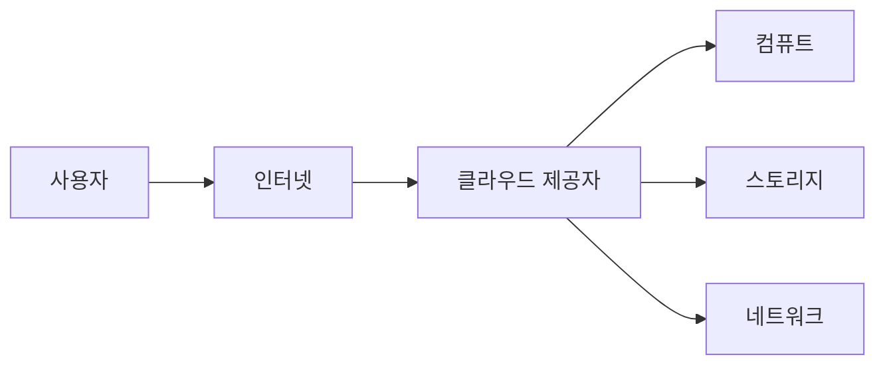

# Cloud Computing이란 무엇인가?

## 이 글에서 다룰 문제

- 왜 많은 팀이 서버를 직접 사는 방식에서 인터넷으로 컴퓨트 자원을 빌려 쓰는 방식으로 이동했을까요?
- 클라우드의 핵심 특성은 무엇이고, 온프레미스와 비교하면 무엇이 달라질까요?
- AWS, Azure, Google Cloud 같은 사업자는 정확히 어떤 역할을 맡을까요?
- 비용과 보안 책임은 어디까지 공급자가 맡고, 어디부터 사용자가 책임져야 할까요?
- 클라우드를 처음 쓸 때 가장 자주 하는 실수는 무엇일까요?

## 왜 중요한가

클라우드를 처음 접하면 보통 “서버를 안 사도 된다”는 장점부터 눈에 들어옵니다. 실제로 그 말은 맞습니다. 예전에는 서비스 하나를 시작하려 해도 서버 주문, 설치, 네트워크 연결, 운영 체제 준비 같은 선행 작업이 먼저 필요했습니다. 지금은 관리 콘솔에서 몇 번 클릭하거나 API를 호출하는 것만으로도 몇 분 안에 컴퓨트와 스토리지를 준비할 수 있습니다.

하지만 편리함만 보고 시작하면 금방 다른 질문과 마주칩니다. 왜 이번 달 비용이 예상보다 많이 나왔는지, 왜 공개 스토리지가 보안 사고로 이어지는지, 왜 멀티 리전을 무작정 도입한다고 좋은 설계가 되지 않는지 같은 질문입니다. 클라우드는 단순히 “남의 서버를 빌려 쓰는 방식”이 아니라, 비용 구조와 운영 책임이 함께 바뀌는 실행 모델입니다.

이 글은 Cloud Computing 101 시리즈의 출발점입니다. 여기서는 클라우드를 정의부터 실무 감각까지 한 번에 연결해 보겠습니다. 핵심은 한 문장으로 정리할 수 있습니다. 클라우드는 컴퓨트, 스토리지, 네트워크 같은 자원을 필요할 때마다 빌려 쓰고, 사용량에 따라 비용을 내는 방식입니다.

> 클라우드는 서버를 사는 방식이 아니라, 필요한 자원을 필요할 때 빌려 쓰는 운영 모델입니다.

## 한눈에 보는 개념



클라우드에서는 사용자가 인터넷을 통해 클라우드 제공자(CSP, Cloud Service Provider)의 자원을 요청합니다. 제공자는 그 요청에 맞춰 가상 머신, 객체 저장소, 가상 네트워크 같은 자원을 즉시 준비합니다. 사용자는 물리 서버를 직접 만지지 않아도 되지만, 어떤 자원을 어떻게 조합할지는 여전히 스스로 결정해야 합니다.

## 핵심 용어

- CSP: AWS, Azure, Google Cloud처럼 클라우드 서비스를 제공하는 사업자입니다.
- 탄력성(Elasticity): 수요가 늘면 자동으로 확장하고, 줄면 다시 축소하는 능력입니다.
- 온디맨드(On-demand): 필요한 순간에 바로 자원을 만들 수 있다는 뜻입니다.
- 사용량 기반 과금(Pay-as-you-go): 서버를 구매하는 대신 사용량만큼 비용을 냅니다.
- 공동 책임 모델(Shared responsibility): 공급자와 사용자가 각각 무엇을 보호해야 하는지 나누는 모델입니다.

## Before / After

Before에서는 서버를 주문하고, 랙에 장착하고, 운영 체제를 설치하고, 네트워크를 연결한 뒤 서비스 시작까지 몇 주를 기다리는 경우가 흔했습니다.

After에서는 콘솔에서 인스턴스를 만들고, 스토리지를 붙이고, 네트워크 정책을 적용한 뒤 몇 분 안에 첫 서비스를 띄울 수 있습니다.

이 차이는 단지 속도의 문제가 아닙니다. 실험 비용이 낮아지고, 실패를 더 빨리 경험할 수 있으며, 작은 팀도 글로벌 서비스를 설계할 수 있게 됩니다.

## 실습: 첫 번째 클라우드 자원 만들기 — boto3로 S3 사용하기

클라우드가 추상적인 개념으로만 남지 않도록 가장 단순한 실습 하나를 보겠습니다. AWS의 객체 스토리지인 S3에 버킷을 만들고 파일을 업로드하는 예제입니다.

### 1단계 — 의존성 설치

```bash
pip install boto3
```

### 2단계 — 자격 증명 설정

```bash
export AWS_ACCESS_KEY_ID="..."
export AWS_SECRET_ACCESS_KEY="..."
export AWS_DEFAULT_REGION="us-east-1"
```

### 3단계 — 클라이언트

```python
import boto3

s3 = boto3.client("s3")
```

### 4단계 — 버킷 생성

```python
def create_bucket(name: str):
    s3.create_bucket(Bucket=name)
    return name
```

### 5단계 — 객체 업로드

```python
def upload(bucket: str, key: str, data: bytes):
    s3.put_object(Bucket=bucket, Key=key, Body=data)
    return f"s3://{bucket}/{key}"

print(upload("my-test-bucket-2026", "hello.txt", b"hi cloud"))
```

이 예제는 작아 보이지만 클라우드의 핵심 감각을 잘 보여 줍니다. 서버를 직접 만들지 않아도 API 한 번으로 저장소를 만들 수 있고, 로컬 디스크가 아니라 관리형 스토리지에 바로 데이터를 올릴 수 있습니다. 인프라가 코드와 API로 다뤄진다는 점이 클라우드의 큰 차이입니다.

## 이 코드에서 주목할 점

- 자격 증명을 소스 코드에 넣지 않고 환경 변수로 분리했습니다.
- 클라이언트는 한 번 만들고 여러 번 재사용하는 방식이 자연스럽습니다.
- S3 버킷 이름은 AWS 전체에서 전역적으로 고유해야 합니다.

이 세 가지는 단순한 문법 문제가 아니라 운영 습관과 연결됩니다. 자격 증명을 코드에 넣으면 유출 사고 위험이 커지고, 리전과 이름 규칙을 무시하면 배포 자동화가 불안정해집니다.

## 온프레미스와 클라우드의 차이

온프레미스에서는 서버 구매와 감가상각, 네트워크 장비, 전원과 냉각, 하드웨어 장애 대응이 먼저 따라옵니다. 클라우드에서는 그 기반 인프라를 공급자가 맡고, 사용자는 어떤 서비스 조합으로 애플리케이션을 만들지에 집중합니다.

그렇다고 해서 사용자의 책임이 사라지는 것은 아닙니다. 운영 체제 패치가 자동인 서비스도 있고 아닌 서비스도 있으며, 스토리지 공개 범위나 IAM 권한 설계는 여전히 사용자의 몫입니다. 그래서 클라우드를 잘 쓴다는 말은 “운영을 안 한다”가 아니라 “운영할 대상을 더 높은 추상화 수준에서 다룬다”에 가깝습니다.

## 공동 책임 모델은 왜 중요한가

입문자가 가장 자주 오해하는 부분이 바로 책임 경계입니다. 많은 팀이 “클라우드에 올렸으니 보안은 사업자가 알아서 해 주겠지”라고 생각하다가 문제가 생깁니다. 실제로는 데이터센터 보안, 물리 장비, 하이퍼바이저 같은 기반 영역은 공급자가 책임지지만, 계정 권한, 애플리케이션 설정, 데이터 공개 범위, 네트워크 접근 제어는 사용자가 책임지는 경우가 많습니다.

예를 들어 S3 버킷이 공개되어 데이터가 유출됐다면, AWS가 객체 스토리지를 제공한 사실 자체가 문제는 아닙니다. 공개 설정을 잘못 둔 사용자의 구성 실수가 원인인 경우가 대부분입니다. 클라우드를 배울 때 비용 구조와 함께 책임 경계를 동시에 이해해야 하는 이유가 여기 있습니다.

## 자주 하는 실수 5가지

1. 루트 계정으로 일상 작업을 처리합니다.
2. 리전을 명시하지 않아 자원이 예상과 다른 위치에 생성됩니다.
3. 공개 버킷 설정을 잘못해 데이터가 노출됩니다.
4. 태그 정책이 없어 비용을 서비스별로 추적하지 못합니다.
5. 테스트 자원을 지우지 않아 비용이 조용히 누적됩니다.

이 실수들은 초보자에게만 일어나는 문제가 아닙니다. 팀이 급하게 움직일수록 태깅, 예산 알림, 권한 최소화 같은 기본 원칙이 뒤로 밀리기 쉽습니다. 그래서 초반에 규칙을 작게라도 세워 두는 편이 훨씬 낫습니다.

## 실무에서는 이렇게 생각합니다

시니어 엔지니어는 클라우드를 “빨리 실험할 수 있게 해 주는 환경”으로 봅니다. 동시에 비용, 권한, 가용성을 아키텍처의 일부로 취급합니다.

- 클라우드는 빠른 실험을 가능하게 해 주지만, 방치하면 비용이 빠르게 커집니다.
- 책임 경계는 문서로 명시해야 팀 안에서 오해가 줄어듭니다.
- 멀티 리전은 목표가 아니라 요구사항의 결과여야 합니다.
- 비용은 회계 항목이 아니라 설계 지표입니다.
- IAM 최소 권한은 처음부터 적용할수록 나중이 편합니다.

## 체크리스트

- [ ] 루트 계정을 잠가 두었는가.
- [ ] MFA가 활성화되어 있는가.
- [ ] 예산 알림이 설정되어 있는가.
- [ ] 리소스 태그 정책이 있는가.

## 연습 문제

1. 위 코드에 버킷 삭제 함수를 추가해 보세요.
2. 가까운 리전을 선택하면 왜 지연 시간이 줄어드는지 한 문장으로 설명해 보세요.
3. 지금도 온프레미스가 더 적합한 워크로드 하나를 떠올려 보세요.

## 정리 및 다음 단계

클라우드는 특정 제품 하나의 이름이 아니라 자원을 빌려 쓰는 운영 모델입니다. 덕분에 초기 투자 없이 빠르게 시작할 수 있지만, 비용과 보안 책임을 더 명확하게 다뤄야 합니다. 이 관점을 잡고 나면 이후에 배우게 될 IaaS, PaaS, SaaS의 차이도 훨씬 쉽게 이해됩니다.

다음 글에서는 클라우드 서비스 모델을 나눠 보겠습니다. 같은 “클라우드”라도 어떤 것은 가상 머신에 가깝고, 어떤 것은 플랫폼이며, 어떤 것은 완성된 애플리케이션입니다. 그 경계를 이해해야 이후의 선택이 흔들리지 않습니다.

<!-- toc:begin -->
- **Cloud Computing이란 무엇인가? (현재 글)**
- IaaS, PaaS, SaaS (예정)
- Region과 Availability Zone (예정)
- Compute (예정)
- Storage (예정)
- Network (예정)
- Identity와 Security (예정)
- Monitoring (예정)
- Cost Management (예정)
- Cloud Architecture 기초 (예정)
<!-- toc:end -->

## 참고 자료

- [NIST — Cloud Computing 정의](https://csrc.nist.gov/publications/detail/sp/800-145/final)
- [AWS Well-Architected](https://aws.amazon.com/architecture/well-architected/)
- [Google Cloud — Concepts](https://cloud.google.com/docs/overview)
- [Azure — Cloud computing 이란](https://learn.microsoft.com/azure/cloud-adoption-framework/)

Tags: Cloud, AWS, Infrastructure, DevOps, Networking
