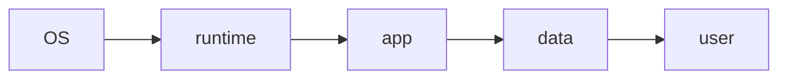

# IaaS, PaaS, SaaS

> Cloud Computing 101 시리즈 (2/10)


## 이 글에서 다룰 문제

*잘못된 모델 선택* 은 *비용* 과 *속도* 모두 망칩니다. *조직 단계* 에 *맞는* 추상화가 있습니다.

## 전체 흐름


## Before/After

**Before**: *모든 것* 을 *직접* (서버, OS, 앱).

**After**: *우리는 코드* 만, *나머지* 는 *플랫폼*.

## PaaS 예시 — 작은 Flask 앱

### 1단계 — 앱 코드

```python
# app.py
from flask import Flask
app = Flask(__name__)

@app.route("/")
def home():
    return {"hello": "cloud"}
```

### 2단계 — 의존성

```text
flask==3.0.0
gunicorn==21.2.0
```

### 3단계 — 실행 명령

```text
# Procfile
web: gunicorn app:app
```

### 4단계 — 배포 (PaaS는 이렇게 단순)

```bash
git init
git add .
git commit -m "init"
# example: heroku create && git push heroku main
```

### 5단계 — IaaS 와 비교

```python
# IaaS 라면 추가로:
# - VM 프로비저닝
# - OS 패키지 설치
# - reverse proxy 설정
# - 로그 수집기 설치
print("PaaS = git push, IaaS = 위 4단계 직접")
```

## 이 코드에서 주목할 점

- *PaaS* 는 *Procfile* 한 줄.
- *IaaS* 는 *모든 단계* 를 *우리가*.
- *SaaS* 는 *코드 자체* 가 없음.

## 자주 하는 실수 5가지

1. ***PaaS 인데* *VM 처럼* 다루기.**
2. ***IaaS* 로 가서 *운영 인력* 부족.**
3. ***SaaS* 의 *데이터 lock-in* 무시.**
4. ***FaaS 의 콜드 스타트* 미고려.**
5. ***모델 혼합* 시 *책임 경계* 모호.**

## 실무에서는 이렇게 쓰입니다

*초기 스타트업* 은 *PaaS (Heroku/Render)*, *성장 시* *IaaS (AWS/EKS)*, *보조 도구* 는 *SaaS (Notion/Slack)*.

## 체크리스트

- [ ] 워크로드별 *모델 매핑*.
- [ ] *공급사 잠금* 평가.
- [ ] *비용 시뮬레이션*.
- [ ] *운영 인력* 가용.

## 정리 및 다음 단계

모델을 골랐다면, *어디에서 돌릴지* 가 다음 질문입니다. 다음 글은 *Region* 과 *AZ*.

<!-- toc:begin -->
- [Cloud Computing이란 무엇인가?](./01-what-is-cloud-computing.md)
- **IaaS, PaaS, SaaS (현재 글)**
- Region과 Availability Zone (예정)
- Compute (예정)
- Storage (예정)
- Network (예정)
- Identity와 Security (예정)
- Monitoring (예정)
- Cost Management (예정)
- Cloud Architecture 기초 (예정)
<!-- toc:end -->

## 참고 자료

- [NIST SP 800-145 — Service Models](https://csrc.nist.gov/publications/detail/sp/800-145/final)
- [AWS — Types of Cloud Computing](https://aws.amazon.com/types-of-cloud-computing/)
- [Heroku — Platform 개요](https://devcenter.heroku.com/categories/platform)
- [Vercel — Serverless Functions](https://vercel.com/docs/functions)

Tags: Cloud, IaaS, PaaS, SaaS, Architecture
