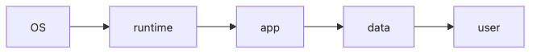

# IaaS, PaaS, SaaS

같은 클라우드라고 해도 어떤 서비스는 가상 머신을 직접 다루게 만들고, 어떤 서비스는 코드만 배포하면 끝나며, 어떤 서비스는 완성된 애플리케이션을 바로 쓰게 합니다. 이 차이를 감으로만 이해하면 팀 역량과 맞지 않는 선택을 하게 됩니다.

핵심 질문은 단순합니다. 누가 무엇을 운영하는가입니다. 이 한 문장을 붙잡고 보면 EC2, Heroku, Notion이 왜 모두 클라우드이면서도 전혀 다르게 느껴지는지 설명할 수 있습니다.

이 글은 Cloud Computing 101 시리즈의 2번째 글입니다.

여기서는 IaaS, PaaS, SaaS를 기능 이름이 아니라 책임 경계의 관점에서 정리하겠습니다.

## 이 글에서 다룰 문제

- EC2, Heroku, Notion처럼 모두 클라우드에 속하는 서비스가 왜 이렇게 다르게 느껴질까요?
- IaaS, PaaS, SaaS는 각각 어디까지를 사용자가 운영하고, 어디부터 공급자가 맡을까요?
- 조직 규모와 워크로드 특성에 따라 어떤 모델을 선택해야 할까요?
- 서버리스(FaaS)는 이 분류 안에서 어디쯤에 놓아야 할까요?
- 서비스 모델을 잘못 고르면 어떤 운영 문제가 생길까요?

> 서비스 모델의 차이는 기능 목록보다 운영 책임이 어디서 끊기는지에서 가장 분명하게 드러납니다.

## 왜 중요한가

작은 팀이 처음부터 IaaS 위에 모든 것을 직접 구축하면 속도가 크게 떨어질 수 있습니다. 반대로 세밀한 제어가 필요한 시스템을 PaaS에 무리하게 올리면 플랫폼 제약 때문에 우회 비용이 늘어납니다. 높은 추상화가 항상 더 좋은 것도 아니고, 낮은 추상화가 항상 더 유연한 정답도 아닙니다.

결국 서비스 모델은 기술 취향이 아니라 조직의 현재 상황을 반영하는 선택입니다. 배포 속도, 운영 인력, 규제 요구사항, 락인 허용 범위가 모두 여기에 연결됩니다.

## 한눈에 보는 개념



*서비스 모델이 높아질수록 사용자가 직접 운영하는 범위가 줄어드는 구조*
IaaS에서는 운영 체제와 런타임 관리가 여전히 사용자 쪽에 가깝습니다. PaaS에서는 운영 체제와 런타임을 플랫폼이 더 많이 맡습니다. SaaS에서는 사용자가 완성된 애플리케이션을 소비하는 쪽에 가까워집니다.

## 핵심 용어

- **IaaS**: 가상 머신, 디스크, 네트워크 같은 인프라 자원을 제공합니다.
- **PaaS**: 런타임과 배포 환경까지 포함해 애플리케이션 실행 기반을 제공합니다.
- **SaaS**: 완성된 소프트웨어를 서비스로 제공합니다.
- **FaaS**: 함수 단위로 코드를 실행하는 서버리스 모델입니다.
- **Managed**: 공급자가 운영을 대신 맡는 범위를 뜻합니다.

## Before / After

**Before**에서는 서버, 운영 체제, 런타임, 배포, 로그 수집까지 모두 팀이 직접 책임져야 했습니다.

**After**에서는 플랫폼이나 완성형 서비스를 선택함으로써 팀은 코드와 비즈니스 로직, 또는 실제 업무 흐름에 더 집중할 수 있습니다.

중요한 점은 추상화가 올라갈수록 운영 부담은 줄지만, 세밀한 제어권도 함께 줄어든다는 점입니다. 결국 무엇을 포기하고 무엇을 얻는지 이해해야 올바른 모델을 고를 수 있습니다.

## 실습: 작은 Flask 앱으로 보는 PaaS

PaaS가 왜 빠른지 감을 잡으려면 실제 배포 흐름을 보는 편이 좋습니다.

### 1단계 — 앱 코드

```python
# app.py
from flask import Flask
app = Flask(__name__)

@app.route("/")
def home():
    return {"hello": "cloud"}
```

### 2단계 — 의존성

```text
flask==3.0.0
gunicorn==21.2.0
```

### 3단계 — 실행 명령

```text
# Procfile
web: gunicorn app:app
```

### 4단계 — 배포 (PaaS is this short)

```bash
git init
git add .
git commit -m "init"
# example: heroku create && git push heroku main
```

### 5단계 — IaaS 비교

```python
# On IaaS you would also need to:
# - provision a VM
# - install OS packages
# - configure a reverse proxy
# - install a log shipper
print("PaaS = git push, IaaS = the four steps above by hand")
```

이 예제가 보여 주는 핵심은 배포 계약의 길이입니다. PaaS에서는 애플리케이션이 어떻게 실행될지만 명시하면 플랫폼이 많은 준비를 대신합니다. IaaS에서는 같은 앱 하나를 띄우기 위해 네트워크, OS 패키지, 웹 서버, 프로세스 관리, 로그 수집까지 직접 설계해야 합니다.

## 이 코드에서 먼저 봐야 할 점

- PaaS 배포에서는 Procfile 한 줄이 실행 계약이 됩니다.
- IaaS에서는 각 단계를 모두 팀이 설계하고 운영해야 합니다.
- SaaS에서는 애초에 이런 애플리케이션 코드를 우리가 배포하지 않을 수도 있습니다.

이 차이는 편의성의 차이를 넘어 팀 구조에도 영향을 줍니다. 운영 인력이 많지 않다면 PaaS가 빠른 선택일 수 있고, 플랫폼 제약을 감당하기 어렵다면 IaaS나 컨테이너 기반 운영이 더 맞을 수 있습니다.

## 이 예제를 실제로 검증하는 순서

이 예제의 핵심은 Flask 문법이 아니라 배포 계약이 얼마나 짧아지는지 눈으로 확인하는 데 있습니다. 로컬에서 먼저 PaaS가 기대하는 형태로 앱이 뜨는지 확인하면, 왜 PaaS가 운영 부담을 줄여 주는지 감이 빨리 옵니다.

```bash
pip install -r requirements.txt
gunicorn app:app --bind 0.0.0.0:8000
curl http://127.0.0.1:8000/
```

**Expected output:**

- Gunicorn 프로세스가 에러 없이 기동해야 합니다.
- `curl` 결과로 `{"hello":"cloud"}` 같은 JSON 응답이 보여야 합니다.
- 이 단계가 통과되면 PaaS가 요구하는 것은 런타임과 시작 명령이라는 점이 훨씬 분명해집니다.

### 자주 막히는 지점

- 로컬에서는 되는데 PaaS에서 실패한다면 `Procfile`의 시작 명령과 실제 모듈 경로가 다른 경우가 많습니다.
- IaaS 비교를 볼 때는 "PaaS가 마법처럼 다 해 준다"보다 "운영 책임을 어디서 끊어 주는가"에 초점을 두는 편이 좋습니다.
- SaaS를 평가할 때는 기능 목록만 보지 말고 데이터 내보내기와 SSO 같은 운영 항목도 함께 봐야 합니다.

## 서버리스는 어디에 들어갈까

FaaS는 보통 PaaS보다 더 높은 추상화로 이해하면 편합니다. 사용자는 함수 코드와 트리거에 집중하고, 인프라와 스케일링은 플랫폼이 대부분 맡습니다. 다만 콜드 스타트, 짧은 실행 시간, 상태 저장 제약이 있기 때문에 모든 워크로드에 잘 맞는 것은 아닙니다.

이벤트 기반 작업, 간헐적 실행, 배치성 처리에는 매우 강력할 수 있습니다. 반대로 긴 연결 유지나 큰 메모리 상태를 오래 붙잡는 애플리케이션에는 불리할 수 있습니다. 그래서 FaaS를 “더 현대적이니 무조건 낫다”로 보기보다, 이벤트 중심 워크로드에 잘 맞는 별도 실행 모델로 보는 편이 정확합니다.

## 선택 기준 5가지

1. 우리 팀은 운영 체제와 네트워크까지 직접 다룰 역량과 시간이 있는가.
2. 배포 속도와 제어권 중 무엇이 지금 더 중요한가.
3. 공급사 종속성을 얼마나 감수할 수 있는가.
4. 워크로드가 이벤트 기반인지, 장시간 실행형인지.
5. 보안과 규제 요구사항 때문에 세밀한 환경 제어가 필요한가.

초기 스타트업은 보통 속도가 더 중요하므로 PaaS나 관리형 서비스를 선호합니다. 반대로 대규모 플랫폼 팀은 비용 최적화와 세밀한 제어를 위해 IaaS나 컨테이너 플랫폼으로 이동하기도 합니다. SaaS는 직접 만들 이유가 없는 업무 영역에서 특히 강력합니다.

## 자주 하는 실수 5가지

1. PaaS를 VM처럼 다루려고 합니다.
2. 운영 인력이 부족한데도 IaaS를 먼저 선택합니다.
3. SaaS 도입 시 데이터 락인과 내보내기 전략을 무시합니다.
4. FaaS의 콜드 스타트와 실행 제약을 과소평가합니다.
5. 여러 모델을 섞어 쓰면서 책임 경계를 명확히 정리하지 않습니다.

실무에서는 다섯 번째 실수가 특히 자주 문제를 만듭니다. 인증은 SaaS, 앱은 PaaS, 데이터 처리는 IaaS에서 돌리는데 책임 문서가 없다면 장애가 났을 때 어디서 무슨 문제가 시작됐는지 추적하기 어려워집니다.

## 실무에서는 이렇게 생각합니다

- 공급자보다 우리가 더 잘할 수 있는 운영만 직접 맡습니다.
- PaaS에서 IaaS로 가는 이동은 비용과 제어권 사이의 교환입니다.
- SaaS의 가격에는 기능뿐 아니라 공급사 리스크도 포함됩니다.
- FaaS는 이벤트 기반 작업에 강력하지만 만능은 아닙니다.
- 추상화는 자유를 주지만 동시에 락인도 만듭니다.

## 체크리스트

- [ ] 각 워크로드가 적절한 서비스 모델에 매핑되어 있는가.
- [ ] 공급사 락인을 평가했는가.
- [ ] 비용을 단순 나열이 아니라 시뮬레이션했는가.
- [ ] 필요한 운영 인력이 준비되어 있는가.

## 연습 문제

1. 데이터베이스를 IaaS 위에 직접 운영하는 경우와 PaaS 데이터베이스를 쓰는 경우를 비교해 보세요.
2. FaaS에 잘 맞지 않는 워크로드 하나를 떠올려 보세요.
3. SaaS를 도입할 때 데이터 내보내기 기능이 왜 필수인지 설명해 보세요.

## 정리 및 다음 단계

IaaS, PaaS, SaaS의 차이는 기능 이름보다 책임 경계에서 분명해집니다. 어디까지를 우리가 운영하고, 어디부터를 공급자가 맡는지 이해하면 모델 선택이 훨씬 쉬워집니다. 다음 글에서는 모델을 골랐다면 그다음에 따라오는 질문, 즉 어디에서 실행할지를 보겠습니다.

<!-- toc:begin -->
- [Cloud Computing이란 무엇인가?](./01-what-is-cloud-computing.md)
- **IaaS, PaaS, SaaS (현재 글)**
- Region과 Availability Zone (예정)
- Compute (예정)
- Storage (예정)
- Network (예정)
- Identity와 Security (예정)
- Monitoring (예정)
- Cost Management (예정)
- Cloud Architecture 기초 (예정)
<!-- toc:end -->

## 참고 자료

- [NIST SP 800-145 — service models](https://csrc.nist.gov/publications/detail/sp/800-145/final)
- [AWS — types of cloud computing](https://aws.amazon.com/types-of-cloud-computing/)
- [Heroku — platform overview](https://devcenter.heroku.com/categories/platform)
- [Vercel — serverless functions](https://vercel.com/docs/functions)

Tags: Cloud, IaaS, PaaS, SaaS, Architecture
