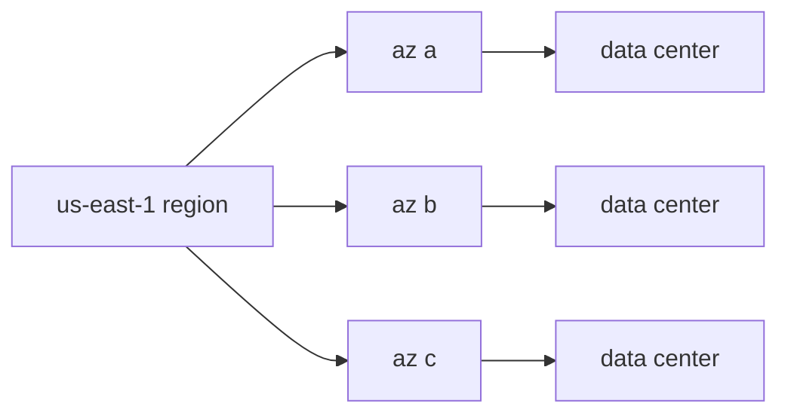

# Region과 Availability Zone

> Cloud Computing 101 시리즈 (3/10)


## 이 글에서 다룰 문제

모든 자원을 1개 AZ에만 두면 데이터센터 화재 같은 사고 한 번에 서비스가 멈출 수 있습니다. 가용성을 확보하려면 분산 배치가 전제입니다.

## 전체 흐름


## Before/After

**Before**: EC2 1대가 az a에 있고 RDS도 az a에 있습니다.

**After**: EC2는 a/b/c에 분산하고 RDS는 Multi-AZ로 구성합니다.

## Python으로 가용 AZ 조회

### 1단계 — 클라이언트

```python
import boto3
ec2 = boto3.client("ec2", region_name="us-east-1")
```

### 2단계 — AZ 목록

```python
def list_azs():
    res = ec2.describe_availability_zones()
    return [z["ZoneName"] for z in res["AvailabilityZones"]]

print(list_azs())
```

### 3단계 — 리전 목록

```python
def list_regions():
    res = boto3.client("ec2").describe_regions()
    return [r["RegionName"] for r in res["Regions"]]

print(list_regions())
```

### 4단계 — RTT 추정 (의사 코드)

```python
def estimate_rtt(km: float) -> float:
    # 광케이블 ~200,000 km/s, 왕복 + 라우터 오버헤드
    return (km / 200_000) * 2 * 1000 * 1.5  # ms
```

### 5단계 — 분산 배치 결정

```python
def placement(azs: list[str], replicas: int) -> list[str]:
    return [azs[i % len(azs)] for i in range(replicas)]

print(placement(["a", "b", "c"], 5))
```

## 이 코드에서 주목할 점

- AZ 이름은 계정마다 다를 수 있어서 실제 물리 매핑이 같다고 가정하면 안 됩니다.
- RTT는 물리 한계를 벗어날 수 없습니다.
- 예시의 분산 배치는 단순한 라운드로빈 방식입니다.

## 자주 하는 실수 5가지

1. **단일 AZ만 사용합니다.**
2. **Multi-Region을 적용하면서 지연 증가 비용을 고려하지 않습니다.**
3. **DB Failover 테스트를 하지 않습니다.**
4. **리전 간 데이터 동기화 문제를 무시합니다.**
5. **엣지 캐시를 활용하지 않습니다.**

## 실무에서는 이렇게 쓰입니다

결제 서비스는 Multi-AZ로 구성하고, 전 세계 CDN은 Edge를 활용하며, 재해 복구는 Multi-Region으로 설계합니다.

## 체크리스트

- [ ] AZ 분산을 적용했습니다.
- [ ] Failover를 자동화했습니다.
- [ ] RTO/RPO를 정의했습니다.
- [ ] 재해 훈련을 연 1회 이상 실시합니다.

## 정리 및 다음 단계

위치를 정했으니 이제 그 위에서 무엇을 돌릴지 판단해야 합니다. 다음 글은 Compute를 다룹니다.

<!-- toc:begin -->
- [Cloud Computing이란 무엇인가?](./01-what-is-cloud-computing.md)
- [IaaS, PaaS, SaaS](./02-iaas-paas-saas.md)
- **Region과 Availability Zone (현재 글)**
- Compute (예정)
- Storage (예정)
- Network (예정)
- Identity와 Security (예정)
- Monitoring (예정)
- Cost Management (예정)
- Cloud Architecture 기초 (예정)
<!-- toc:end -->

## 참고 자료

- [AWS — Regions and AZs](https://docs.aws.amazon.com/AWSEC2/latest/UserGuide/using-regions-availability-zones.html)
- [Google Cloud — geography and regions](https://cloud.google.com/about/locations)
- [Azure — regions](https://learn.microsoft.com/azure/reliability/availability-zones-overview)
- [Cloudflare — what is a CDN](https://www.cloudflare.com/learning/cdn/what-is-a-cdn/)

Tags: Cloud, AWS, Region, HighAvailability, Architecture
