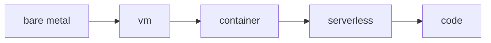

# Compute

VM·컨테이너·서버리스 등 클라우드 컴퓨트의 종류와 선택 기준을 boto3 EC2 예제와 함께 정리한 입문 글

이 글은 Cloud Computing 101 시리즈의 4번째 글입니다.

> Cloud Computing 101 시리즈 (4/10)


## 이 글에서 다룰 문제

컴퓨트 선택은 비용과 운영 부담에 직접 영향을 줍니다. 어떤 실행 모델을 고르느냐에 따라 비용 구조와 운영 방식이 함께 달라집니다.

## 전체 흐름


## Before/After

**Before**: 트래픽 피크에 맞춰 항상 큰 서버를 켜 둡니다. 여유분이 많아 보여도 대부분의 시간에는 낭비가 됩니다.

**After**: Auto Scaling으로 수요에 맞춰 인스턴스를 늘리고 줄입니다. 평균 구간에서는 비용을 아끼고, 피크 구간에서는 용량을 확보할 수 있습니다.

## boto3로 EC2 인스턴스 다루기

### 1단계 — 클라이언트

```python
import boto3
ec2 = boto3.client("ec2", region_name="us-east-1")
```

### 2단계 — 인스턴스 시작 (예시)

```python
def launch(ami: str, type_: str = "t3.micro"):
    res = ec2.run_instances(
        ImageId=ami, InstanceType=type_, MinCount=1, MaxCount=1,
    )
    return res["Instances"][0]["InstanceId"]
```

### 3단계 — 상태 조회

```python
def status(instance_id: str):
    res = ec2.describe_instances(InstanceIds=[instance_id])
    return res["Reservations"][0]["Instances"][0]["State"]["Name"]
```

### 4단계 — 종료

```python
def terminate(instance_id: str):
    ec2.terminate_instances(InstanceIds=[instance_id])
```

### 5단계 — 인스턴스 타입 읽기

```python
def parse_type(t: str) -> dict:
    family, size = t.split(".")
    return {"family": family, "size": size}

print(parse_type("t3.micro"))
print(parse_type("m5.large"))
```

## 이 코드에서 주목할 점

- AMI는 VM을 시작할 때 쓰는 기준 이미지입니다.
- `terminate`는 되돌릴 수 없는 종료 작업입니다.
- 인스턴스 타입 이름은 `family.size` 형식으로 읽으면 됩니다.

## 자주 하는 실수 5가지

1. **스팟 인스턴스를 데이터베이스에 사용합니다.** 중단 가능성이 있는 자원이라 상태 저장 워크로드와 맞지 않습니다.
2. **Auto Scaling을 설정하지 않습니다.** 평소에는 괜찮다가 피크 순간에만 서비스가 무너질 수 있습니다.
3. **예약 할인을 너무 많이 사 둡니다.** 기준 부하가 불안정한데 과도하게 약정하면 오히려 유연성을 잃습니다.
4. **인스턴스를 멈추면 비용이 완전히 사라진다고 생각합니다.** 디스크나 고정 IP 같은 부가 비용은 계속 남을 수 있습니다.
5. **로그를 외부로 보내지 않은 채 인스턴스를 종료합니다.** 장애 원인을 추적할 증거가 함께 사라집니다.

## 실무에서는 이렇게 쓰입니다

실무에서는 웹 계층에 On-Demand 인스턴스와 ASG를 두고, 배치 작업에는 Spot을 섞고, 안정적인 데이터베이스 부하에는 예약 할인을 붙이는 식으로 조합합니다. 실행 시간이 짧고 호출 패턴이 들쭉날쭉한 작업은 Lambda 같은 서버리스가 더 잘 맞을 수 있습니다.

## 체크리스트

- [ ] 워크로드별로 적절한 컴퓨트 모델을 매핑했는가.
- [ ] 각 계층에 ASG를 적용할 수 있는가.
- [ ] 예약 할인과 Spot 비율이 의도적으로 설계되어 있는가.
- [ ] 종료 정책과 로그 보존 방식이 문서화되어 있는가.

## 정리 및 다음 단계

컴퓨트가 코드를 실행한다면, 그 결과로 생기는 데이터는 어딘가에 안정적으로 저장되어야 합니다. 다음 글에서는 Storage를 보겠습니다.

<!-- toc:begin -->
- [Cloud Computing이란 무엇인가?](./01-what-is-cloud-computing.md)
- [IaaS, PaaS, SaaS](./02-iaas-paas-saas.md)
- [Region과 Availability Zone](./03-region-and-availability-zone.md)
- **Compute (현재 글)**
- Storage (예정)
- Network (예정)
- Identity와 Security (예정)
- Monitoring (예정)
- Cost Management (예정)
- Cloud Architecture 기초 (예정)
<!-- toc:end -->

## 참고 자료

- [AWS EC2 사용자 가이드](https://docs.aws.amazon.com/AWSEC2/latest/UserGuide/concepts.html)
- [AWS Auto Scaling](https://docs.aws.amazon.com/autoscaling/)
- [AWS — Spot Instances](https://docs.aws.amazon.com/AWSEC2/latest/UserGuide/using-spot-instances.html)
- [AWS Lambda 개요](https://docs.aws.amazon.com/lambda/latest/dg/welcome.html)

Tags: Cloud, Compute, EC2, AutoScaling, DevOps
