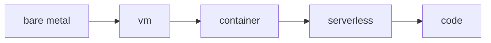

# Compute

클라우드에서 비용과 운영 피로를 가장 크게 좌우하는 축 중 하나가 컴퓨트입니다. 같은 애플리케이션이라도 VM에 올릴지, 컨테이너로 돌릴지, 서버리스로 실행할지에 따라 비용 구조와 운영 방식이 완전히 달라집니다. 이 글은 Cloud Computing 101 시리즈의 4번째 글입니다. 여기서는 VM, 컨테이너, 서버리스, 베어메탈을 어떤 기준으로 구분해야 하는지 살펴보겠습니다.

핵심은 기술 유행이 아니라 워크로드 적합성입니다. 좋은 팀은 “우리가 좋아하는 플랫폼이 무엇인가”보다 “이 워크로드가 어떤 실행 모델과 가장 잘 맞는가”를 먼저 묻습니다.

## 이 글에서 다룰 문제

- VM, 컨테이너, 서버리스, 베어메탈은 각각 어떤 상황에서 선택할까요?
- Auto Scaling은 실제로 무엇을 자동화하고 무엇은 자동화하지 않을까요?
- On-Demand, Reserved, Spot은 어떤 식으로 조합해야 할까요?
- 인스턴스 타입 이름은 어떻게 읽어야 할까요?
- 컴퓨트 선택에서 가장 자주 하는 실수는 무엇일까요?

> 컴퓨트는 코드를 실행하는 모든 수단이며, VM에서 서버리스로 갈수록 제어권 대신 자동화를 더 많이 얻게 됩니다.

## 왜 중요한가

컴퓨트 선택은 청구서와 운영 난이도에 직접 영향을 줍니다. 과하게 큰 서버를 항상 켜 두면 비용이 새고, 반대로 제약을 무시한 서버리스 선택은 디버깅과 운영에 더 큰 비용을 만들 수 있습니다.

특히 컴퓨트는 데이터, 네트워크, 보안과 모두 연결됩니다. 그래서 “어디서 실행할까”는 단일 서비스 선택이 아니라 전체 시스템의 운영 모델을 정하는 결정에 가깝습니다.

## 한눈에 보는 개념



왼쪽으로 갈수록 제어권이 크고, 오른쪽으로 갈수록 플랫폼 자동화가 많아집니다. 하지만 오른쪽으로 갈수록 언제나 더 좋다는 뜻은 아닙니다. 워크로드 특성과 팀 역량에 맞는 수준을 고르는 것이 중요합니다.

## 핵심 용어

- **EC2**: AWS의 VM 서비스입니다.
- **AMI**: VM 시작에 사용하는 이미지입니다.
- **Auto Scaling Group**: 수요에 따라 인스턴스를 자동으로 관리하는 기능입니다.
- **Spot**: 남는 용량을 할인된 가격으로 사용하는 방식입니다.
- **Reserved**: 1년 또는 3년 약정으로 할인을 받는 방식입니다.

## Before / After

**Before**에서는 트래픽 피크에 맞춰 항상 큰 서버를 켜 둡니다. 대부분의 시간에는 낭비가 됩니다.

**After**에서는 Auto Scaling Group이 수요에 맞춰 늘고 줄어듭니다. 평균 구간에서는 비용을 줄이고, 피크 구간에서는 용량을 확보할 수 있습니다.

## 실습: boto3로 EC2 인스턴스 다루기

### 1단계 — 클라이언트

```python
import boto3
ec2 = boto3.client("ec2", region_name="us-east-1")
```

### 2단계 — 인스턴스 시작

```python
def launch(ami: str, type_: str = "t3.micro"):
    res = ec2.run_instances(
        ImageId=ami, InstanceType=type_, MinCount=1, MaxCount=1,
    )
    return res["Instances"][0]["InstanceId"]
```

### 3단계 — 상태 조회

```python
def status(instance_id: str):
    res = ec2.describe_instances(InstanceIds=[instance_id])
    return res["Reservations"][0]["Instances"][0]["State"]["Name"]
```

### 4단계 — 종료

```python
def terminate(instance_id: str):
    ec2.terminate_instances(InstanceIds=[instance_id])
```

### 5단계 — 인스턴스 타입 읽기

```python
def parse_type(t: str) -> dict:
    family, size = t.split(".")
    return {"family": family, "size": size}

print(parse_type("t3.micro"))
print(parse_type("m5.large"))
```

이 예제는 컴퓨트가 얼마나 명시적인 자원인지를 잘 보여 줍니다. 어떤 이미지를 쓸지, 어떤 크기로 띄울지, 언제 종료할지, 비용과 성능을 어떤 이름 규칙으로 읽을지 모두 사용자가 결정합니다.

## 이 코드에서 먼저 봐야 할 점

- AMI는 VM의 출생 사진 같은 기준 이미지입니다.
- `terminate`는 되돌릴 수 없는 작업입니다.
- 인스턴스 타입 이름은 `family.size` 구조로 읽습니다.

이 세 가지를 이해하면 컴퓨트를 “그냥 서버 하나”가 아니라, 조합 가능한 자원 단위로 보기 쉬워집니다.

## 어떤 실행 모델을 언제 고를까

VM은 운영 체제 수준 제어가 필요할 때 강합니다. 컨테이너는 배포 일관성과 이식성이 중요할 때 좋습니다. 서버리스는 실행 시간이 짧고 변동성이 큰 워크로드에서 인간의 운영 시간을 크게 줄여 줍니다. 베어메탈은 특수한 성능 요구사항이나 하드웨어 제어가 필요할 때 고려합니다.

Auto Scaling도 오해가 많습니다. 이것은 애플리케이션 설계 문제를 자동으로 해결해 주는 기능이 아니라, 수요에 맞춰 인스턴스 개수를 조정하는 장치입니다. 애플리케이션이 상태를 내부에 품고 있다면 ASG를 붙여도 기대만큼 잘 확장되지 않습니다.

## 자주 하는 실수 5가지

1. Spot 인스턴스를 데이터베이스에 사용합니다.
2. Auto Scaling을 두지 않아 피크 순간에만 서비스가 무너집니다.
3. 유연성을 고려하지 않고 Reserved를 과도하게 구매합니다.
4. 중지한 인스턴스는 비용이 0이라고 생각합니다.
5. 로그를 외부로 보내지 않은 채 인스턴스를 종료합니다.

## 실무에서는 이렇게 생각합니다

- 워크로드에 컴퓨트를 맞추지, 컴퓨트에 워크로드를 억지로 맞추지 않습니다.
- Auto Scaling은 예외가 아니라 기본값에 가깝습니다.
- Spot은 재시도가 쉬운 작업에 배치합니다.
- Reserved는 안정적인 기준 부하에만 적용합니다.
- 서버리스는 컴퓨트 비용보다 사람의 운영 시간이 비쌀 때 특히 강력합니다.

## 체크리스트

- [ ] 워크로드별로 적절한 컴퓨트 모델을 매핑했는가.
- [ ] 각 계층에 Auto Scaling을 검토했는가.
- [ ] Reserved와 Spot 비율이 의도적으로 설계되어 있는가.
- [ ] 종료 정책과 로그 보존 방식이 문서화되어 있는가.

## 연습 문제

1. Lambda의 최대 실행 시간이 설계에 주는 제약을 설명해 보세요.
2. Spot 중단 알림이 왔을 때 graceful shutdown을 어떻게 구현할지 생각해 보세요.
3. `t3`와 `m5`를 워크로드 적합성 관점에서 비교해 보세요.

## 정리 및 다음 단계

컴퓨트가 코드를 실행한다면, 그 결과로 생기는 데이터는 어딘가에 안정적으로 저장되어야 합니다. 다음 글에서는 객체, 블록, 파일, 아카이브를 다루는 Storage로 넘어가겠습니다.

<!-- toc:begin -->
- [Cloud Computing이란 무엇인가?](./01-what-is-cloud-computing.md)
- [IaaS, PaaS, SaaS](./02-iaas-paas-saas.md)
- [Region과 Availability Zone](./03-region-and-availability-zone.md)
- **Compute (현재 글)**
- Storage (예정)
- Network (예정)
- Identity와 Security (예정)
- Monitoring (예정)
- Cost Management (예정)
- Cloud Architecture 기초 (예정)
<!-- toc:end -->

## 참고 자료

- [AWS EC2 user guide](https://docs.aws.amazon.com/AWSEC2/latest/UserGuide/concepts.html)
- [AWS Auto Scaling](https://docs.aws.amazon.com/autoscaling/)
- [AWS — Spot Instances](https://docs.aws.amazon.com/AWSEC2/latest/UserGuide/using-spot-instances.html)
- [AWS Lambda overview](https://docs.aws.amazon.com/lambda/latest/dg/welcome.html)

Tags: Cloud, Compute, EC2, AutoScaling, DevOps
