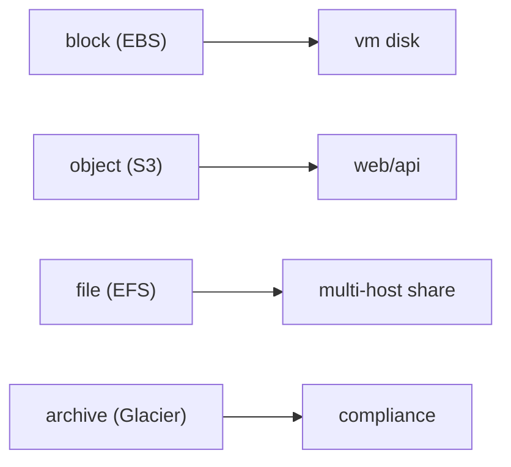

# Storage

> Cloud Computing 101 시리즈 (5/10)

<!-- a-grade-intro:begin -->

**핵심 질문**: *S3*, *EBS*, *EFS*, *Glacier* 는 *왜 다 따로* 있을까요?

> *클라우드 스토리지 는 *접근 방식* 과 *비용/내구성* 에 따라 *객체 / 블록 / 파일 / 아카이브* 로 나뉩니다.*

<!-- a-grade-intro:end -->

## 이 글에서 배울 것

- *4가지 스토리지* 의 차이
- *내구성 vs 가용성*
- *수명 주기 정책*
- *암호화* 기본
- 흔한 함정 5가지

## 왜 중요한가

*잘못된 스토리지* 는 *비싸고 느리고* *깨지기 쉽습니다*. 맞으면 *수년간* 그대로.

## 개념 한눈에 보기



## 핵심 용어 정리

- **Object**: *키-값 + 메타데이터*. *S3*.
- **Block**: *디스크* 처럼 *블록 단위*. *EBS*.
- **File**: *POSIX* 디렉터리. *EFS*.
- **Durability**: *데이터가 살아있을 확률* (예: 11 9s).
- **Lifecycle**: *시간* 따라 *티어 전환*.

## Before/After

**Before**: *모든 파일* 을 *VM 디스크* 에 → *백업 부담*.

**After**: *S3* 에 *객체 저장* + *Glacier* 로 *수명 주기*.

## 실습: S3 객체 라이프사이클

### 1단계 — 클라이언트

```python
import boto3
s3 = boto3.client("s3")
```

### 2단계 — 객체 업로드

```python
def put(bucket, key, body):
    s3.put_object(Bucket=bucket, Key=key, Body=body)
    return f"s3://{bucket}/{key}"
```

### 3단계 — 객체 조회

```python
def get(bucket, key):
    res = s3.get_object(Bucket=bucket, Key=key)
    return res["Body"].read()
```

### 4단계 — 라이프사이클 정책 (의사 JSON)

```python
policy = {
    "Rules": [{
        "ID": "to-glacier-after-90d",
        "Status": "Enabled",
        "Filter": {"Prefix": "logs/"},
        "Transitions": [{"Days": 90, "StorageClass": "GLACIER"}],
    }]
}
```

### 5단계 — 적용

```python
def apply_lifecycle(bucket, policy):
    s3.put_bucket_lifecycle_configuration(
        Bucket=bucket, LifecycleConfiguration=policy,
    )
```

## 이 코드에서 주목할 점

- *prefix* 로 *객체 묶음* 정책.
- *Transition* 은 *비용 절감* 의 *핵심*.
- *EBS* 는 *VM 1개* 와만 결합 (보통).

## 자주 하는 실수 5가지

1. ***공개 ACL* 로 *S3 노출*.**
2. ***라이프사이클 없음* → *비용 누적*.**
3. ***EBS 스냅샷* 미실시.**
4. ***EFS* 를 *고성능 IOPS* 가정.**
5. ***Glacier 복원 시간* 미고려.**

## 실무에서는 이렇게 쓰입니다

*로그* 는 *S3 → 90일 후 Glacier*, *DB 데이터* 는 *EBS gp3*, *공유 디렉터리* 는 *EFS*.

## 시니어 엔지니어는 이렇게 생각합니다

- *접근 패턴* 이 *스토리지 결정*.
- *암호화* 는 *기본*.
- *수명 주기* 는 *Day 1* 에 정의.
- *복원 비용* 도 *비용*.
- *백업 ≠ 복제*.

## 체크리스트

- [ ] *기본 암호화* 활성.
- [ ] *수명 주기* 정의.
- [ ] *공개 차단* 기본.
- [ ] *복원 테스트* 연 1회.

## 연습 문제

1. *Glacier 복원* 의 *3가지 속도 옵션* 을 적으세요 (의사 정답 가능).
2. *S3 versioning* 을 켜는 *적합한 시나리오* 를 들어 보세요.
3. *EBS* 와 *EFS* 의 *공유 가능성* 차이를 한 줄로.

## 정리 및 다음 단계

데이터가 자리잡았으면 *연결* 이 다음. 다음 글은 *Network*.

<!-- toc:begin -->
- [Cloud Computing이란 무엇인가?](./01-what-is-cloud-computing.md)
- [IaaS, PaaS, SaaS](./02-iaas-paas-saas.md)
- [Region과 Availability Zone](./03-region-and-availability-zone.md)
- [Compute](./04-compute.md)
- **Storage (현재 글)**
- Network (예정)
- Identity와 Security (예정)
- Monitoring (예정)
- Cost Management (예정)
- Cloud Architecture 기초 (예정)
<!-- toc:end -->

## 참고 자료

- [AWS S3 사용자 가이드](https://docs.aws.amazon.com/AmazonS3/latest/userguide/Welcome.html)
- [AWS EBS](https://docs.aws.amazon.com/ebs/latest/userguide/ebs-volume-types.html)
- [AWS EFS](https://docs.aws.amazon.com/efs/latest/ug/whatisefs.html)
- [AWS Glacier — restore options](https://docs.aws.amazon.com/AmazonS3/latest/userguide/restoring-objects-retrieval-options.html)

Tags: Cloud, Storage, S3, EBS, Architecture
