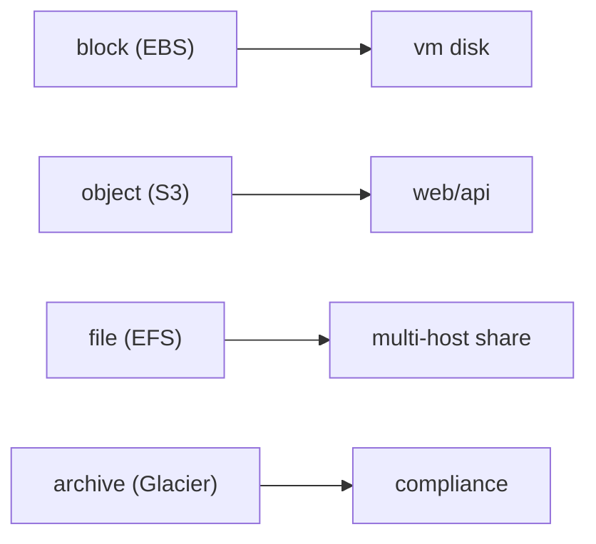

# Storage

클라우드 스토리지는 전부 비슷해 보이지만, 실제로는 접근 패턴과 내구성, 비용 구조에 따라 완전히 다른 서비스로 나뉩니다. S3, EBS, EFS, Glacier가 따로 존재하는 이유도 여기에 있습니다. 이 글은 Cloud Computing 101 시리즈의 5번째 글입니다. 여기서는 객체, 블록, 파일, 아카이브 스토리지를 어떤 기준으로 구분해야 하는지 살펴보겠습니다.

저장소를 잘못 고르면 비용이 늘고 성능이 흔들리며 복구 전략까지 취약해집니다. 반대로 처음에 맞는 저장소를 고르면 오랫동안 큰 수정 없이 안정적으로 운영할 수 있습니다.

## 이 글에서 다룰 문제

- 객체, 블록, 파일, 아카이브 스토리지는 각각 무엇이 다를까요?
- 내구성과 가용성은 왜 같은 말이 아닐까요?
- S3 라이프사이클 정책은 어떤 문제를 해결할까요?
- 암호화는 언제 선택 기능이 아니라 기본값이 될까요?
- 스토리지 선택에서 가장 자주 하는 실수는 무엇일까요?

> 스토리지는 접근 패턴과 내구성·비용의 균형에 따라 객체, 블록, 파일, 아카이브로 나뉩니다.

## 왜 중요한가

모든 데이터를 VM 디스크에 몰아넣는 방식은 처음에는 단순해 보여도 백업, 확장, 복구에서 빠르게 한계를 드러냅니다. 반대로 데이터의 성격에 맞춰 저장 계층을 분리하면 비용과 운영 모두 훨씬 예측 가능해집니다.

예를 들어 로그는 S3에 쌓아 두었다가 시간이 지나면 Glacier로 내리는 편이 합리적입니다. 데이터베이스 볼륨은 블록 스토리지가 적합하고, 여러 인스턴스가 공유해야 하는 디렉터리는 파일 스토리지가 맞습니다. 저장소는 “어디든 넣으면 되는 공간”이 아니라 워크로드 구조의 일부입니다.

## 한눈에 보는 개념



블록 스토리지는 디스크처럼, 객체 스토리지는 키-값 저장소처럼, 파일 스토리지는 공유 디렉터리처럼 동작합니다. 아카이브는 거의 읽지 않지만 오래 보관해야 하는 데이터를 위한 계층입니다.

## 핵심 용어

- **Object**: 메타데이터를 가진 키-값 객체 저장 방식입니다.
- **Block**: 고정 블록 단위의 디스크형 저장소입니다.
- **File**: POSIX 스타일 디렉터리 구조를 가진 파일시스템입니다.
- **Durability**: 데이터가 살아남을 확률입니다.
- **Lifecycle**: 시간이 지나면서 저장 계층을 전환하는 정책입니다.

## Before / After

**Before**에서는 모든 파일이 VM 디스크에 놓여 백업과 복구가 악몽이 됩니다.

**After**에서는 객체는 S3에 저장하고, 오래된 데이터는 Glacier로 넘기는 정책을 둡니다.

이렇게 계층을 나누면 저장 비용뿐 아니라 복구 전략도 훨씬 명확해집니다.

## 실습: S3 객체 라이프사이클

### 1단계 — 클라이언트

```python
import boto3
s3 = boto3.client("s3")
```

### 2단계 — 객체 업로드

```python
def put(bucket, key, body):
    s3.put_object(Bucket=bucket, Key=key, Body=body)
    return f"s3://{bucket}/{key}"
```

### 3단계 — 객체 조회

```python
def get(bucket, key):
    res = s3.get_object(Bucket=bucket, Key=key)
    return res["Body"].read()
```

### 4단계 — 라이프사이클 정책

```python
policy = {
    "Rules": [{
        "ID": "to-glacier-after-90d",
        "Status": "Enabled",
        "Filter": {"Prefix": "logs/"},
        "Transitions": [{"Days": 90, "StorageClass": "GLACIER"}],
    }]
}
```

### 5단계 — 적용

```python
def apply_lifecycle(bucket, policy):
    s3.put_bucket_lifecycle_configuration(
        Bucket=bucket, LifecycleConfiguration=policy,
    )
```

이 예제는 저장소 비용 최적화가 나중의 정리 작업이 아니라, 처음부터 정책으로 설계할 수 있는 영역이라는 점을 보여 줍니다. 데이터를 얼마나 오래 둘지, 언제 더 싼 계층으로 내릴지 미리 정해 두면 운영이 훨씬 단순해집니다.

## 이 코드에서 먼저 봐야 할 점

- Prefix를 기준으로 객체 묶음에 같은 정책을 적용할 수 있습니다.
- Transition 규칙이 실제 비용 절감의 핵심입니다.
- EBS는 보통 한 시점에 하나의 VM에 연결합니다.

## 내구성과 가용성은 왜 다를까

내구성은 데이터가 장기적으로 살아남는 가능성에 가깝고, 가용성은 지금 당장 읽고 쓸 수 있는가에 더 가깝습니다. 입문 단계에서는 이 둘을 같은 말처럼 쓰기 쉽지만, 실무에서는 분리해서 봐야 합니다.

예를 들어 아카이브 계층은 내구성이 매우 높아도 즉시 읽기에는 적합하지 않을 수 있습니다. 반대로 빠르게 접근 가능한 스토리지가 항상 가장 싸거나 가장 오래 보관하기 좋은 것은 아닙니다. 저장소 선택은 결국 접근 패턴을 기준으로 해야 합니다.

## 자주 하는 실수 5가지

1. 공개 ACL로 S3 버킷을 노출합니다.
2. 라이프사이클 정책을 만들지 않아 비용이 계속 누적됩니다.
3. EBS 스냅샷을 남기지 않습니다.
4. EFS를 고성능 IOPS 스토리지처럼 기대합니다.
5. Glacier 복원 시간을 고려하지 않습니다.

## 실무에서는 이렇게 생각합니다

- 접근 패턴이 저장소를 결정합니다.
- 암호화는 선택 기능이 아니라 기본값입니다.
- 라이프사이클 정책은 첫날부터 정의하는 편이 좋습니다.
- 복원 비용과 시간도 총비용의 일부입니다.
- 백업과 복제는 같은 개념이 아닙니다.

## 체크리스트

- [ ] 기본 암호화를 활성화했는가.
- [ ] 라이프사이클 정책을 정의했는가.
- [ ] 공개 접근 차단이 기본값으로 설정되어 있는가.
- [ ] 연 1회 이상 복원 테스트를 수행하는가.

## 연습 문제

1. Glacier의 복원 속도 계층 세 가지를 적어 보세요.
2. S3 버전 관리를 켜 둘 만한 현실적인 시나리오 하나를 설명해 보세요.
3. EBS와 EFS의 공유 방식 차이를 한 문장으로 정리해 보세요.

## 정리 및 다음 단계

데이터가 어디에 놓일지 정했다면, 이제는 그 데이터에 어떻게 연결하고 어떤 경로로 접근을 통제할지 살펴봐야 합니다. 다음 글에서는 Cloud 네트워킹의 기본인 Network로 넘어가겠습니다.

<!-- toc:begin -->
- [Cloud Computing이란 무엇인가?](./01-what-is-cloud-computing.md)
- [IaaS, PaaS, SaaS](./02-iaas-paas-saas.md)
- [Region과 Availability Zone](./03-region-and-availability-zone.md)
- [Compute](./04-compute.md)
- **Storage (현재 글)**
- Network (예정)
- Identity와 Security (예정)
- Monitoring (예정)
- Cost Management (예정)
- Cloud Architecture 기초 (예정)
<!-- toc:end -->

## 참고 자료

- [AWS S3 user guide](https://docs.aws.amazon.com/AmazonS3/latest/userguide/Welcome.html)
- [AWS EBS](https://docs.aws.amazon.com/ebs/latest/userguide/ebs-volume-types.html)
- [AWS EFS](https://docs.aws.amazon.com/efs/latest/ug/whatisefs.html)
- [AWS Glacier — restore options](https://docs.aws.amazon.com/AmazonS3/latest/userguide/restoring-objects-retrieval-options.html)

Tags: Cloud, Storage, S3, EBS, Architecture
