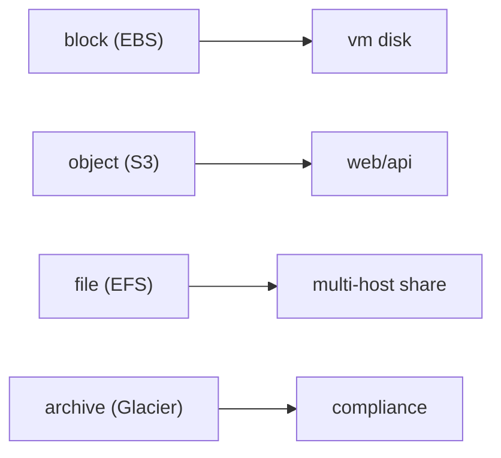

# Storage

> Cloud Computing 101 시리즈 (5/10)


## 이 글에서 다룰 문제

스토리지를 잘못 고르면 비용이 늘고 성능이 흔들리며 운영 복잡도도 커집니다. 반대로 처음에 잘 고르면 오랫동안 큰 수정 없이 안정적으로 사용할 수 있습니다.

## 전체 흐름


## Before/After

**Before**: 모든 파일을 VM 디스크에 올려 둡니다. 백업과 확장, 장애 복구를 전부 애플리케이션 팀이 떠안게 됩니다.

**After**: 객체는 S3에 저장하고, 오래된 데이터는 Glacier로 넘기는 수명 주기를 둡니다. 저장 계층을 나누면 비용과 복구 전략을 함께 관리하기 쉬워집니다.

## S3 객체 라이프사이클

### 1단계 — 클라이언트

```python
import boto3
s3 = boto3.client("s3")
```

### 2단계 — 객체 업로드

```python
def put(bucket, key, body):
    s3.put_object(Bucket=bucket, Key=key, Body=body)
    return f"s3://{bucket}/{key}"
```

### 3단계 — 객체 조회

```python
def get(bucket, key):
    res = s3.get_object(Bucket=bucket, Key=key)
    return res["Body"].read()
```

### 4단계 — 라이프사이클 정책 (의사 JSON)

```python
policy = {
    "Rules": [{
        "ID": "to-glacier-after-90d",
        "Status": "Enabled",
        "Filter": {"Prefix": "logs/"},
        "Transitions": [{"Days": 90, "StorageClass": "GLACIER"}],
    }]
}
```

### 5단계 — 적용

```python
def apply_lifecycle(bucket, policy):
    s3.put_bucket_lifecycle_configuration(
        Bucket=bucket, LifecycleConfiguration=policy,
    )
```

## 이 코드에서 주목할 점

- prefix를 기준으로 객체 묶음에 같은 정책을 적용할 수 있습니다.
- Transition 규칙은 장기 보관 비용을 줄이는 핵심 수단입니다.
- EBS는 보통 한 시점에 하나의 VM과 연결해 사용합니다.

## 자주 하는 실수 5가지

1. **공개 ACL로 S3 버킷을 노출합니다.** 기본 차단 정책 없이 운영하면 의도치 않은 공개로 이어질 수 있습니다.
2. **라이프사이클 정책을 만들지 않습니다.** 오래된 로그와 백업이 계속 쌓여 비용이 누적됩니다.
3. **EBS 스냅샷을 주기적으로 남기지 않습니다.** 볼륨 장애나 실수 복구가 어려워집니다.
4. **EFS를 고성능 IOPS 스토리지처럼 기대합니다.** 공유 파일시스템과 고성능 블록 스토리지는 목적이 다릅니다.
5. **Glacier 복원 시간을 고려하지 않습니다.** 필요할 때 바로 읽을 수 없어서 운영 일정이 꼬일 수 있습니다.

## 실무에서는 이렇게 쓰입니다

실무에서는 로그를 S3에 쌓아 두었다가 90일 뒤 Glacier로 넘기고, 데이터베이스 볼륨에는 EBS gp3를 쓰고, 여러 인스턴스가 함께 읽어야 하는 디렉터리는 EFS에 두는 식으로 역할을 나눕니다.

## 체크리스트

- [ ] 기본 암호화를 활성화했는가.
- [ ] 데이터 종류별 수명 주기를 정의했는가.
- [ ] 공개 접근 차단이 기본값으로 설정되어 있는가.
- [ ] 연 1회 이상 복원 테스트를 수행하는가.

## 정리 및 다음 단계

데이터가 어디에 놓일지 정했다면, 이제는 그 데이터에 어떻게 연결하고 어떤 경로로 접근을 통제할지 봐야 합니다. 다음 글에서는 Network를 다룹니다.

<!-- toc:begin -->
- [Cloud Computing이란 무엇인가?](./01-what-is-cloud-computing.md)
- [IaaS, PaaS, SaaS](./02-iaas-paas-saas.md)
- [Region과 Availability Zone](./03-region-and-availability-zone.md)
- [Compute](./04-compute.md)
- **Storage (현재 글)**
- Network (예정)
- Identity와 Security (예정)
- Monitoring (예정)
- Cost Management (예정)
- Cloud Architecture 기초 (예정)
<!-- toc:end -->

## 참고 자료

- [AWS S3 사용자 가이드](https://docs.aws.amazon.com/AmazonS3/latest/userguide/Welcome.html)
- [AWS EBS](https://docs.aws.amazon.com/ebs/latest/userguide/ebs-volume-types.html)
- [AWS EFS](https://docs.aws.amazon.com/efs/latest/ug/whatisefs.html)
- [AWS Glacier — restore options](https://docs.aws.amazon.com/AmazonS3/latest/userguide/restoring-objects-retrieval-options.html)

Tags: Cloud, Storage, S3, EBS, Architecture
