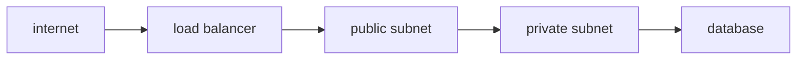

# Network

> Cloud Computing 101 시리즈 (6/10)


## 이 글에서 다룰 문제

네트워크 설계는 나중에 되돌리기 가장 어려운 결정 중 하나입니다. 초기에 잡은 VPC와 서브넷 구조가 운영 수년을 좌우하는 경우가 많습니다.

## 전체 흐름


## Before/After

**Before**: 모든 서버에 공인 IP를 붙입니다. 배포는 쉬워 보이지만 공격 표면이 급격히 넓어집니다.

**After**: 애플리케이션은 Private 서브넷에 두고 ALB만 외부에 노출합니다. 외부 진입점을 줄이면 보안과 운영 모두 단순해집니다.

## 보안 그룹 만들기

### 1단계 — 클라이언트

```python
import boto3
ec2 = boto3.client("ec2")
```

### 2단계 — SG 생성

```python
def create_sg(vpc_id, name):
    res = ec2.create_security_group(
        GroupName=name, Description=name, VpcId=vpc_id,
    )
    return res["GroupId"]
```

### 3단계 — 인바운드 허용

```python
def allow_https(sg_id):
    ec2.authorize_security_group_ingress(
        GroupId=sg_id,
        IpPermissions=[{
            "IpProtocol": "tcp", "FromPort": 443, "ToPort": 443,
            "IpRanges": [{"CidrIp": "0.0.0.0/0"}],
        }],
    )
```

### 4단계 — DB SG는 앱 SG만 허용

```python
def allow_db_from_app(db_sg, app_sg):
    ec2.authorize_security_group_ingress(
        GroupId=db_sg,
        IpPermissions=[{
            "IpProtocol": "tcp", "FromPort": 5432, "ToPort": 5432,
            "UserIdGroupPairs": [{"GroupId": app_sg}],
        }],
    )
```

### 5단계 — 검증

```python
def describe(sg_id):
    return ec2.describe_security_groups(GroupIds=[sg_id])
```

## 이 코드에서 주목할 점

- DB 보안 그룹은 CIDR보다 애플리케이션 보안 그룹을 참조하는 방식이 일반적입니다.
- `0.0.0.0/0`은 누구에게나 열겠다는 명시적 선언이므로 매우 신중해야 합니다.
- SG는 상태 저장 방식이고 NACL은 무상태 방식입니다.

## 자주 하는 실수 5가지

1. **SSH를 `0.0.0.0/0`으로 열어 둡니다.** 편하지만 가장 흔한 보안 사고 출발점이 됩니다.
2. **데이터베이스를 Public 서브넷에 둡니다.** 접근 경로를 줄여야 할 자원을 굳이 외부 가까이에 두는 셈입니다.
3. **NACL과 SG의 책임을 혼동합니다.** 문제를 추적할 때 어느 계층에서 막히는지 판단이 어려워집니다.
4. **Cross-AZ 트래픽 비용을 무시합니다.** 구조는 맞아도 데이터 이동 비용 때문에 예상보다 청구서가 커질 수 있습니다.
5. **Egress 규칙을 검토하지 않습니다.** 인바운드만 막고 아웃바운드를 방치하면 통제가 절반만 된 상태입니다.

## 실무에서는 이렇게 쓰입니다

실무에서는 ALB를 Public 서브넷에 두고, 앱 서버는 Private 서브넷에 넣고, RDS는 별도의 DB 전용 Private 서브넷에 배치하는 구성이 기본입니다. 외부 API 호출이 필요하면 NAT Gateway 같은 별도 출구를 둡니다.

## 체크리스트

- [ ] Public 서브넷에 데이터베이스가 없는가.
- [ ] 보안 그룹이 역할별로 분리되어 있는가.
- [ ] Flow Log가 활성화되어 있는가.
- [ ] Egress 규칙이 명시적으로 정의되어 있는가.

## 정리 및 다음 단계

연결 경로를 정했다면, 이제는 누가 어떤 권한으로 접근할지를 설계해야 합니다. 다음 글에서는 Identity와 Security를 보겠습니다.

<!-- toc:begin -->
- [Cloud Computing이란 무엇인가?](./01-what-is-cloud-computing.md)
- [IaaS, PaaS, SaaS](./02-iaas-paas-saas.md)
- [Region과 Availability Zone](./03-region-and-availability-zone.md)
- [Compute](./04-compute.md)
- [Storage](./05-storage.md)
- **Network (현재 글)**
- Identity와 Security (예정)
- Monitoring (예정)
- Cost Management (예정)
- Cloud Architecture 기초 (예정)
<!-- toc:end -->

## 참고 자료

- [AWS VPC 사용자 가이드](https://docs.aws.amazon.com/vpc/latest/userguide/what-is-amazon-vpc.html)
- [AWS Security Groups](https://docs.aws.amazon.com/vpc/latest/userguide/vpc-security-groups.html)
- [AWS Network ACL](https://docs.aws.amazon.com/vpc/latest/userguide/vpc-network-acls.html)
- [AWS Elastic Load Balancing](https://docs.aws.amazon.com/elasticloadbalancing/latest/userguide/what-is-load-balancing.html)

Tags: Cloud, Networking, VPC, Security, AWS
