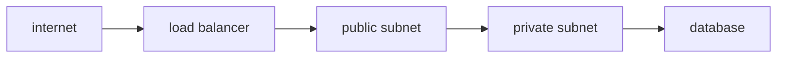

# Network

클라우드 네트워크는 처음 설계할 때는 단순해 보여도, 한번 구조가 잡히면 나중에 되돌리기 가장 어려운 영역 중 하나입니다. VPC, 서브넷, 보안 그룹, 로드밸런서는 이름만 보면 비슷하게 느껴지지만 서로 다른 층위의 책임을 맡습니다. 이 글은 Cloud Computing 101 시리즈의 6번째 글입니다. 여기서는 클라우드 네트워크를 격리, 배치, 허용, 분산이라는 네 단계로 이해해 보겠습니다.

좋은 네트워크 설계는 화려한 구성이 아니라 기본값을 얼마나 안전하게 잡았는가에서 드러납니다. 특히 외부에 공개되는 지점과 내부 자원이 구분되어야 이후의 보안과 운영이 훨씬 쉬워집니다.

## 이 글에서 다룰 문제

- VPC와 서브넷은 무엇이 다를까요?
- Security Group과 NACL은 왜 따로 존재할까요?
- Public 서브넷과 Private 서브넷은 어떤 패턴으로 나누는 것이 일반적일까요?
- 로드밸런서는 단순 라운드로빈 그 이상으로 어떤 역할을 할까요?
- 네트워크 설계에서 가장 자주 하는 실수는 무엇일까요?

> 클라우드 네트워킹은 VPC로 격리하고, 서브넷으로 배치하고, SG/NACL로 허용 범위를 정하고, LB로 트래픽을 분산하는 구조입니다.

## 왜 중요한가

초기 한 시간의 네트워크 설계가 이후 몇 년의 운영을 좌우하는 경우가 많습니다. 모든 서버에 공인 IP를 붙인 구조는 처음에는 단순해 보여도 공격 표면이 급격히 넓어집니다. 반대로 앱은 Private 서브넷에 두고 외부 공개는 ALB 한 지점으로 제한하면 보안과 운영이 함께 단순해집니다.

네트워크는 기능보다 경계를 설계하는 영역입니다. 그래서 한 번 꼬이면 단순한 설정 수정으로 해결되지 않고, 서비스 구조 전체를 다시 정리해야 하는 경우가 많습니다.

## 한눈에 보는 개념



외부 인터넷은 로드밸런서를 통해서만 들어오고, 애플리케이션과 데이터베이스는 내부로 감춥니다. 이 구조가 흔한 이유는 멋져서가 아니라, 공개 지점을 최소화하는 것이 가장 강력한 기본 보안이기 때문입니다.

## 핵심 용어

- **VPC**: 논리적으로 격리된 가상 네트워크입니다.
- **Subnet**: VPC 내부의 IP 범위이며, AZ 단위로 배치됩니다.
- **Security Group**: 인스턴스 단위의 상태 저장 방화벽입니다.
- **NACL**: 서브넷 단위의 무상태 방화벽입니다.
- **Load Balancer**: 여러 대상에 트래픽을 분산합니다.

## Before / After

**Before**에서는 모든 서버에 공인 IP를 붙입니다. 배포는 쉬워 보이지만 공격 표면이 크게 넓어집니다.

**After**에서는 앱은 Private 서브넷에 두고 ALB만 외부에 노출합니다. 데이터베이스는 별도의 내부 서브넷에 배치합니다.

## 실습: 보안 그룹 만들기

### 1단계 — 클라이언트

```python
import boto3
ec2 = boto3.client("ec2")
```

### 2단계 — SG 생성

```python
def create_sg(vpc_id, name):
    res = ec2.create_security_group(
        GroupName=name, Description=name, VpcId=vpc_id,
    )
    return res["GroupId"]
```

### 3단계 — 인바운드 허용

```python
def allow_https(sg_id):
    ec2.authorize_security_group_ingress(
        GroupId=sg_id,
        IpPermissions=[{
            "IpProtocol": "tcp", "FromPort": 443, "ToPort": 443,
            "IpRanges": [{"CidrIp": "0.0.0.0/0"}],
        }],
    )
```

### 4단계 — DB SG는 앱 SG만 허용

```python
def allow_db_from_app(db_sg, app_sg):
    ec2.authorize_security_group_ingress(
        GroupId=db_sg,
        IpPermissions=[{
            "IpProtocol": "tcp", "FromPort": 5432, "ToPort": 5432,
            "UserIdGroupPairs": [{"GroupId": app_sg}],
        }],
    )
```

### 5단계 — 검증

```python
def describe(sg_id):
    return ec2.describe_security_groups(GroupIds=[sg_id])
```

이 예제는 네트워크 보안에서 가장 흔한 패턴 하나를 보여 줍니다. 데이터베이스는 CIDR 대역 전체가 아니라 애플리케이션 보안 그룹 자체를 신뢰합니다. 즉, IP 주소보다 역할에 맞춰 접근을 허용하는 방식입니다.

## 이 코드에서 먼저 봐야 할 점

- DB 보안 그룹은 CIDR보다 애플리케이션 보안 그룹을 참조하는 방식이 일반적입니다.
- `0.0.0.0/0`은 전 세계에 열겠다는 명시적 선언입니다.
- SG는 상태 저장, NACL은 무상태라는 차이가 있습니다.

## Public / Private 패턴은 왜 기본값일까

Public 서브넷은 인터넷과 직접 연결될 수 있는 자원을 위한 공간입니다. Private 서브넷은 외부에서 직접 들어오지 못하고, 필요한 경우 NAT 같은 별도 출구를 통해서만 나갑니다. 앱 서버와 데이터베이스를 Private에 두는 이유는 단순합니다. 외부 공개가 꼭 필요한 지점만 공개하기 위해서입니다.

실무에서는 ALB를 Public 서브넷에 두고, 앱 서버는 Private 서브넷에, RDS는 DB 전용 Private 서브넷에 두는 구성이 기본입니다. 이렇게 하면 진입점이 명확해지고, 방화벽 규칙도 역할별로 단순하게 유지할 수 있습니다.

## 자주 하는 실수 5가지

1. SSH를 `0.0.0.0/0`으로 열어 둡니다.
2. 데이터베이스를 Public 서브넷에 둡니다.
3. NACL과 SG의 책임을 혼동합니다.
4. Cross-AZ 트래픽 비용을 무시합니다.
5. Egress 규칙을 검토하지 않습니다.

## 실무에서는 이렇게 생각합니다

- Private가 기본값이고, Public은 예외입니다.
- 보안 그룹은 역할별로 쪼개는 편이 낫습니다.
- 인바운드만큼 아웃바운드도 명시적으로 제한해야 합니다.
- VPC Flow Logs는 기본적으로 켜 두는 편이 좋습니다.
- CIDR 범위는 미래의 병합과 확장을 고려해 잡아야 합니다.

## 체크리스트

- [ ] Public 서브넷에 데이터베이스가 없는가.
- [ ] 보안 그룹이 역할별로 분리되어 있는가.
- [ ] Flow Logs가 활성화되어 있는가.
- [ ] Egress 규칙이 명시적으로 정의되어 있는가.

## 연습 문제

1. Security Group과 NACL의 차이 세 가지를 적어 보세요.
2. Public/Private 서브넷 분리가 보안에 도움이 되는 이유를 한 문장으로 설명해 보세요.
3. ALB와 NLB의 큰 차이 하나를 적어 보세요.

## 정리 및 다음 단계

연결 경로를 정했다면, 이제는 누가 어떤 권한으로 그 경로를 사용할지를 설계해야 합니다. 다음 글에서는 Identity와 Security를 다루겠습니다.

<!-- toc:begin -->
- [Cloud Computing이란 무엇인가?](./01-what-is-cloud-computing.md)
- [IaaS, PaaS, SaaS](./02-iaas-paas-saas.md)
- [Region과 Availability Zone](./03-region-and-availability-zone.md)
- [Compute](./04-compute.md)
- [Storage](./05-storage.md)
- **Network (현재 글)**
- Identity와 Security (예정)
- Monitoring (예정)
- Cost Management (예정)
- Cloud Architecture 기초 (예정)
<!-- toc:end -->

## 참고 자료

- [AWS VPC user guide](https://docs.aws.amazon.com/vpc/latest/userguide/what-is-amazon-vpc.html)
- [AWS Security Groups](https://docs.aws.amazon.com/vpc/latest/userguide/vpc-security-groups.html)
- [AWS Network ACL](https://docs.aws.amazon.com/vpc/latest/userguide/vpc-network-acls.html)
- [AWS Elastic Load Balancing](https://docs.aws.amazon.com/elasticloadbalancing/latest/userguide/what-is-load-balancing.html)

Tags: Cloud, Networking, VPC, Security, AWS
