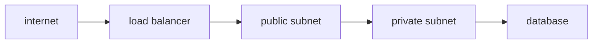

# Network

> Cloud Computing 101 시리즈 (6/10)


## 이 글에서 다룰 문제

*네트워크 설계* 는 *나중에 바꾸기 가장 어려운* 결정입니다. *처음 한 시간* 이 *수년* 을 좌우합니다.

## 개념 한눈에 보기



## Before/After

**Before**: *모든 서버* 가 *공인 IP* → *공격 표면* 폭발.

**After**: *Private 서브넷* 에 *앱 배치*, *ALB* 만 *공개 노출*.

## 실습: 보안 그룹 만들기

### 1단계 — 클라이언트

```python
import boto3
ec2 = boto3.client("ec2")
```

### 2단계 — SG 생성

```python
def create_sg(vpc_id, name):
    res = ec2.create_security_group(
        GroupName=name, Description=name, VpcId=vpc_id,
    )
    return res["GroupId"]
```

### 3단계 — 인바운드 허용

```python
def allow_https(sg_id):
    ec2.authorize_security_group_ingress(
        GroupId=sg_id,
        IpPermissions=[{
            "IpProtocol": "tcp", "FromPort": 443, "ToPort": 443,
            "IpRanges": [{"CidrIp": "0.0.0.0/0"}],
        }],
    )
```

### 4단계 — DB SG 는 *앱 SG* 만 허용

```python
def allow_db_from_app(db_sg, app_sg):
    ec2.authorize_security_group_ingress(
        GroupId=db_sg,
        IpPermissions=[{
            "IpProtocol": "tcp", "FromPort": 5432, "ToPort": 5432,
            "UserIdGroupPairs": [{"GroupId": app_sg}],
        }],
    )
```

### 5단계 — 검증

```python
def describe(sg_id):
    return ec2.describe_security_groups(GroupIds=[sg_id])
```

## 이 코드에서 주목할 점

- *DB SG* 는 *CIDR* 이 아닌 *SG 참조* 가 *정석*.
- *0.0.0.0/0* 은 *공개 노출* 의 *명시적 의도*.
- *SG* 는 *상태 저장*, *NACL* 은 *무상태*.

## 자주 하는 실수 5가지

1. ***0.0.0.0/0* 으로 *SSH* 개방.**
2. ***DB* 를 *Public 서브넷* 에 배치.**
3. ***NACL* 과 *SG* 의 *책임* 혼동.**
4. ***Cross-AZ* 트래픽 비용 무시.**
5. ***Egress* 룰 점검 누락.**

## 실무에서는 이렇게 쓰입니다

*ALB* 는 *Public* 서브넷, *앱* 은 *Private* 서브넷, *RDS* 는 *DB Private* 서브넷, *NAT Gateway* 로 *외부 호출*.

## 체크리스트

- [ ] *Public 서브넷* 에 *DB* 가 없는가.
- [ ] *SG* 가 *역할별* 로 분리되어 있는가.
- [ ] *Flow Log* 가 활성인가.
- [ ] *Egress* 가 *명시적* 인가.

## 정리 및 다음 단계

연결이 정해졌으면 *누가* 접근할지가 문제입니다. 다음 글은 *Identity와 Security*.

<!-- toc:begin -->
- [Cloud Computing이란 무엇인가?](./01-what-is-cloud-computing.md)
- [IaaS, PaaS, SaaS](./02-iaas-paas-saas.md)
- [Region과 Availability Zone](./03-region-and-availability-zone.md)
- [Compute](./04-compute.md)
- [Storage](./05-storage.md)
- **Network (현재 글)**
- Identity와 Security (예정)
- Monitoring (예정)
- Cost Management (예정)
- Cloud Architecture 기초 (예정)
<!-- toc:end -->

## 참고 자료

- [AWS VPC 사용자 가이드](https://docs.aws.amazon.com/vpc/latest/userguide/what-is-amazon-vpc.html)
- [AWS Security Groups](https://docs.aws.amazon.com/vpc/latest/userguide/vpc-security-groups.html)
- [AWS Network ACL](https://docs.aws.amazon.com/vpc/latest/userguide/vpc-network-acls.html)
- [AWS Elastic Load Balancing](https://docs.aws.amazon.com/elasticloadbalancing/latest/userguide/what-is-load-balancing.html)

Tags: Cloud, Networking, VPC, Security, AWS
