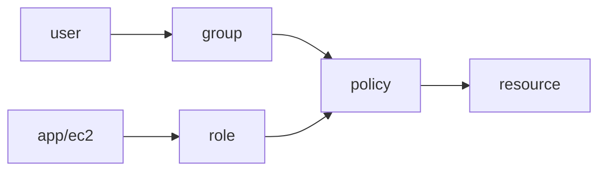

# Identity와 Security

IAM 사용자, 역할, 정책, MFA, KMS까지 클라우드 보안의 핵심을 boto3 예제와 최소 권한 원칙으로 정리한 입문 글

이 글은 Cloud Computing 101 시리즈의 7번째 글입니다.

> Cloud Computing 101 시리즈 (7/10)


## 이 글에서 다룰 문제

보안 사고의 대부분은 과도한 권한과 방치된 키에서 시작됩니다. IAM을 제대로 설계하면 사고의 영향 범위를 크게 줄일 수 있습니다.

## 전체 흐름


## Before/After

**Before**: 액세스 키를 코드에 하드코딩해서 유출 사고로 이어집니다.

**After**: EC2 Role을 부착하고 임시 토큰을 자동으로 갱신합니다.

## 최소 권한 정책

### 1단계 — 클라이언트

```python
import boto3, json
iam = boto3.client("iam")
```

### 2단계 — 정책 문서

```python
policy = {
    "Version": "2012-10-17",
    "Statement": [{
        "Effect": "Allow",
        "Action": ["s3:GetObject"],
        "Resource": "arn:aws:s3:::my-bucket/*",
    }],
}
```

### 3단계 — 정책 생성

```python
def create_policy(name, doc):
    res = iam.create_policy(
        PolicyName=name, PolicyDocument=json.dumps(doc),
    )
    return res["Policy"]["Arn"]
```

### 4단계 — 역할 생성 + 신뢰

```python
trust = {
    "Version": "2012-10-17",
    "Statement": [{
        "Effect": "Allow",
        "Principal": {"Service": "ec2.amazonaws.com"},
        "Action": "sts:AssumeRole",
    }],
}

def create_role(name):
    res = iam.create_role(
        RoleName=name, AssumeRolePolicyDocument=json.dumps(trust),
    )
    return res["Role"]["Arn"]
```

### 5단계 — 부착

```python
def attach(role_name, policy_arn):
    iam.attach_role_policy(RoleName=role_name, PolicyArn=policy_arn)
```

## 이 코드에서 주목할 점

- Role에는 신뢰 정책과 권한 정책 두 가지가 모두 필요합니다.
- Resource 범위는 가능한 한 좁게 잡아야 합니다.
- Action에는 와일드카드를 남용하지 않는 편이 좋습니다.

## 자주 하는 실수 5가지

1. **Action에 `*` 권한을 넓게 부여합니다.**
2. **액세스 키를 Git에 커밋합니다.**
3. **루트 계정으로 일상 작업을 처리합니다.**
4. **MFA를 적용하지 않습니다.**
5. **키 회전 정책이 없습니다.**

## 실무에서는 이렇게 쓰입니다

실무에서는 EC2 Role로 S3에 접근하고, KMS로 데이터를 암호화하며, AWS SSO로 직원 로그인을 관리합니다. MFA는 모든 사용자에게 필수로 적용하는 편이 안전합니다.

## 체크리스트

- [ ] 루트 계정에 MFA를 활성화했습니다.
- [ ] 키 회전 일정을 운영하고 있습니다.
- [ ] 가능하면 Role을 우선 사용합니다.
- [ ] CloudTrail을 활성화했습니다.

## 정리 및 다음 단계

권한 구성을 마쳤다면 이제 시스템에서 무슨 일이 일어나는지 관찰해야 합니다. 다음 글은 Monitoring을 다룹니다.

<!-- toc:begin -->
- [Cloud Computing이란 무엇인가?](./01-what-is-cloud-computing.md)
- [IaaS, PaaS, SaaS](./02-iaas-paas-saas.md)
- [Region과 Availability Zone](./03-region-and-availability-zone.md)
- [Compute](./04-compute.md)
- [Storage](./05-storage.md)
- [Network](./06-network.md)
- **Identity와 Security (현재 글)**
- Monitoring (예정)
- Cost Management (예정)
- Cloud Architecture 기초 (예정)
<!-- toc:end -->

## 참고 자료

- [AWS IAM 사용자 가이드](https://docs.aws.amazon.com/IAM/latest/UserGuide/introduction.html)
- [IAM 모범 사례](https://docs.aws.amazon.com/IAM/latest/UserGuide/best-practices.html)
- [AWS KMS](https://docs.aws.amazon.com/kms/latest/developerguide/overview.html)
- [AWS CloudTrail](https://docs.aws.amazon.com/awscloudtrail/latest/userguide/cloudtrail-user-guide.html)

Tags: Cloud, Security, IAM, AWS, Architecture
