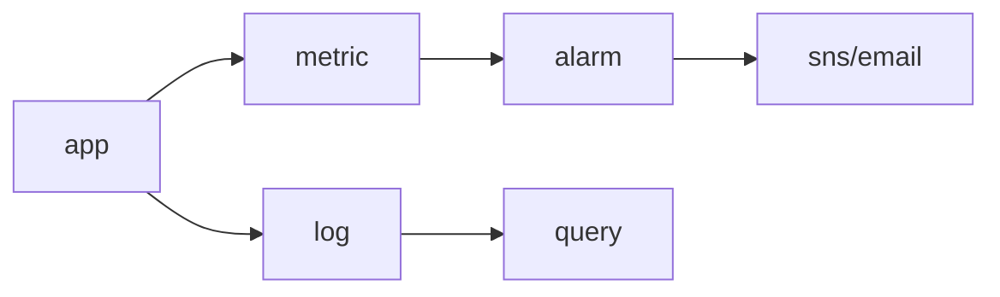

# Monitoring

> Cloud Computing 101 시리즈 (8/10)


## 이 글에서 다룰 문제

모니터링 없이 운영하면 장애를 가장 먼저 알아차리는 사람이 고객이 됩니다. 반대로 잘 설계된 알람 하나는 대응 시간을 크게 줄여 줍니다.

## 전체 흐름


## Before/After

**Before**: 오류를 고객 문의로 처음 알게 됩니다. 이미 서비스 영향이 밖으로 드러난 뒤에야 대응이 시작됩니다.

**After**: 5xx 비율이 임계값을 넘으면 Slack이나 온콜 채널로 즉시 알림이 갑니다. 문제를 먼저 감지하고 선제적으로 대응할 수 있습니다.

## CloudWatch 알람

### 1단계 — 클라이언트

```python
import boto3
cw = boto3.client("cloudwatch")
sns = boto3.client("sns")
```

### 2단계 — 토픽 만들기

```python
def create_topic(name):
    res = sns.create_topic(Name=name)
    return res["TopicArn"]
```

### 3단계 — 구독 (이메일)

```python
def subscribe(topic_arn, email):
    sns.subscribe(
        TopicArn=topic_arn, Protocol="email", Endpoint=email,
    )
```

### 4단계 — CPU 알람

```python
def cpu_alarm(name, instance_id, topic_arn):
    cw.put_metric_alarm(
        AlarmName=name,
        Namespace="AWS/EC2",
        MetricName="CPUUtilization",
        Dimensions=[{"Name": "InstanceId", "Value": instance_id}],
        Statistic="Average",
        Period=60, EvaluationPeriods=5,
        Threshold=80.0, ComparisonOperator="GreaterThanThreshold",
        AlarmActions=[topic_arn],
    )
```

### 5단계 — 사용자 정의 메트릭

```python
def emit(value):
    cw.put_metric_data(
        Namespace="MyApp",
        MetricData=[{"MetricName": "OrdersPerMin", "Value": value}],
    )
```

## 이 코드에서 주목할 점

- `Period`와 `EvaluationPeriods` 조합이 알람 민감도를 결정합니다.
- 사용자 정의 메트릭은 비즈니스 지표를 관측할 때 유용합니다.
- Topic을 사용하면 알람 발신과 수신 대상을 분리할 수 있습니다.

## 자주 하는 실수 5가지

1. **모든 항목에 알람을 겁니다.** 결국 아무 알람도 중요하게 보이지 않는 알람 피로로 이어집니다.
2. **로그만 있고 메트릭이 없습니다.** 상태 추세를 빠르게 판단하기 어려워집니다.
3. **임계값이 너무 민감하거나 너무 둔감합니다.** 거짓 양성이나 탐지 지연이 반복됩니다.
4. **로그 보존 기간을 무기한으로 둡니다.** 필요 이상으로 저장 비용이 계속 늘어납니다.
5. **대시보드를 너무 복잡하게 만듭니다.** 급한 상황에서 핵심 신호가 눈에 들어오지 않습니다.

## 실무에서는 이렇게 쓰입니다

실무에서는 ALB 5xx 비율, RDS 연결 수, Lambda 에러율, 주문 생성 분당 건수 같은 지표를 한 대시보드에 모으고, 핵심 항목만 알람으로 연결합니다. 알람은 Slack이나 PagerDuty처럼 실제 대응 채널로 이어져야 의미가 있습니다.

## 체크리스트

- [ ] 핵심 메트릭에 대한 알람이 존재하는가.
- [ ] 로그 보존 정책을 설정했는가.
- [ ] 운영용 대시보드를 최소 1개 이상 유지하는가.
- [ ] 온콜 통보 경로를 실제로 점검했는가.

## 정리 및 다음 단계

관측 체계를 갖췄다면 이제는 그 시스템을 얼마에 운영하는지도 봐야 합니다. 다음 글에서는 Cost Management를 다룹니다.

<!-- toc:begin -->
- [Cloud Computing이란 무엇인가?](./01-what-is-cloud-computing.md)
- [IaaS, PaaS, SaaS](./02-iaas-paas-saas.md)
- [Region과 Availability Zone](./03-region-and-availability-zone.md)
- [Compute](./04-compute.md)
- [Storage](./05-storage.md)
- [Network](./06-network.md)
- [Identity와 Security](./07-identity-and-security.md)
- **Monitoring (현재 글)**
- Cost Management (예정)
- Cloud Architecture 기초 (예정)
<!-- toc:end -->

## 참고 자료

- [AWS CloudWatch 사용자 가이드](https://docs.aws.amazon.com/AmazonCloudWatch/latest/monitoring/WhatIsCloudWatch.html)
- [CloudWatch Logs Insights](https://docs.aws.amazon.com/AmazonCloudWatch/latest/logs/AnalyzingLogData.html)
- [AWS X-Ray](https://docs.aws.amazon.com/xray/latest/devguide/aws-xray.html)
- [Google SRE Book — Monitoring](https://sre.google/sre-book/monitoring-distributed-systems/)

Tags: Cloud, Monitoring, CloudWatch, AWS, Observability
