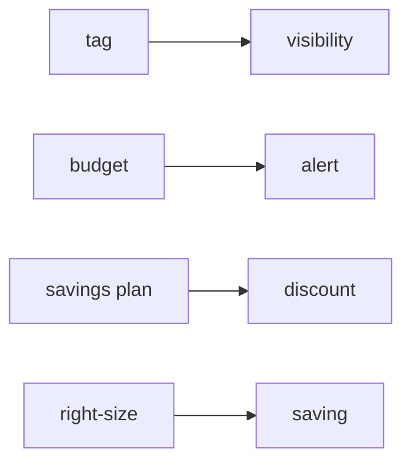

# Cost Management

> Cloud Computing 101 시리즈 (9/10)


## 이 글에서 다룰 문제

*첫 청구서* 의 *놀람* 은 *전형적* 입니다. *FinOps* 는 *엔지니어링* 의 일부입니다.

## 전체 흐름


## Before/After

**Before**: *모든 인스턴스* 가 *m5.xlarge*, *야간* 에도 *풀타임 가동*.

**After**: *비프로덕션* 은 *야간 정지*, *프로덕션* 은 *Savings Plans*.

## 예산 만들기

### 1단계 — 클라이언트

```python
import boto3
budgets = boto3.client("budgets")
account_id = boto3.client("sts").get_caller_identity()["Account"]
```

### 2단계 — 예산 정의

```python
budget = {
    "BudgetName": "monthly-cap",
    "BudgetLimit": {"Amount": "500", "Unit": "USD"},
    "TimeUnit": "MONTHLY",
    "BudgetType": "COST",
}
```

### 3단계 — 알림 정의

```python
notif = [{
    "Notification": {
        "NotificationType": "ACTUAL",
        "ComparisonOperator": "GREATER_THAN",
        "Threshold": 80.0,
        "ThresholdType": "PERCENTAGE",
    },
    "Subscribers": [{"SubscriptionType": "EMAIL", "Address": "ops@example.com"}],
}]
```

### 4단계 — 생성

```python
def create_budget():
    budgets.create_budget(
        AccountId=account_id,
        Budget=budget,
        NotificationsWithSubscribers=notif,
    )
```

### 5단계 — 태그 강제 (의사 정책)

```python
require_tags = {
    "Effect": "Deny",
    "Action": "ec2:RunInstances",
    "Resource": "*",
    "Condition": {"Null": {"aws:RequestTag/Project": "true"}},
}
```

## 이 코드에서 주목할 점

- *80%* 알림은 *행동 시간* 을 줍니다.
- *Tag* 정책은 *비용 추적* 의 *전제 조건*.
- *예산* 은 *팀 단위* 로도 가능.

## 자주 하는 실수 5가지

1. ***태그* 없는 *리소스* 방치.**
2. ***예산 알림* 없음.**
3. ***SP* 를 *과다 약정*.**
4. ***고가 인스턴스* 를 *유휴 상태* 로 방치.**
5. ***NAT/데이터 전송 비용* 간과.**

## 실무에서는 이렇게 쓰입니다

*Project=acme* 태그로 *팀 비용 분리*, *야간 자동 정지* Lambda, *SP 1년 약정*, *분기별* *라이트사이징* 회의.

## 체크리스트

- [ ] *모든 리소스* 에 *Project 태그*.
- [ ] *월 예산* 알림 활성.
- [ ] *유휴 자원* 정기 점검.
- [ ] *SP/RI* 검토 분기 1회.

## 정리 및 다음 단계

운영, 보안, 비용까지 다 봤으면 *전체 그림* 을 묶어 봅니다. 다음 글은 *Cloud Architecture 기초*.

<!-- toc:begin -->
- [Cloud Computing이란 무엇인가?](./01-what-is-cloud-computing.md)
- [IaaS, PaaS, SaaS](./02-iaas-paas-saas.md)
- [Region과 Availability Zone](./03-region-and-availability-zone.md)
- [Compute](./04-compute.md)
- [Storage](./05-storage.md)
- [Network](./06-network.md)
- [Identity와 Security](./07-identity-and-security.md)
- [Monitoring](./08-monitoring.md)
- **Cost Management (현재 글)**
- Cloud Architecture 기초 (예정)
<!-- toc:end -->

## 참고 자료

- [AWS Billing 사용자 가이드](https://docs.aws.amazon.com/awsaccountbilling/latest/aboutv2/billing-what-is.html)
- [AWS Budgets](https://docs.aws.amazon.com/cost-management/latest/userguide/budgets-managing-costs.html)
- [Savings Plans](https://docs.aws.amazon.com/savingsplans/latest/userguide/what-is-savings-plans.html)
- [FinOps Foundation](https://www.finops.org/framework/)

Tags: Cloud, FinOps, Cost, AWS, Architecture
