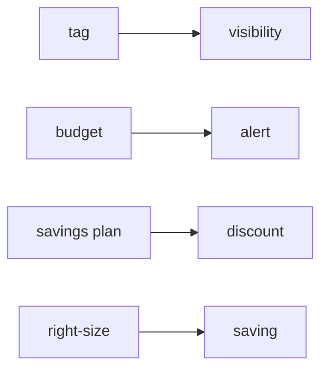

# Cost Management

> Cloud Computing 101 시리즈 (9/10)


## 이 글에서 다룰 문제

첫 클라우드 청구서를 보고 놀라는 일은 흔합니다. 비용 관리는 재무팀만의 일이 아니라 엔지니어링의 일부로 다뤄야 합니다.

## 전체 흐름


## Before/After

**Before**: 모든 인스턴스를 m5.xlarge로 맞춰 두고 밤에도 그대로 켜 둡니다. 사용량 차이를 반영하지 못해 불필요한 비용이 계속 나갑니다.

**After**: 비프로덕션 환경은 야간에 자동으로 멈추고, 안정적인 프로덕션 부하는 Savings Plans로 할인받습니다. 같은 워크로드라도 운영 방식에 따라 청구서가 크게 달라집니다.

## 예산 만들기

### 1단계 — 클라이언트

```python
import boto3
budgets = boto3.client("budgets")
account_id = boto3.client("sts").get_caller_identity()["Account"]
```

### 2단계 — 예산 정의

```python
budget = {
    "BudgetName": "monthly-cap",
    "BudgetLimit": {"Amount": "500", "Unit": "USD"},
    "TimeUnit": "MONTHLY",
    "BudgetType": "COST",
}
```

### 3단계 — 알림 정의

```python
notif = [{
    "Notification": {
        "NotificationType": "ACTUAL",
        "ComparisonOperator": "GREATER_THAN",
        "Threshold": 80.0,
        "ThresholdType": "PERCENTAGE",
    },
    "Subscribers": [{"SubscriptionType": "EMAIL", "Address": "ops@example.com"}],
}]
```

### 4단계 — 생성

```python
def create_budget():
    budgets.create_budget(
        AccountId=account_id,
        Budget=budget,
        NotificationsWithSubscribers=notif,
    )
```

### 5단계 — 태그 강제 (의사 정책)

```python
require_tags = {
    "Effect": "Deny",
    "Action": "ec2:RunInstances",
    "Resource": "*",
    "Condition": {"Null": {"aws:RequestTag/Project": "true"}},
}
```

## 이 코드에서 주목할 점

- 80% 예산 알림은 대응할 시간을 벌어 줍니다.
- 태그 강제 정책은 비용 추적의 출발점입니다.
- 예산은 계정 전체뿐 아니라 팀 단위로도 나눠 관리할 수 있습니다.

## 자주 하는 실수 5가지

1. **태그 없는 리소스를 그대로 둡니다.** 나중에 비용 원인을 팀별로 나누어 보기 어려워집니다.
2. **예산 알림을 만들지 않습니다.** 이상 지출을 청구서가 나온 뒤에야 발견하게 됩니다.
3. **Savings Plans를 과하게 약정합니다.** 실제 변동 폭보다 큰 약정은 할인보다 제약으로 돌아올 수 있습니다.
4. **비싼 인스턴스를 유휴 상태로 방치합니다.** 꼭 필요한 시간에만 켜도 되는 자원이 상시 과금됩니다.
5. **NAT와 데이터 전송 비용을 과소평가합니다.** 컴퓨트보다 잘 안 보여서 더 늦게 발견되는 경우가 많습니다.

## 실무에서는 이렇게 쓰입니다

실무에서는 `Project=acme` 같은 태그로 팀별 비용을 분리하고, 비프로덕션은 Lambda나 스케줄러로 야간 자동 정지를 걸고, 안정적인 기준 부하에는 1년 단위 Savings Plans를 적용합니다. 여기에 분기별 라이트사이징 리뷰를 더해 조금씩 낭비를 줄여 갑니다.

## 체크리스트

- [ ] 모든 리소스에 `Project` 태그가 있는가.
- [ ] 월 예산 알림이 활성화되어 있는가.
- [ ] 유휴 자원을 정기적으로 점검하는가.
- [ ] SP와 RI를 분기마다 한 번 이상 검토하는가.

## 정리 및 다음 단계

운영, 보안, 비용을 각각 이해했다면 이제는 이 요소들을 하나의 설계로 묶어 볼 차례입니다. 다음 글에서는 Cloud Architecture 기초를 다룹니다.

<!-- toc:begin -->
- [Cloud Computing이란 무엇인가?](./01-what-is-cloud-computing.md)
- [IaaS, PaaS, SaaS](./02-iaas-paas-saas.md)
- [Region과 Availability Zone](./03-region-and-availability-zone.md)
- [Compute](./04-compute.md)
- [Storage](./05-storage.md)
- [Network](./06-network.md)
- [Identity와 Security](./07-identity-and-security.md)
- [Monitoring](./08-monitoring.md)
- **Cost Management (현재 글)**
- Cloud Architecture 기초 (예정)
<!-- toc:end -->

## 참고 자료

- [AWS Billing 사용자 가이드](https://docs.aws.amazon.com/awsaccountbilling/latest/aboutv2/billing-what-is.html)
- [AWS Budgets](https://docs.aws.amazon.com/cost-management/latest/userguide/budgets-managing-costs.html)
- [Savings Plans](https://docs.aws.amazon.com/savingsplans/latest/userguide/what-is-savings-plans.html)
- [FinOps Foundation](https://www.finops.org/framework/)

Tags: Cloud, FinOps, Cost, AWS, Architecture
