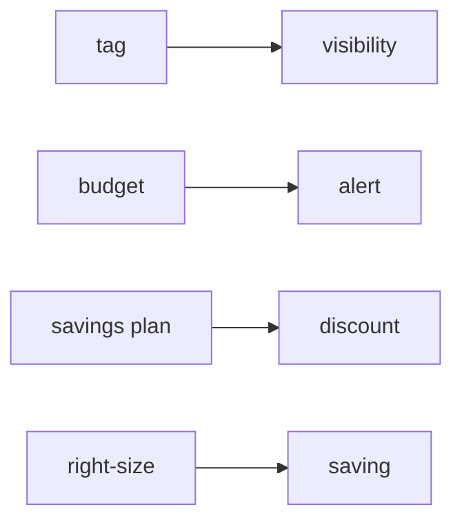

# Cost Management

클라우드에서는 기능을 만드는 속도만큼 비용도 빠르게 늘 수 있습니다. 첫 청구서를 보고 놀라는 일은 너무 흔해서 거의 통과 의례처럼 취급되기도 합니다. 이 글은 Cloud Computing 101 시리즈의 9번째 글입니다. 여기서는 태그, 예산, Savings Plans, 라이트사이징을 중심으로 비용 관리를 엔지니어링의 일부로 보는 관점을 정리하겠습니다.

핵심은 비용을 나중에 보는 회계 숫자가 아니라, 설계와 운영의 결과로 읽는 것입니다. 보이지 않는 비용은 줄일 수 없고, 책임이 배정되지 않은 비용은 계속 커집니다.

## 이 글에서 다룰 문제

- 클라우드 비용은 왜 예상보다 자주 높게 나올까요?
- 태그는 비용 배분에서 어떤 역할을 할까요?
- 예산 알림은 언제 만들어야 할까요?
- Savings Plans와 Reserved Instances는 어떻게 다를까요?
- 비용 관리에서 가장 자주 하는 실수는 무엇일까요?

> 클라우드 비용은 태그로 보이게 만들고, 예산으로 경고하고, 약정 할인으로 줄이며, 라이트사이징으로 다듬는 흐름으로 관리합니다.

## 왜 중요한가

비용 놀람은 기술 팀이 피할 수 없는 운명이 아닙니다. 대부분은 가시성 부족, 태그 부재, 유휴 자원 방치, 너무 이른 약정 같은 반복 가능한 실수에서 시작됩니다. 그래서 FinOps는 재무팀의 뒷정리가 아니라 엔지니어링 팀의 설계 습관에 가깝습니다.

비용은 성능이나 가용성과 다르게 보이지 않는 경우가 많습니다. 시스템은 멀쩡히 동작하는데 청구서만 커질 수 있기 때문입니다. 그래서 더 의도적으로 설계하고 점검해야 합니다.

## 한눈에 보는 개념



비용 관리의 첫 단계는 보이게 만드는 것입니다. 그다음 알림을 걸고, 안정적인 부하에는 약정을 적용하고, 마지막으로 실제 사용량에 맞춰 자원 크기를 줄입니다.

## 핵심 용어

- **Tag**: 리소스에 붙이는 키-값 레이블입니다.
- **Budget**: 월별 한도와 알림 규칙입니다.
- **Savings Plans**: 일정 사용량을 약정하고 할인을 받는 방식입니다.
- **Reserved Instance**: 특정 인스턴스 계열에 더 강하게 묶이는 할인 방식입니다.
- **Rightsizing**: 실제 사용량에 맞춰 자원을 줄이거나 바꾸는 작업입니다.

## Before / After

**Before**에서는 모든 인스턴스를 `m5.xlarge`로 맞춰 두고 밤에도 그대로 켜 둡니다.

**After**에서는 비프로덕션은 야간에 자동으로 멈추고, 안정적인 프로덕션 부하는 Savings Plans로 할인받습니다.

이 차이는 큰 혁신보다 작은 운영 습관이 비용에 얼마나 큰 영향을 주는지 보여 줍니다.

## 실습: 예산 만들기

### 1단계 — 클라이언트

```python
import boto3
budgets = boto3.client("budgets")
account_id = boto3.client("sts").get_caller_identity()["Account"]
```

### 2단계 — 예산 정의

```python
budget = {
    "BudgetName": "monthly-cap",
    "BudgetLimit": {"Amount": "500", "Unit": "USD"},
    "TimeUnit": "MONTHLY",
    "BudgetType": "COST",
}
```

### 3단계 — 알림 정의

```python
notif = [{
    "Notification": {
        "NotificationType": "ACTUAL",
        "ComparisonOperator": "GREATER_THAN",
        "Threshold": 80.0,
        "ThresholdType": "PERCENTAGE",
    },
    "Subscribers": [{"SubscriptionType": "EMAIL", "Address": "ops@example.com"}],
}]
```

### 4단계 — 생성

```python
def create_budget():
    budgets.create_budget(
        AccountId=account_id,
        Budget=budget,
        NotificationsWithSubscribers=notif,
    )
```

### 5단계 — 태그 강제 정책

```python
require_tags = {
    "Effect": "Deny",
    "Action": "ec2:RunInstances",
    "Resource": "*",
    "Condition": {"Null": {"aws:RequestTag/Project": "true"}},
}
```

이 예제는 비용 관리가 보고서 읽기로 끝나지 않는다는 점을 보여 줍니다. 태그가 없으면 누가 비용을 만들었는지 추적할 수 없고, 예산 알림이 없으면 이상 징후를 너무 늦게 발견하게 됩니다. 비용 관리도 결국 정책과 자동화 문제입니다.

## 이 코드에서 먼저 봐야 할 점

- 80% 예산 알림은 대응할 시간을 벌어 줍니다.
- 태그 강제 정책은 비용 추적의 출발점입니다.
- 예산은 계정 전체뿐 아니라 팀 단위로도 나눌 수 있습니다.

## Savings Plans와 라이트사이징은 어떻게 함께 쓰나

약정 할인은 변동성이 낮은 기준 부하에 적용할 때 가장 효과적입니다. 아직 사용 패턴을 잘 모르는 단계에서 과하게 약정하면 할인보다 제약이 더 커질 수 있습니다. 그래서 보통은 먼저 사용량을 관찰하고, 그다음 안정적인 부분에만 약정을 얹습니다.

라이트사이징은 이와 별개로 계속 반복해야 하는 작업입니다. 한때 적절했던 인스턴스 크기가 지금도 적절하다는 보장은 없습니다. 비용 최적화는 한 번의 큰 결정보다 정기적인 작은 조정의 합에 가깝습니다.

## 자주 하는 실수 5가지

1. 태그 없는 리소스를 그대로 둡니다.
2. 예산 알림을 만들지 않습니다.
3. Savings Plans를 과하게 약정합니다.
4. 비싼 인스턴스를 유휴 상태로 방치합니다.
5. NAT와 데이터 전송 비용을 과소평가합니다.

## 실무에서는 이렇게 생각합니다

- 비용은 설계 지표입니다.
- 태그는 FinOps의 입구입니다.
- 실제 변동성을 본 뒤에만 약정을 걸어야 합니다.
- 데이터 전송 비용은 보이지 않는 곳에서 커지기 쉽습니다.
- 비용 리뷰는 정기 리듬으로 운영해야 합니다.

## 체크리스트

- [ ] 모든 리소스에 `Project` 태그가 있는가.
- [ ] 월 예산 알림이 활성화되어 있는가.
- [ ] 유휴 자원을 정기적으로 점검하는가.
- [ ] SP와 RI를 분기마다 한 번 이상 검토하는가.

## 연습 문제

1. On-Demand와 Savings Plans의 차이를 한 줄로 설명해 보세요.
2. 비용 추적에 필요한 최소 태그 세 가지를 적어 보세요.
3. NAT Gateway 비용을 줄이는 전략 하나를 제안해 보세요.

## 정리 및 다음 단계

운영, 보안, 비용을 각각 이해했다면 이제는 이 조각들을 하나의 설계 그림으로 묶어야 합니다. 다음 글에서는 시리즈 마지막으로 Cloud Architecture 기초를 정리하겠습니다.

<!-- toc:begin -->
- [Cloud Computing이란 무엇인가?](./01-what-is-cloud-computing.md)
- [IaaS, PaaS, SaaS](./02-iaas-paas-saas.md)
- [Region과 Availability Zone](./03-region-and-availability-zone.md)
- [Compute](./04-compute.md)
- [Storage](./05-storage.md)
- [Network](./06-network.md)
- [Identity와 Security](./07-identity-and-security.md)
- [Monitoring](./08-monitoring.md)
- **Cost Management (현재 글)**
- Cloud Architecture 기초 (예정)
<!-- toc:end -->

## 참고 자료

- [AWS Billing user guide](https://docs.aws.amazon.com/awsaccountbilling/latest/aboutv2/billing-what-is.html)
- [AWS Budgets](https://docs.aws.amazon.com/cost-management/latest/userguide/budgets-managing-costs.html)
- [Savings Plans](https://docs.aws.amazon.com/savingsplans/latest/userguide/what-is-savings-plans.html)
- [FinOps Foundation](https://www.finops.org/framework/)

Tags: Cloud, FinOps, Cost, AWS, Architecture
