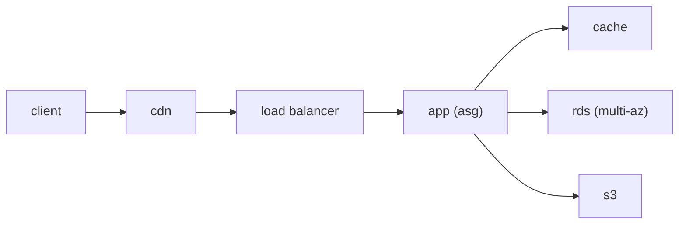

# Cloud Architecture 기초

> Cloud Computing 101 시리즈 (10/10)

<!-- a-grade-intro:begin -->

**핵심 질문**: 시리즈 전체를 *하나의 시스템* 으로 *어떻게 묶어야* 잘 만든 *클라우드 아키텍처* 가 될까요?

> *Well-Architected 의 *5대 기둥* (운영, 보안, 신뢰성, 성능, 비용) 을 *기준* 으로 삼고, *다층 구조* 로 *느슨하게 결합* 하면 됩니다.*

<!-- a-grade-intro:end -->

## 이 글에서 배울 것

- *Well-Architected 5대 기둥*
- *다층 웹 아키텍처* 패턴
- *Stateless* 와 *Stateful* 분리
- *IaC* 의 가치
- 흔한 함정 5가지

## 왜 중요한가

*동일한 기능* 도 *아키텍처* 에 따라 *비용*, *가용성*, *유지보수* 가 *10배* 차이가 납니다. *시리즈 마무리* 에서 *전체 그림* 을 잡습니다.

## 개념 한눈에 보기



## 핵심 용어 정리

- **Well-Architected**: AWS *모범 설계* 프레임워크.
- **Stateless**: *서버* 가 *상태 보관* 안 함.
- **IaC**: *인프라를 코드* 로 관리 (Terraform, CloudFormation).
- **Loose coupling**: *큐* 등으로 *분리*.
- **Idempotent**: *같은 요청* 을 *반복해도 안전*.

## Before/After

**Before**: *모놀리스* 가 *단일 서버* 에 박혀 *변경 두렵고* *장애에 취약*.

**After**: *Stateless 앱* + *Multi-AZ DB* + *IaC*, *변경* 이 *안전*.

## 실습: 다층 웹 아키텍처 (의사 코드)

### 1단계 — IaC 골조 (Terraform 의사 코드)

```python
def vpc(): return {"cidr": "10.0.0.0/16", "azs": 2}
def subnets(): return ["public-a", "public-b", "private-a", "private-b"]
```

### 2단계 — 컴퓨트

```python
def asg(min_, max_): return {"min": min_, "max": max_, "policy": "cpu>60"}
```

### 3단계 — 데이터

```python
def rds(): return {"engine": "postgres", "multi_az": True, "backup_days": 7}
def cache(): return {"engine": "redis", "nodes": 2}
```

### 4단계 — 객체/큐

```python
def s3(): return {"versioning": True, "lifecycle": "to-glacier-90d"}
def queue(): return {"visibility_timeout": 30, "dlq": True}
```

### 5단계 — 라우팅

```python
def alb(): return {"listeners": [{"port": 443, "tls": True}], "target": "asg"}
```

## 이 코드에서 주목할 점

- *Multi-AZ* 가 *기본*.
- *DLQ* 로 *재시도 안전망*.
- *Stateless* 라야 *ASG* 가 산다.

## 자주 하는 실수 5가지

1. ***Stateful 앱* 을 *수평 확장* 시도.**
2. ***Single-AZ DB* 운영.**
3. ***IaC* 없이 *수동 변경*.**
4. ***재시도 없이* *외부 호출*.**
5. ***백업 복구* 미연습.**

## 실무에서는 이렇게 쓰입니다

*CloudFront* + *ALB* + *ASG* + *RDS Multi-AZ* + *Redis* + *S3*, *Terraform* 으로 *환경* 별 *동일 구성*, *온콜* 은 *대시보드* 와 *Runbook* 으로 운영.

## 시니어 엔지니어는 이렇게 생각합니다

- *Well-Architected* 는 *체크리스트* 가 아니라 *대화 도구*.
- *변경 안전성* 이 *최고 가치*.
- *복원 훈련* 이 *백업* 보다 중요.
- *작게 시작*, *모듈화* 로 성장.
- *문서* 와 *Runbook* 은 *코드* 의 일부.

## 체크리스트

- [ ] *Multi-AZ* 적용.
- [ ] *IaC* 로 환경 재현.
- [ ] *복원* 훈련 정기 실시.
- [ ] *5대 기둥* 점검 분기 1회.

## 연습 문제

1. *Well-Architected 5대 기둥* 을 모두 적으세요.
2. *Stateless* 를 만드는 *대표 기법* 한 가지를 들어 보세요.
3. *IaC* 가 *수동 변경* 보다 *안전한 이유* 를 한 줄로.

## 정리 및 다음 단계

여기까지가 *Cloud Computing 101* 의 끝입니다. 다음은 *Containers 101*, *Kubernetes 101*, *Serverless 101* 으로 *컴퓨트 추상화* 를 깊게 봅니다.

<!-- toc:begin -->
- [Cloud Computing이란 무엇인가?](./01-what-is-cloud-computing.md)
- [IaaS, PaaS, SaaS](./02-iaas-paas-saas.md)
- [Region과 Availability Zone](./03-region-and-availability-zone.md)
- [Compute](./04-compute.md)
- [Storage](./05-storage.md)
- [Network](./06-network.md)
- [Identity와 Security](./07-identity-and-security.md)
- [Monitoring](./08-monitoring.md)
- [Cost Management](./09-cost-management.md)
- **Cloud Architecture 기초 (현재 글)**
<!-- toc:end -->

## 참고 자료

- [AWS Well-Architected Framework](https://docs.aws.amazon.com/wellarchitected/latest/framework/welcome.html)
- [Multi-AZ 설계](https://docs.aws.amazon.com/whitepapers/latest/aws-overview/global-infrastructure.html)
- [Terraform AWS Provider](https://registry.terraform.io/providers/hashicorp/aws/latest/docs)
- [Twelve-Factor App](https://12factor.net/)

Tags: Cloud, Architecture, WellArchitected, AWS, DevOps
