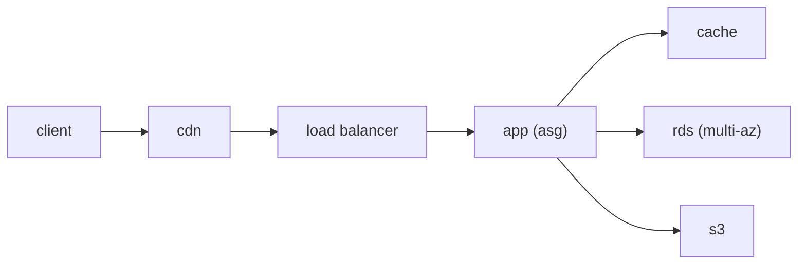

# Cloud Architecture 기초

> Cloud Computing 101 시리즈 (10/10)


## 이 글에서 다룰 문제

같은 기능이라도 아키텍처에 따라 비용, 가용성, 유지보수 난도가 크게 달라집니다. 이 글에서는 시리즈 전체 내용을 하나의 설계 관점으로 묶어 보겠습니다.

## 전체 흐름


## Before/After

**Before**: 모놀리식 애플리케이션이 단일 서버 한 대에 묶여 있습니다. 작은 변경도 부담스럽고, 서버 하나의 장애가 곧 전체 장애로 이어집니다.

**After**: Stateless 앱 계층, Multi-AZ 데이터베이스, IaC 기반 배포를 조합합니다. 구조를 나누면 변경과 복구가 훨씬 안전해집니다.

## 다층 웹 아키텍처 (의사 코드)

### 1단계 — IaC 골조 (Terraform 의사 코드)

```python
def vpc(): return {"cidr": "10.0.0.0/16", "azs": 2}
def subnets(): return ["public-a", "public-b", "private-a", "private-b"]
```

### 2단계 — 컴퓨트

```python
def asg(min_, max_): return {"min": min_, "max": max_, "policy": "cpu>60"}
```

### 3단계 — 데이터

```python
def rds(): return {"engine": "postgres", "multi_az": True, "backup_days": 7}
def cache(): return {"engine": "redis", "nodes": 2}
```

### 4단계 — 객체/큐

```python
def s3(): return {"versioning": True, "lifecycle": "to-glacier-90d"}
def queue(): return {"visibility_timeout": 30, "dlq": True}
```

### 5단계 — 라우팅

```python
def alb(): return {"listeners": [{"port": 443, "tls": True}], "target": "asg"}
```

## 이 코드에서 주목할 점

- Multi-AZ는 선택 기능이 아니라 기본 전제로 보는 편이 안전합니다.
- DLQ는 재시도 실패를 흡수하는 안전망 역할을 합니다.
- ASG를 제대로 활용하려면 애플리케이션이 Stateless해야 합니다.

## 자주 하는 실수 5가지

1. **상태를 내부 메모리에 둔 앱을 그대로 수평 확장하려고 합니다.** 확장 이후 세션 일관성과 장애 복구가 어려워집니다.
2. **데이터베이스를 Single-AZ로 운영합니다.** 한 장애 영역의 문제를 그대로 서비스 전체가 떠안게 됩니다.
3. **IaC 없이 수동 변경에 의존합니다.** 환경 차이와 재현 불가능한 설정이 쌓이기 쉽습니다.
4. **외부 호출에 재시도를 넣지 않습니다.** 일시적인 네트워크 실패가 바로 사용자 오류로 번질 수 있습니다.
5. **백업은 하지만 복구 연습을 하지 않습니다.** 실제 복원 시점에 절차가 검증되지 않았다는 문제가 드러납니다.

## 실무에서는 이렇게 쓰입니다

실무에서는 CloudFront, ALB, ASG, RDS Multi-AZ, Redis, S3를 조합한 전형적인 다층 웹 구조를 자주 봅니다. Terraform 같은 IaC로 환경별 구성을 반복 가능하게 만들고, 온콜 운영은 대시보드와 Runbook에 기대는 방식이 일반적입니다.

## 체크리스트

- [ ] Multi-AZ 구성이 적용되어 있는가.
- [ ] IaC로 환경을 재현할 수 있는가.
- [ ] 복원 훈련을 정기적으로 실시하는가.
- [ ] 5대 기둥 기준 점검을 분기마다 수행하는가.

## 정리 및 다음 단계

여기까지가 Cloud Computing 101의 마무리입니다. 다음 시리즈에서는 Containers 101, Kubernetes 101, Serverless 101으로 넘어가 컴퓨트 추상화를 더 깊게 다룰 예정입니다.

<!-- toc:begin -->
- [Cloud Computing이란 무엇인가?](./01-what-is-cloud-computing.md)
- [IaaS, PaaS, SaaS](./02-iaas-paas-saas.md)
- [Region과 Availability Zone](./03-region-and-availability-zone.md)
- [Compute](./04-compute.md)
- [Storage](./05-storage.md)
- [Network](./06-network.md)
- [Identity와 Security](./07-identity-and-security.md)
- [Monitoring](./08-monitoring.md)
- [Cost Management](./09-cost-management.md)
- **Cloud Architecture 기초 (현재 글)**
<!-- toc:end -->

## 참고 자료

- [AWS Well-Architected Framework](https://docs.aws.amazon.com/wellarchitected/latest/framework/welcome.html)
- [Multi-AZ 설계](https://docs.aws.amazon.com/whitepapers/latest/aws-overview/global-infrastructure.html)
- [Terraform AWS Provider](https://registry.terraform.io/providers/hashicorp/aws/latest/docs)
- [Twelve-Factor App](https://12factor.net/)

Tags: Cloud, Architecture, WellArchitected, AWS, DevOps
