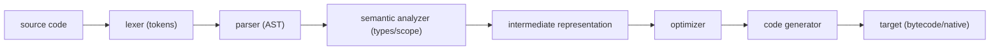

# Compilers 101 (1/10): What Is a Compiler?

This is the first post in the Compilers 101 series.

> Compilers 101 series (1/10)

**Core question**: How many stages sit between writing `2 + 3 * 4` and getting the result `14`?

> A compiler is a program that translates a program written in one language into another (usually less abstract). The translation does not happen in one step — it runs as a **pipeline**: lexer, parser, semantic analyzer, IR, optimizer, code generator. Once you can draw this pipeline in your head, every compiler, interpreter, and transpiler looks like a variation of the same picture.


*compilers 101 chapter 1 flow overview*

## Questions to Keep in Mind

- How would you define a compiler in one line?
- What stages make up the standard compiler pipeline?
- How much of that pipeline do interpreters and transpilers share?

## Why It Matters

The meaning of error messages ("is this syntax or semantic?"), why builds are slow ("optimization is expensive"), how new languages get built — all of it is about which stage of the pipeline you are in. Knowing the stages makes the tools usable.

> Knowing compilers means being able to answer "how far did this line get translated, and where did it stop?"



These six nodes are also the table of contents for this series. We take them one at a time.

## Key Terms

- **Compiler**: A program that translates one (source) language into another (target).
- **Interpreter**: A program that executes the source directly. Usually shares the front-end stages with a compiler.
- **Transpiler**: A compiler between two languages of similar abstraction (TS to JS).
- **Pipeline**: A structure that transforms input stage by stage.
- **Frontend / Backend**: Stages closer to the source / closer to the target.

## Before/After

**Before — "compilation is magic"**

```text
.c → ??? → a.out
```

**After — a pipeline with stages**

```text
.c → lex → parse → check → IR → optimize → codegen → a.out
```

Each stage acts like a function with a defined input and output. That is the power of separation.

## Hands-on: One Expression's Journey

### Step 1 — Tokenize: text into meaningful chunks

```python
# 1_lex.py
import re
from dataclasses import dataclass

@dataclass
class Token:
    kind: str
    text: str

PATTERNS = [
    ("NUM", r"\d+"),
    ("OP",  r"[+\-*/]"),
    ("WS",  r"\s+"),
]

def lex(src: str) -> list[Token]:
    tokens, i = [], 0
    while i < len(src):
        for kind, pat in PATTERNS:
            m = re.match(pat, src[i:])
            if m:
                if kind != "WS":
                    tokens.append(Token(kind, m.group()))
                i += m.end()
                break
        else:
            raise SyntaxError(src[i])
    return tokens

print(lex("2 + 3 * 4"))
```

A string becomes `[NUM 2, OP +, NUM 3, OP *, NUM 4]` — meaningful units.

### Step 2 — Parse: tokens into a tree

```python
# 2_parse.py
from dataclasses import dataclass
@dataclass
class Num: value: int
@dataclass
class BinOp: op: str; left: object; right: object

# input: 2 + 3 * 4 (precedence ignored for this sketch)
def parse(tokens):
    def parse_expr(i):
        left = Num(int(tokens[i].text)); i += 1
        while i < len(tokens) and tokens[i].kind == "OP":
            op = tokens[i].text; i += 1
            right = Num(int(tokens[i].text)); i += 1
            left = BinOp(op, left, right)
        return left, i
    tree, _ = parse_expr(0)
    return tree

# Real precedence handling shows up in ep03. For now we just need a tree.
```

Now we have a **tree** rather than text. A much better shape for asking semantic questions.

### Step 3 — Semantic analysis: "does this make sense?"

```python
# 3_check.py
def check(node):
    if isinstance(node, Num):
        return "int"
    t1 = check(node.left); t2 = check(node.right)
    if t1 != "int" or t2 != "int":
        raise TypeError("only int supported")
    return "int"
```

This stage answers "do the types line up?" and "are variables declared?"

### Step 4 — Evaluation (a tiny interpreter)

```python
# 4_eval.py
def evaluate(node):
    if isinstance(node, Num):
        return node.value
    a, b = evaluate(node.left), evaluate(node.right)
    return {"+": a+b, "-": a-b, "*": a*b, "/": a//b}[node.op]
```

If we stop here, the program is an **interpreter**. Send the same tree on to code generation and it becomes a compiler.

### Step 5 — Code generation (a fake assembly)

```python
# 5_codegen.py
def emit(node, out=None):
    out = out if out is not None else []
    if hasattr(node, "value"):
        out.append(f"PUSH {node.value}")
        return out
    emit(node.left, out)
    emit(node.right, out)
    out.append({"+":"ADD","-":"SUB","*":"MUL","/":"DIV"}[node.op])
    return out
```

The same AST emits assembly (or bytecode) — the last stage of a compiler.

## What to Notice in This Code

- The same AST evaluated is an interpreter; emitted as code, it is a compiler.
- Each stage has clean inputs and outputs, so unit testing is straightforward.
- The frontend (lex → check) is decided by the language; the backend (IR → codegen) is decided by the target.
- Tokens and ASTs are **shapes that are easy to reason about** — much easier than text.

## Five Common Mistakes

1. **Mixing lexer and parser in one function.** Debugging blows up — always split into stages.
2. **Doing semantic analysis on raw text.** Precedence and nesting collapse.
3. **Folding type checking into code generation.** Errors surface far too late.
4. **Believing "an interpreter is simpler than a compiler."** They share the front end; only the last stage differs.
5. **Forgetting to attach line/column to errors.** Every stage should carry source position with it.

## How This Shows Up in Production

The same pipeline lives inside GCC, Clang, V8, CPython, Babel, and TypeScript. LLVM is the canonical modular backend — many languages share its lower stages. When you build an internal DSL, the pattern repeats: `tokenize → parse → AST → walk`.

## How a Senior Engineer Thinks

- Asks "where does the frontend end and the backend begin?" first.
- Reaches for PEG/ANTLR before writing a parser by hand.
- Treats error message quality as a result of stage separation.
- Always attaches positions to AST nodes.
- Sees interpreters, compilers, and transpilers as variants of the same picture.

## Checklist

- [ ] Can you define a compiler in one line?
- [ ] Can you sketch the six-stage pipeline?
- [ ] Can you say which stages an interpreter shares?
- [ ] Can you say in one line why an AST is easier than text?
- [ ] Can you state the benefit of frontend/backend separation in one line?

## Practice Problems

1. Combine steps 1-5 into a single script that prints tokens, AST, evaluated result (`14`), and fake assembly for `2 + 3 * 4` (precedence is fixed in the next episode).
2. Add a CLI flag that runs your tiny compiler in interpreter mode or code-emit mode.
3. Write a paragraph on where the frontend/backend boundary sits in a language you use often (Python, JavaScript).

## Wrap-up and Next Steps

A compiler is a system that only makes sense once you decompose it into stages. Next we look at the very first stage in detail — lexical analysis, where text becomes tokens.

## Answering the Opening Questions

- **How would you define a compiler in one line?**
  - A compiler is a staged translation system that turns source code into target code through tokens, AST, type information, and IR. The example where `2 + 3 * 4` passes through `lex → parse → check → IR → optimize → codegen` shows that definition in action.
- **What stages make up the standard compiler pipeline?**
  - Lexer, parser, semantic analyzer, intermediate representation, optimizer, and code generator — six stages in one flow. The `Token` list, `Num/BinOp` AST, `check(node)` type check, and `emit(node)` pseudo-assembly output concretely show each stage's input and output.
- **How much of that pipeline do interpreters and transpilers share?**
  - An interpreter shares the same front-end but executes the AST directly via `evaluate(node)` instead of emitting code. A transpiler also shares tokenization, parsing, and semantic checks but outputs another high-level language instead of machine code.

<!-- toc:begin -->
## In this series

- **What Is a Compiler? (current)**
- lexical analysis (upcoming)
- parsing and AST (upcoming)
- semantic analysis (upcoming)
- symbol table and scope (upcoming)
- intermediate representation (upcoming)
- optimization basics (upcoming)
- code generation (upcoming)
- JIT vs AOT (upcoming)
- Building a Tiny Interpreter (upcoming)

<!-- toc:end -->

## References

- [Compilers: Principles, Techniques, and Tools (Aho et al.)](https://suif.stanford.edu/dragonbook/)
- [Crafting Interpreters (Robert Nystrom)](https://craftinginterpreters.com/)
- [LLVM Project](https://llvm.org/)
- [PEP 339 — Design of the CPython compiler](https://peps.python.org/pep-0339/)

Tags: Computer Science, Compilers, Pipeline, AST, Bytecode, Frontend
