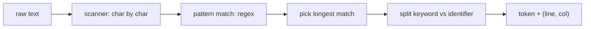

# lexical analysis

This is post 2 in the Compilers 101 series.

> Compilers 101 series (2/10)

<!-- a-grade-intro:begin -->

**Core question**: In the single line `print("hello")`, exactly how many "words" does the compiler see?

> Lexical analysis (or lexing) is the step that cuts a raw string into meaningful pieces called **tokens**. When this step is well defined, every step above it (parser, semantic analyzer) works on clean units instead of raw text.

<!-- a-grade-intro:end -->

## What You Will Learn

- The definition of a token and the problem a lexer solves
- Regex-based lexers and the longest-match rule
- The standard trick for separating keywords from identifiers
- How to keep position information (line, column) flowing
- Looking at a real lexer using Python's built-in `tokenize` module

## Why It Matters

The difference between someone who can answer "where does `SyntaxError: unexpected token` come from?" and someone who cannot is whether they have ever looked at lexical analysis. A good lexer is the starting point of good error messages.

> If you cut tokens wrong, every step after that is built on the same wrong split.

## Concept at a Glance



The two key ideas are "pick the longest match" and "carry the position all the way through."

## Key Terms

- **Token**: a meaningful unit produced by the lexer. A combination of `(kind, text, position)`.
- **Lexeme**: the text part of a token.
- **Longest match**: when several patterns match at the same position, pick the longest one.
- **Keyword vs identifier**: `if` is a keyword, `iff` is an identifier. They start from the same pattern, so we separate them in a post-processing step.
- **Whitespace / comment**: the lexer recognizes them but usually drops them from the token stream.

## Before/After

**Before — branching one character at a time**

```python
# if/else per character makes the code explode
def lex_naive(s):
    out, i = [], 0
    while i < len(s):
        if s[i].isdigit():
            j = i
            while j < len(s) and s[j].isdigit(): j += 1
            out.append(("NUM", s[i:j])); i = j
        elif s[i] in "+-*/":
            out.append(("OP", s[i])); i += 1
        else:
            i += 1
    return out
```

**After — a regex-based table**

```python
SPEC = [("NUM", r"\d+"), ("OP", r"[+\-*/]"), ("WS", r"\s+")]
```

Adding a new token is just one more row. Maintainability and readability are much better.

## Hands-on: a small lexer, step by step

### Step 1 — A regex-based lexer

```python
# 1_regex_lex.py
import re
from dataclasses import dataclass

@dataclass
class Token:
    kind: str
    text: str
    line: int
    col: int

SPEC = [
    ("NUM",   r"\d+"),
    ("ID",    r"[A-Za-z_]\w*"),
    ("STR",   r'"[^"]*"'),
    ("OP",    r"[+\-*/=<>!]+"),
    ("LP",    r"\("),
    ("RP",    r"\)"),
    ("NL",    r"\n"),
    ("WS",    r"[ \t]+"),
]
KEYWORDS = {"if", "else", "while", "return", "True", "False"}

def lex(src: str) -> list[Token]:
    tokens, i, line, col = [], 0, 1, 1
    while i < len(src):
        for kind, pat in SPEC:
            m = re.match(pat, src[i:])
            if m:
                text = m.group()
                if kind == "ID" and text in KEYWORDS:
                    kind = "KW"
                if kind not in ("WS",):
                    tokens.append(Token(kind, text, line, col))
                if kind == "NL":
                    line += 1; col = 1
                else:
                    col += len(text)
                i += len(text)
                break
        else:
            raise SyntaxError(f"unexpected {src[i]!r} at {line}:{col}")
    return tokens

for t in lex('if x == 1\n  return "ok"\n'):
    print(t)
```

One table expresses every token kind. Position information is updated at every step.

### Step 2 — Why longest-match matters

```python
# 2_longest.py
# imagine a language that has both == and =
SPEC = [("EQ", r"=="), ("ASSIGN", r"=")]
import re
src = "=="
for kind, pat in SPEC:
    m = re.match(pat, src)
    if m:
        print("first match:", kind, m.group())
        break
```

If the order is reversed, `=` matches first and `==` is split into two tokens. Either rely on SPEC order to imitate longest-match, or sort regex alternations by length.

### Step 3 — Separating keywords and identifiers

```python
# 3_keywords.py
import re
KEYWORDS = {"if", "else", "while"}
src = "if iff while"
for m in re.finditer(r"[A-Za-z_]\w*", src):
    text = m.group()
    kind = "KW" if text in KEYWORDS else "ID"
    print(kind, text)
```

The standard pattern is: catch them with the same regex and compare against a keyword set in a post-processing step. Hardcoding keywords inside the regex makes adding or changing them painful.

### Step 4 — Keeping position information

```python
# 4_position.py
# the lex from step 1 already carries line/col.
# When we need to report an error, that info builds a nice message.
def report(token, message):
    print(f"  File \"<src>\", line {token.line}, col {token.col}")
    print(f"    {token.text}")
    print(f"  SyntaxError: {message}")
```

The starting point of good compiler error messages is a lexer that never loses position.

### Step 5 — Python's built-in `tokenize`

```python
# 5_python_tokenize.py
import tokenize, io

src = "x = 1 + 2  # add\n"
for tok in tokenize.generate_tokens(io.StringIO(src).readline):
    print(tok)
```

You can see CPython's lexer directly. Tokens like `OP`, `NAME`, `NUMBER`, `NEWLINE`, and `COMMENT` come out with line/column information attached.

## What to Notice in This Code

- A table-based lexer turns adding or changing tokens into a data change.
- Longest-match is guaranteed by SPEC order or by an explicit length comparison.
- Keywords are not recognized by the lexer directly; they are separated in post-processing.
- Position information is a first-class citizen of every token.

## Five Common Mistakes

1. **Not guaranteeing longest-match for tokens with overlapping prefixes like `==` and `=`.** The most common lexer bug.
2. **Hardcoding keywords inside the regex.** Adding a keyword turns into a regex change.
3. **Not carrying position information.** Error messages degrade to "syntax error somewhere."
4. **Dropping whitespace or comments too early.** Code formatters and linters need that information.
5. **Building no error recovery.** If the lexer dies on the first syntax error, the user experience is poor.

## How This Shows Up in Production

Most language tooling uses regex-based lexers or a variant (DFA). PEG and parser combinators sometimes merge lexer and parser into one (scannerless parsing). LSP language servers call the lexer first, and syntax highlighting is essentially a visualization of the lexer's output.

## How a Senior Engineer Thinks

- When meeting a new language, they sketch the token kinds table first.
- The order of the regex SPEC is part of the language specification.
- They know position information is core to tool quality.
- For an internal DSL, they first check whether `re` plus a table is enough before writing anything fancier.
- They design error recovery starting from the lexer.

## Checklist

- [ ] Can you define a token in one sentence?
- [ ] Can you explain longest-match in one sentence?
- [ ] Do you know the standard pattern for separating keywords and identifiers?
- [ ] Can you answer why a lexer must carry position information?
- [ ] Have you ever printed the output of Python's `tokenize` module?

## Practice Problems

1. Add `<=` and `>=` to the step 1 lexer with longest-match in mind, and experiment with what breaks when the order is wrong.
2. Add error recovery so the same lexer can report multiple syntax errors in one call (the simplest strategy: "skip one character and keep going").
3. Take the output of the `tokenize` module and build a small tool that counts keyword frequency (`if/while/return` ratio).

## Wrap-up and Next Steps

The lexer is the first transformation that turns text into meaningful units. The next post looks at the step that turns that token stream into a tree (AST) — parsing.

<!-- toc:begin -->
- [What Is a Compiler?](./01-what-is-a-compiler.md)
- **lexical analysis (current)**
- parsing and AST (upcoming)
- semantic analysis (upcoming)
- symbol table and scope (upcoming)
- intermediate representation (upcoming)
- optimization basics (upcoming)
- code generation (upcoming)
- JIT vs AOT (upcoming)
- building a tiny interpreter (upcoming)
<!-- toc:end -->

## References

- [Python — tokenize module](https://docs.python.org/3/library/tokenize.html)
- [Crafting Interpreters — Scanning](https://craftinginterpreters.com/scanning.html)
- [Lex (Wikipedia)](https://en.wikipedia.org/wiki/Lex_(software))
- [Regular language (Wikipedia)](https://en.wikipedia.org/wiki/Regular_language)

Tags: Computer Science, Compilers, Lexer, Tokens, Regex, Position
