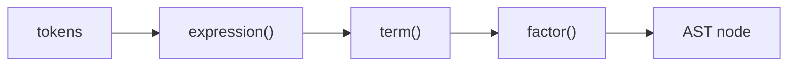

# Compilers 101 (3/10): parsing and AST

> Compilers 101 series (3/10)

**Core question**: Why does the compiler group `1 + 2 * 3` as `(1 + (2 * 3))` and not as `((1 + 2) * 3)`?

> A parser takes a token stream as input and builds a **tree (AST)** that captures structure. Operator precedence, associativity, and error reporting are all decided in this step.

This is post 3 in the Compilers 101 series.


*compilers 101 chapter 3 flow overview*

## Questions to Keep in Mind

- What boundary should you inspect first when applying parsing and AST?
- Which signal should the example or diagram make visible for parsing and AST?
- What failure should be prevented first when parsing and AST reaches a real system?

## What You Will Learn

- What an AST (abstract syntax tree) is and why it must be a tree
- The basic shape of a recursive descent parser
- How to express operator precedence and associativity in code
- How to pretty-print an AST
- The shape of a good parser error message

## Why It Matters

If the lexer made the "words," the parser builds the "sentence structure." When the AST is clean, every step above it — semantic analysis, optimization, code generation — is clean. When the AST is sloppy, every step has to compensate for the sloppiness.

> Almost every compiler bug ends up being "the AST is wrong."



Grammar levels map directly onto function levels. Higher-precedence operators are handled in inner functions.

## Key Terms

- **AST**: a tree that represents program structure. Surface syntax like parentheses disappears; only meaning remains.
- **Recursive descent**: a parser where each grammar rule becomes one function.
- **Precedence**: which operator binds tighter (`*` binds tighter than `+`).
- **Associativity**: at the same precedence, which side groups (`-` is left-associative).
- **Lookahead**: peeking one (or k) tokens ahead.

## Before/After

**Before — a flat token list**

```python
tokens = [("NUM",1),("OP","+"),("NUM",2),("OP","*"),("NUM",3)]
# this data structure makes meaning hard to read
```

**After — a tree where meaning is visible**

```python
ast = Bin("+", Num(1), Bin("*", Num(2), Num(3)))
# precedence is engraved into the tree shape
```

The shape of the tree IS precedence. Evaluators and code generators just walk the tree.

## Hands-on: a small expression parser

### Step 1 — Define AST nodes

```python
# 1_ast_nodes.py
from dataclasses import dataclass

@dataclass
class Num:    value: int
@dataclass
class Bin:
    op: str
    left: object
    right: object

print(Bin("+", Num(1), Bin("*", Num(2), Num(3))))
```

Two dataclasses can express expression ASTs. The set of node kinds IS the expressive power of the language.

### Step 2 — Token stream and cursor

```python
# 2_cursor.py
class Cursor:
    def __init__(self, tokens):
        self.tokens, self.i = tokens, 0
    def peek(self):
        return self.tokens[self.i] if self.i < len(self.tokens) else ("EOF","")
    def advance(self):
        t = self.peek(); self.i += 1; return t
    def expect(self, kind):
        t = self.advance()
        if t[0] != kind:
            raise SyntaxError(f"expected {kind}, got {t}")
        return t
```

`peek/advance/expect` is the entire flow vocabulary of a recursive descent parser.

### Step 3 — Recursive descent (precedence climbing)

```python
# 3_recursive_descent.py
from dataclasses import dataclass
@dataclass
class Num: value: int
@dataclass
class Bin:
    op: str; left: object; right: object

# expr   := term  (("+"|"-") term)*
# term   := factor (("*"|"/") factor)*
# factor := NUM | "(" expr ")"

def parse(tokens):
    i = [0]
    def peek(): return tokens[i[0]] if i[0] < len(tokens) else ("EOF","")
    def eat(): t = peek(); i[0] += 1; return t
    def expr():
        node = term()
        while peek()[0] == "OP" and peek()[1] in "+-":
            op = eat()[1]; node = Bin(op, node, term())
        return node
    def term():
        node = factor()
        while peek()[0] == "OP" and peek()[1] in "*/":
            op = eat()[1]; node = Bin(op, node, factor())
        return node
    def factor():
        t = eat()
        if t[0] == "NUM": return Num(t[1])
        if t == ("LP","("):
            node = expr()
            assert eat() == ("RP",")")
            return node
        raise SyntaxError(f"unexpected {t}")
    return expr()

toks = [("NUM",1),("OP","+"),("NUM",2),("OP","*"),("NUM",3)]
print(parse(toks))
```

The `expr → term → factor` order IS "lower precedence → higher precedence." Since `*` is caught by `term`, it always groups deeper.

### Step 4 — Pretty-print the AST

```python
# 4_pretty.py
def show(n, depth=0):
    pad = "  " * depth
    if hasattr(n, "value"):
        print(f"{pad}Num({n.value})")
    else:
        print(f"{pad}Bin({n.op})")
        show(n.left, depth+1); show(n.right, depth+1)
```

Print the tree as is and precedence is visible at a glance. An AST visualizer solves 80 percent of debugging.

### Step 5 — Verify with an evaluator

```python
# 5_eval.py
def evaluate(n):
    if hasattr(n, "value"): return n.value
    l, r = evaluate(n.left), evaluate(n.right)
    return {"+": l+r, "-": l-r, "*": l*r, "/": l//r}[n.op]
```

If the AST is right, the evaluator agrees with school arithmetic. The fastest way to test a parser is an evaluator.

## What to Notice in This Code

- One grammar rule equals one function.
- Precedence is expressed by call depth.
- Associativity is decided by the direction of the while loop (left-associative accumulates with while).
- Carrying an explicit token cursor avoids backtracking.

## Five Common Mistakes

1. **Trying to fit precedence into a single SPEC line.** Precedence has to be expressed by splitting functions.
2. **Forgetting associativity and ending up right-associative.** A bug where `1 - 2 - 3` evaluates as `1 - (2 - 3) = 2`.
3. **Catching `expect`'s SyntaxError and ignoring it.** That builds a wrong AST.
4. **Not pulling error positions from the tokens.** Do not throw away the line/col you collected in step 1.
5. **Leaving surface syntax (parentheses) in the AST.** Parentheses must disappear after they decide precedence.

## How This Shows Up in Production

Most hand-written compilers (rustc, clang, CPython) use recursive descent parsers. Generator tools (yacc, bison, lark) end up building similar trees. For most unambiguous grammars, recursive descent is the easiest choice to read and to debug.

## How a Senior Engineer Thinks

- When meeting a new grammar, they first decide which function it belongs in.
- They keep the set of AST node kinds as small as possible (readability beats extensibility).
- They always have a debug tool that draws the parser's AST as a picture.
- They answer "why was this expression grouped this way?" with call depth.
- They fix ambiguous grammars by changing the grammar, not by working around them in the parser.

## Checklist

- [ ] Can you say why an AST has to be a tree?
- [ ] Can you sketch a recursive descent parser on one screen?
- [ ] Can you explain the difference between precedence and associativity in one sentence?
- [ ] Have you ever built an AST visualizer?
- [ ] Have you defined what message a parser error should give the user?

## Practice Problems

1. Add unary minus (`-1`, `-(1+2)`) to the parser above. Which function does it belong in?
2. Add `**` (exponent, right-associative). Where in the code does it differ from left-associative `+`?
3. Design the error message you would show the user for the bad input `1 + * 2`.

## Wrap-up and Next Steps

A parser turns a flat token stream into a meaningful tree. The next post looks at the step that reads that tree and answers questions like "where was this variable declared? does this type match?" — semantic analysis.

## Answering the Opening Questions

- **What boundary should you inspect first when applying parsing and AST?**
  - The article treats parsing and AST as a set of boundaries rather than one abstract idea, then separates input, processing, verification, and operational signals.
- **Which signal should the example or diagram make visible for parsing and AST?**
  - The example and diagram should make visible what enters the system, where it changes, and which check decides pass or fail.
- **What failure should be prevented first when parsing and AST reaches a real system?**
  - In production, keep that decision in checklists, logs, and tests so the same failure does not return after the next change.

<!-- toc:begin -->
## In this series

- [Compilers 101 (1/10): What Is a Compiler?](./01-what-is-a-compiler.md)
- [Compilers 101 (2/10): lexical analysis](./02-lexical-analysis.md)
- **parsing and AST (current)**
- semantic analysis (upcoming)
- symbol table and scope (upcoming)
- intermediate representation (upcoming)
- optimization basics (upcoming)
- code generation (upcoming)
- JIT vs AOT (upcoming)
- Building a Tiny Interpreter (upcoming)

<!-- toc:end -->

## References

- [Crafting Interpreters — Parsing Expressions](https://craftinginterpreters.com/parsing-expressions.html)
- [Recursive descent parser (Wikipedia)](https://en.wikipedia.org/wiki/Recursive_descent_parser)
- [Operator-precedence parser (Wikipedia)](https://en.wikipedia.org/wiki/Operator-precedence_parser)
- [Python ast module](https://docs.python.org/3/library/ast.html)

Tags: Computer Science, Compilers, Parser, AST, RecursiveDescent, Precedence

> Compilers 101 series (3/10)

**Core question**: Why does the compiler group `1 + 2 * 3` as `(1 + (2 * 3))` and not as `((1 + 2) * 3)`?

> A parser takes a token stream as input and builds a **tree (AST)** that captures structure. Operator precedence, associativity, and error reporting are all decided in this step.

## What You Will Learn

- What an AST (abstract syntax tree) is and why it must be a tree
- The basic shape of a recursive descent parser
- How to express operator precedence and associativity in code
- How to pretty-print an AST
- The shape of a good parser error message

## Why It Matters

If the lexer made the "words," the parser builds the "sentence structure." When the AST is clean, every step above it — semantic analysis, optimization, code generation — is clean. When the AST is sloppy, every step has to compensate for the sloppiness.

> Almost every compiler bug ends up being "the AST is wrong."


Grammar levels map directly onto function levels. Higher-precedence operators are handled in inner functions.

## Key Terms

- **AST**: a tree that represents program structure. Surface syntax like parentheses disappears; only meaning remains.
- **Recursive descent**: a parser where each grammar rule becomes one function.
- **Precedence**: which operator binds tighter (`*` binds tighter than `+`).
- **Associativity**: at the same precedence, which side groups (`-` is left-associative).
- **Lookahead**: peeking one (or k) tokens ahead.

## Before/After

**Before — a flat token list**

```python
tokens = [("NUM",1),("OP","+"),("NUM",2),("OP","*"),("NUM",3)]
# this data structure makes meaning hard to read
```

**After — a tree where meaning is visible**

```python
ast = Bin("+", Num(1), Bin("*", Num(2), Num(3)))
# precedence is engraved into the tree shape
```

The shape of the tree IS precedence. Evaluators and code generators just walk the tree.

## Hands-on: a small expression parser

### Step 1 — Define AST nodes

```python
# 1_ast_nodes.py
from dataclasses import dataclass

@dataclass
class Num:    value: int
@dataclass
class Bin:
    op: str
    left: object
    right: object

print(Bin("+", Num(1), Bin("*", Num(2), Num(3))))
```

Two dataclasses can express expression ASTs. The set of node kinds IS the expressive power of the language.

### Step 2 — Token stream and cursor

```python
# 2_cursor.py
class Cursor:
    def __init__(self, tokens):
        self.tokens, self.i = tokens, 0
    def peek(self):
        return self.tokens[self.i] if self.i < len(self.tokens) else ("EOF","")
    def advance(self):
        t = self.peek(); self.i += 1; return t
    def expect(self, kind):
        t = self.advance()
        if t[0] != kind:
            raise SyntaxError(f"expected {kind}, got {t}")
        return t
```

`peek/advance/expect` is the entire flow vocabulary of a recursive descent parser.

### Step 3 — Recursive descent (precedence climbing)

```python
# 3_recursive_descent.py
from dataclasses import dataclass
@dataclass
class Num: value: int
@dataclass
class Bin:
    op: str; left: object; right: object

# expr   := term  (("+"|"-") term)*
# term   := factor (("*"|"/") factor)*
# factor := NUM | "(" expr ")"

def parse(tokens):
    i = [0]
    def peek(): return tokens[i[0]] if i[0] < len(tokens) else ("EOF","")
    def eat(): t = peek(); i[0] += 1; return t
    def expr():
        node = term()
        while peek()[0] == "OP" and peek()[1] in "+-":
            op = eat()[1]; node = Bin(op, node, term())
        return node
    def term():
        node = factor()
        while peek()[0] == "OP" and peek()[1] in "*/":
            op = eat()[1]; node = Bin(op, node, factor())
        return node
    def factor():
        t = eat()
        if t[0] == "NUM": return Num(t[1])
        if t == ("LP","("):
            node = expr()
            assert eat() == ("RP",")")
            return node
        raise SyntaxError(f"unexpected {t}")
    return expr()

toks = [("NUM",1),("OP","+"),("NUM",2),("OP","*"),("NUM",3)]
print(parse(toks))
```

The `expr → term → factor` order IS "lower precedence → higher precedence." Since `*` is caught by `term`, it always groups deeper.

### Step 4 — Pretty-print the AST

```python
# 4_pretty.py
def show(n, depth=0):
    pad = "  " * depth
    if hasattr(n, "value"):
        print(f"{pad}Num({n.value})")
    else:
        print(f"{pad}Bin({n.op})")
        show(n.left, depth+1); show(n.right, depth+1)
```

Print the tree as is and precedence is visible at a glance. An AST visualizer solves 80 percent of debugging.

### Step 5 — Verify with an evaluator

```python
# 5_eval.py
def evaluate(n):
    if hasattr(n, "value"): return n.value
    l, r = evaluate(n.left), evaluate(n.right)
    return {"+": l+r, "-": l-r, "*": l*r, "/": l//r}[n.op]
```

If the AST is right, the evaluator agrees with school arithmetic. The fastest way to test a parser is an evaluator.

## What to Notice in This Code

- One grammar rule equals one function.
- Precedence is expressed by call depth.
- Associativity is decided by the direction of the while loop (left-associative accumulates with while).
- Carrying an explicit token cursor avoids backtracking.

## Five Common Mistakes

1. **Trying to fit precedence into a single SPEC line.** Precedence has to be expressed by splitting functions.
2. **Forgetting associativity and ending up right-associative.** A bug where `1 - 2 - 3` evaluates as `1 - (2 - 3) = 2`.
3. **Catching `expect`'s SyntaxError and ignoring it.** That builds a wrong AST.
4. **Not pulling error positions from the tokens.** Do not throw away the line/col you collected in step 1.
5. **Leaving surface syntax (parentheses) in the AST.** Parentheses must disappear after they decide precedence.

## How This Shows Up in Production

Most hand-written compilers (rustc, clang, CPython) use recursive descent parsers. Generator tools (yacc, bison, lark) end up building similar trees. For most unambiguous grammars, recursive descent is the easiest choice to read and to debug.

## How a Senior Engineer Thinks

- When meeting a new grammar, they first decide which function it belongs in.
- They keep the set of AST node kinds as small as possible (readability beats extensibility).
- They always have a debug tool that draws the parser's AST as a picture.
- They answer "why was this expression grouped this way?" with call depth.
- They fix ambiguous grammars by changing the grammar, not by working around them in the parser.

## Checklist

- [ ] Can you say why an AST has to be a tree?
- [ ] Can you sketch a recursive descent parser on one screen?
- [ ] Can you explain the difference between precedence and associativity in one sentence?
- [ ] Have you ever built an AST visualizer?
- [ ] Have you defined what message a parser error should give the user?

## Practice Problems

1. Add unary minus (`-1`, `-(1+2)`) to the parser above. Which function does it belong in?
2. Add `**` (exponent, right-associative). Where in the code does it differ from left-associative `+`?
3. Design the error message you would show the user for the bad input `1 + * 2`.

## Wrap-up and Next Steps

A parser turns a flat token stream into a meaningful tree. The next post looks at the step that reads that tree and answers questions like "where was this variable declared? does this type match?" — semantic analysis.

<!-- toc:begin -->
## In this series

- [Compilers 101 (1/10): What Is a Compiler?](./01-what-is-a-compiler.md)
- [Compilers 101 (2/10): lexical analysis](./02-lexical-analysis.md)
- **parsing and AST (current)**
- semantic analysis (upcoming)
- symbol table and scope (upcoming)
- intermediate representation (upcoming)
- optimization basics (upcoming)
- code generation (upcoming)
- JIT vs AOT (upcoming)
- Building a Tiny Interpreter (upcoming)

<!-- toc:end -->

## References

- [Crafting Interpreters — Parsing Expressions](https://craftinginterpreters.com/parsing-expressions.html)
- [Recursive descent parser (Wikipedia)](https://en.wikipedia.org/wiki/Recursive_descent_parser)
- [Operator-precedence parser (Wikipedia)](https://en.wikipedia.org/wiki/Operator-precedence_parser)
- [Python ast module](https://docs.python.org/3/library/ast.html)

Tags: Computer Science, Compilers, Parser, AST, RecursiveDescent, Precedence
