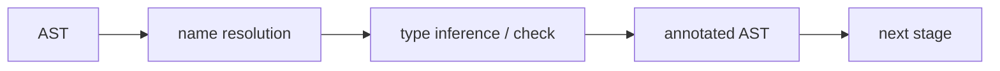

# semantic analysis

> Compilers 101 series (4/10)

<!-- a-grade-intro:begin -->

**Core question**: `x + "hello"` is syntactically fine, so why does the compiler reject it?

> Semantic analysis is the step that asks "does this make sense?" of an AST that already passed syntax. It catches name resolution, type errors, and use-before-declare style mistakes.

<!-- a-grade-intro:end -->

## What You Will Learn

- The difference between syntactic correctness and semantic correctness
- Name resolution: where does this name point?
- Type checking: are these two values the same type?
- The pattern of walking the AST once and attaching meaning to it
- The shape of a good error message at the semantic stage

## Why It Matters

A parser can only say "are the parentheses balanced?" The case where `y` in `x = y + 1` was never declared, or where `y` is a string but you try to add `1`, is caught at the semantic stage. If this stage is weak, code that compiled cleanly dies at runtime.

> Compilers earn trust through semantics, not through syntax.

## Concept at a Glance



The result is the same AST with metadata like "this name points to that declaration; the type of this expression is int" attached.

## Key Terms

- **Name resolution**: deciding which declaration an identifier points to.
- **Type checking**: confirming the type of an expression is allowed in its context.
- **Type inference**: deducing types that were not written explicitly.
- **Annotated AST**: an AST with semantic information attached.
- **Coercion**: an implicit conversion between compatible types (`int → float`).

## Before/After

**Before — AST as the parser left it**

```python
ast = Bin("+", Var("x"), Str("hello"))
# nobody knows what x is, or whether the two sides match
```

**After — AST with semantics attached**

```python
# x: int (declared at line 3)
# Bin.+ requires int + int, got int + str → TypeError
```

This is now a form the next stage can trust.

## Hands-on: a small semantic analyzer

### Step 1 — A simple typed environment

```python
# 1_env.py
class Env:
    def __init__(self, parent=None):
        self.parent, self.table = parent, {}
    def declare(self, name, ty):
        if name in self.table:
            raise SyntaxError(f"redeclared: {name}")
        self.table[name] = ty
    def lookup(self, name):
        if name in self.table: return self.table[name]
        if self.parent: return self.parent.lookup(name)
        raise NameError(f"undeclared: {name}")
```

Name resolution is just a dictionary lookup. A parent pointer expresses nested scope naturally.

### Step 2 — Name resolution

```python
# 2_resolve.py
from dataclasses import dataclass
@dataclass
class Var: name: str
@dataclass
class Decl:
    name: str; ty: str

env = {"int_globals": "int"}
def resolve(node):
    if isinstance(node, Var):
        if node.name not in env:
            raise NameError(f"'{node.name}' is not defined")
    if isinstance(node, Decl):
        env[node.name] = node.ty
```

The key is treating declaration and use through the same data structure. Walk the AST once, updating and querying the environment.

### Step 3 — Simple type checking

```python
# 3_typecheck.py
def type_of(node, env):
    kind = node[0]
    if kind == "NUM": return "int"
    if kind == "STR": return "str"
    if kind == "VAR": return env[node[1]]
    if kind == "BIN":
        op, l, r = node[1], type_of(node[2], env), type_of(node[3], env)
        if l != r:
            raise TypeError(f"{op}: {l} vs {r}")
        return l

env = {"x": "int"}
print(type_of(("BIN","+",("VAR","x"),("NUM",1)), env))  # int
```

Types bubble up through the tree. If two children disagree, the error is raised right there.

### Step 4 — Annotated AST

```python
# 4_annotate.py
def annotate(node, env):
    kind = node[0]
    if kind == "NUM": return ("NUM", node[1], "int")
    if kind == "VAR": return ("VAR", node[1], env[node[1]])
    if kind == "BIN":
        l = annotate(node[2], env); r = annotate(node[3], env)
        if l[-1] != r[-1]:
            raise TypeError(f"{node[1]}: {l[-1]} vs {r[-1]}")
        return ("BIN", node[1], l, r, l[-1])
```

Attach the type to the original AST in a trailing slot. The next stage walks the tree once more and emits code that matches the type.

### Step 5 — Good error messages

```python
# 5_error.py
def report(token, expected, got):
    print(f"  File \"<src>\", line {token['line']}")
    print(f"    {token['text']}")
    print(f"  TypeError: expected {expected}, got {got}")

report({"line": 12, "text": 'x + "hello"'}, "int", "str")
```

A semantic error is enough with three lines: location, what was expected, what arrived.

## What to Notice in This Code

- The environment (Env) expresses nested scope naturally as a chained dictionary.
- Types are extra information on the AST, not a separate data structure.
- Errors are reported as close to the position as possible.
- One pass can do it; you can also split into multiple passes.

## Five Common Mistakes

1. **Treating Name and Symbol as the same thing.** A name is text; a symbol is a declaration entry.
2. **Not collecting type errors and reporting them all at once.** Stopping at the first error gives a bad user experience.
3. **Judging type compatibility with `==` only.** Subtypes, generics, and coercion break that.
4. **Building two data structures for declarations and uses, ending up with two environments.** There must be one source of truth.
5. **Implementing scope entry/exit without a parent pointer.** Variable shadowing breaks.

## How This Shows Up in Production

The core of a language server (LSP) lives here. "Go to definition" is name resolution; "type hint" is type inference; "rename symbol" is symbol table updating. The semantic stage of the compiler is exactly the core feature set of an IDE.

## How a Senior Engineer Thinks

- They know semantic error messages are the most-read sentences a user will ever read.
- They strongly enforce a single environment as source of truth.
- They attach semantic information to the AST instead of carrying it on the side.
- They design error recovery from the start (report many errors per pass).
- They abstract the type system as a lattice for extensibility.

## Checklist

- [ ] Can you explain syntactic vs semantic in one sentence?
- [ ] Have you accepted that name resolution is a dictionary lookup?
- [ ] Have you ever written the pattern of attaching types to an AST?
- [ ] Have you defined a standard shape for semantic error messages?
- [ ] Can you say how LSP features map to the semantic stage?

## Practice Problems

1. Add nested scope (function entry/exit) to the environment above.
2. Add coercion that automatically promotes `int + float` to `float`.
3. Design a structure that collects all semantic errors in a file and prints them at the end.

## Wrap-up and Next Steps

Semantic analysis answers the "does this make sense?" question that syntax cannot. The next post zooms into its central tools — symbol table and scope.

<!-- toc:begin -->
- [What Is a Compiler?](./01-what-is-a-compiler.md)
- [lexical analysis](./02-lexical-analysis.md)
- [parsing and AST](./03-parsing-and-ast.md)
- **semantic analysis (current)**
- symbol table and scope (upcoming)
- intermediate representation (upcoming)
- optimization basics (upcoming)
- code generation (upcoming)
- JIT vs AOT (upcoming)
- building a tiny interpreter (upcoming)
<!-- toc:end -->

## References

- [Crafting Interpreters — Resolving and Binding](https://craftinginterpreters.com/resolving-and-binding.html)
- [Type system (Wikipedia)](https://en.wikipedia.org/wiki/Type_system)
- [Name resolution (Wikipedia)](https://en.wikipedia.org/wiki/Name_resolution_(programming_languages))
- [Language Server Protocol](https://microsoft.github.io/language-server-protocol/)

Tags: Computer Science, Compilers, SemanticAnalysis, TypeChecking, NameResolution
