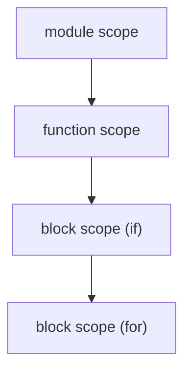

# Compilers 101 (5/10): symbol table and scope

> Compilers 101 series (5/10)

**Core question**: The `x` inside a function and the `x` outside are different variables. How does the compiler tell them apart?

> A symbol table is the compiler's memory of "which name points to which declaration." Nested scope and shadowing are expressed directly by the shape of this data structure.

This is the 5th post in the Compilers 101 series.


*compilers 101 chapter 5 flow overview*

## Questions to Keep in Mind

- What exactly is a symbol table, and why is it the compiler's core data structure?
- How can scopes be represented as a stack or linked dictionaries?
- Why do shadowing and lookup follow naturally?

## Why It Matters

The previous post's analyzer used a single dictionary as its environment. Real languages have many scopes — functions, blocks, classes, modules. How you design the symbol table IS the language's visibility rules.

> You must answer "is this variable visible here?" in one step.



Scope is a tree (or a stack). Lookup proceeds from inner to outer.

## Key Terms

- **Symbol**: a declaration entry. `(name, kind, type, location)`.
- **Scope**: a group of symbols sharing the same visibility.
- **Shadowing**: a name in an inner scope hides a name in an outer scope.
- **Lookup**: walking from inner to outer to find the first match.
- **Forward declaration**: when a declaration appears later than its use (e.g., calling a function defined below).

## Before/After

**Before — flat dictionary**

```python
env = {"x": "int"}  # cannot express x inside a function
```

**After — chained dictionary**

```python
class Scope:
    def __init__(self, parent=None):
        self.parent, self.table = parent, {}
```

A single parent pointer brings functions, blocks, and modules into the same data structure.

## Hands-on: a symbol table, step by step

### Step 1 — The simplest Scope

```python
# 1_scope.py
class Scope:
    def __init__(self, parent=None):
        self.parent, self.table = parent, {}
    def define(self, name, sym):
        if name in self.table:
            raise SyntaxError(f"redeclared: {name}")
        self.table[name] = sym
    def resolve(self, name):
        if name in self.table: return self.table[name]
        if self.parent: return self.parent.resolve(name)
        return None

g = Scope(); g.define("x", "int")
f = Scope(g); print(f.resolve("x"))  # int
```

A single `parent` pointer makes nested lookup automatic.

### Step 2 — Shadowing

```python
# 2_shadow.py
g = Scope(); g.define("x", "int(global)")
f = Scope(g); f.define("x", "int(local)")
print(f.resolve("x"))   # int(local) — inner hides outer
print(g.resolve("x"))   # int(global)
```

Redefining the same name in an inner scope hides it automatically. That is shadowing.

### Step 3 — Operating a scope stack

```python
# 3_stack.py
class Analyzer:
    def __init__(self):
        self.scopes = [Scope()]
    def enter(self): self.scopes.append(Scope(self.scopes[-1]))
    def exit(self): self.scopes.pop()
    def current(self): return self.scopes[-1]

a = Analyzer()
a.current().define("x", "int")
a.enter()
a.current().define("y", "int")
print(a.current().resolve("x"))  # int (found in outer scope)
a.exit()
```

`enter/exit` express block entry/exit. They must be called as the AST is walked.

### Step 4 — Function scope

```python
# 4_function.py
def visit(stmt, analyzer):
    kind, name = stmt
    if kind == "LET":
        analyzer.current().define(name, "local")

def visit_function(name, params, body, analyzer):
    analyzer.current().define(name, "fn")
    analyzer.enter()
    try:
        for p in params:
            analyzer.current().define(p, "param")
        for stmt in body:
            visit(stmt, analyzer)
        print(analyzer.current().resolve("arg"))  # param
        print(analyzer.current().resolve("tmp"))  # local
    finally:
        analyzer.exit()

a = Analyzer()
visit_function("add_one", ["arg"], [("LET", "tmp")], a)
print(a.current().resolve("add_one"))  # fn
print(a.current().resolve("tmp"))      # None
```

Make a new scope on function entry, put the parameters in it, analyze the body, then close the scope when the function ends. This version is self-contained: it includes the minimal `visit(...)` helper and a tiny body, so you can verify that `arg` and `tmp` are visible inside the function while `tmp` disappears after the scope closes.

### Step 5 — Storing locations for go-to-definition

```python
# 5_goto.py
class Symbol:
    def __init__(self, name, kind, ty, line, col):
        self.name, self.kind, self.ty = name, kind, ty
        self.line, self.col = line, col

def goto(scope, name):
    s = scope.resolve(name)
    return f"{s.name} at line {s.line}, col {s.col}" if s else "not found"
```

Store the declaration position on the symbol, and IDE go-to-definition becomes a plain lookup.

## What to Notice in This Code

- The core data structure is just one — scope with a parent pointer.
- Shadowing is a natural consequence of the lookup algorithm.
- Function, block, and module are all expressed by the same shape.
- Ninety percent of IDE features come out of the symbol table.

## Five Common Mistakes

1. **Trying to live with one dictionary as scope.** You cannot express variables inside a function.
2. **Calling enter/exit unbalanced.** Scope starts to leak.
3. **Trying to forbid shadowing by checking every scope.** Shadowing is a feature in most languages, not a bug.
4. **Not handling forward declarations, breaking calls of functions inside functions.** You need two passes.
5. **Not storing position on the symbol.** You cannot add go-to-definition later.

## How This Shows Up in Production

The central data structure of an LSP server is the symbol table. "Find all references" sweeps every scope in reverse; "Rename symbol" rewrites every use that points to the same symbol at once. All of this sits on top of the symbol table.

## How a Senior Engineer Thinks

- When they see a new language feature, they first ask "which scope does it go into?"
- They decide at the language level whether shadowing is intended or a source of bugs.
- They store position, visibility, and use count on the symbol.
- They default to two-pass analysis (collect declarations, then analyze uses).
- They know the symbol table is the IDE's data model.

## Checklist

- [ ] Have you accepted that a Scope is a dictionary with a parent pointer?
- [ ] Can you explain why shadowing is a natural result of the lookup rule?
- [ ] Can you express function and block scope in the same data structure?
- [ ] Do you see that go-to-definition is a lookup?
- [ ] Can you give a reason for filling the symbol table in two passes?

## Practice Problems

1. Add a method that lists every symbol defined in a given scope to the Scope above.
2. Add an option that warns when shadowing happens.
3. Write pseudocode that splits analysis into two passes to support forward declarations.

## Wrap-up and Next Steps

The symbol table is the memory the compiler uses to answer "what is this name?" The next post looks at how the analyzed AST gets turned into a simpler form — intermediate representation.

## Answering the Opening Questions

- **What exactly is a symbol table, and why is it the compiler's core data structure?**
  - A symbol table connects names to declaration info like `(kind, type, location)` — the compiler's memory. `Scope.define("x", "int")` and `Symbol(name, kind, ty, line, col)` store declaration info with position, enabling both name resolution and go-to-definition from the same structure.
- **How can scopes be represented as a stack or linked dictionaries?**
  - A single `Scope` with a `parent` pointer represents module, function, and block scopes. `Analyzer.enter()` and `exit()` push and pop `Scope(self.scopes[-1])`, so the current and outer scopes are naturally accessible while walking the AST.
- **Why do shadowing and lookup follow naturally?**
  - Because `resolve()` checks the current table first and walks up via `parent` if the name is missing. After `g.define("x", "int(global)")` and `f.define("x", "int(local)")`, `f.resolve("x")` returns local and `g.resolve("x")` returns global — no special rules needed.

<!-- toc:begin -->
## In this series

- [Compilers 101 (1/10): What Is a Compiler?](./01-what-is-a-compiler.md)
- [Compilers 101 (2/10): lexical analysis](./02-lexical-analysis.md)
- [Compilers 101 (3/10): parsing and AST](./03-parsing-and-ast.md)
- [Compilers 101 (4/10): semantic analysis](./04-semantic-analysis.md)
- **symbol table and scope (current)**
- intermediate representation (upcoming)
- optimization basics (upcoming)
- code generation (upcoming)
- JIT vs AOT (upcoming)
- Building a Tiny Interpreter (upcoming)

<!-- toc:end -->

## References

- Alfred V. Aho, Monica S. Lam, Ravi Sethi, Jeffrey D. Ullman, *Compilers: Principles, Techniques, and Tools* (2nd ed.), Section 2.7 “Symbol Tables”.
- [Shriram Krishnamurthi, *Programming Languages: Application and Interpretation* (3rd ed.)](https://www.plai.org/) — environment-model and static-scope coverage.
- [Robert Nystrom, *Crafting Interpreters* — Chapter 11 “Resolving and Binding”](https://craftinginterpreters.com/resolving-and-binding.html)
- Keith D. Cooper, Linda Torczon, *Engineering a Compiler* (2nd ed.), name-analysis and semantic-environment chapters.

Tags: Computer Science, Compilers, SymbolTable, Scope, Lookup
