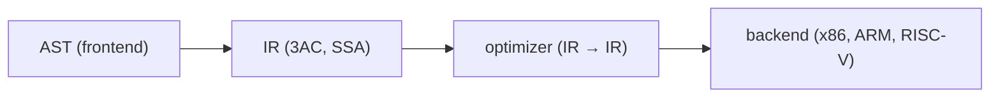

# Compilers 101 (6/10): intermediate representation

> Compilers 101 series (6/10)

**Core question**: Why not just go from the AST straight to machine code? Why insert another stage in the middle?

> An intermediate representation (IR) is a language simpler than an AST and more abstract than machine code. Optimization and multi-backend support all live on top of it.

This is post 6 in the Compilers 101 series.

## Questions to Keep in Mind

- What boundary should you inspect first when applying intermediate representation?
- Which signal should the example or diagram make visible for intermediate representation?
- What failure should be prevented first when intermediate representation reaches a real system?

## Big Picture


*compilers 101 chapter 6 flow overview*

This picture places intermediate representation inside an operating flow. The point is not to memorize the concept in isolation, but to see how input, processing, verification, and operational signals connect across boundaries.

> The core of intermediate representation is not the feature name; it is deciding what to verify at each boundary and which signal to keep.

## What You Will Learn

- What an IR is and why it exists
- The shape of three-address code (3AC)
- The intuition for SSA (static single assignment)
- The structure that lets one IR target many architectures
- Writing AST → IR lowering by hand

## Why It Matters

The AST is a form for humans. Machine code is a form for the CPU. Without an IR between them, optimization is tightly coupled to the AST, and supporting a new CPU means rewriting every analysis. The IR splits the compiler cleanly into two halves — frontend and backend.

> The bridge that turns "M languages × N architectures" into "M + N" is the IR.

## Concept at a Glance



Once the IR is well defined, the optimizer and the backend only need to know the IR.

## Key Terms

- **IR (intermediate representation)**: the middle language used inside the compiler.
- **Three-address code**: at most three operands per line, like `t1 = a + b`.
- **Basic block**: a straight-line sequence of instructions with no branches.
- **CFG (control flow graph)**: a graph whose nodes are basic blocks.
- **SSA**: every variable is assigned exactly once. It makes optimization simple.

## Before/After

**Before — tree-based evaluation**

```python
ast = Bin("+", Num(1), Bin("*", Num(2), Num(3)))
# evaluate recursively over the tree
```

**After — flat instruction sequence**

```text
t1 = 2 * 3
t2 = 1 + t1
return t2
```

It is much easier to analyze instruction by instruction.

## Hands-on: AST → IR lowering

### Step 1 — Define IR instructions

```python
# 1_ir.py
from dataclasses import dataclass
@dataclass
class Inst:
    op: str
    dst: str
    src1: object
    src2: object = None
```

Four fields `(op, dst, src1, src2)` express almost every arithmetic, compare, or assignment.

### Step 2 — Generating temporaries

```python
# 2_temps.py
class TempGen:
    def __init__(self): self.n = 0
    def fresh(self):
        self.n += 1; return f"t{self.n}"

g = TempGen()
print(g.fresh(), g.fresh(), g.fresh())  # t1 t2 t3
```

Each intermediate value of an expression needs a name. A counter is enough.

### Step 3 — Expression → 3AC

```python
# 3_lower.py
def lower(node, code, g):
    kind = node[0]
    if kind == "NUM":
        t = g.fresh(); code.append(("LOAD", t, node[1])); return t
    if kind == "BIN":
        l = lower(node[2], code, g)
        r = lower(node[3], code, g)
        t = g.fresh(); code.append((node[1], t, l, r)); return t

g = TempGen(); code = []
ast = ("BIN","+",("NUM",1),("BIN","*",("NUM",2),("NUM",3)))
result = lower(ast, code, g)
for inst in code: print(inst)
print("result:", result)
```

A single tree walk produces a flat instruction list. The result is in the last temporary.

If you run that exact snippet, you get a concrete 3AC dump like this:

```text
('LOAD', 't1', 1)
('LOAD', 't2', 2)
('LOAD', 't3', 3)
('*', 't4', 't2', 't3')
('+', 't5', 't1', 't4')
result: t5
```

That output is the proof artifact: the nested AST has been lowered into a flat sequence of `LOAD`, `*`, and `+` instructions, and the final value now lives in `t5`.

### Step 4 — Basic blocks and the CFG

```python
# 4_cfg.py
class Block:
    def __init__(self, name):
        self.name, self.insts, self.next = name, [], []

entry = Block("entry"); body = Block("body"); exit_ = Block("exit")
entry.next = [body]; body.next = [body, exit_]   # loop
```

The moment conditional branches and jumps appear, the IR becomes a graph. Optimization and analysis run on top of this graph.

Written as plain edges, the CFG above is:

```text
entry -> body
body  -> body   # loop back-edge
body  -> exit
```

That is enough to make control flow explicit: one entry, one loop back-edge, and one exit edge.

### Step 5 — A taste of SSA

```python
# 5_ssa.py
# code that assigns the same variable several times
# x = 1
# x = x + 2
# return x

# in SSA:
# x1 = 1
# x2 = x1 + 2
# return x2
```

Index every variable to enforce "single assignment." That is SSA. Data-flow analysis becomes very simple.

At merge points, a `phi` node records which version flows in from each predecessor:

```text
# before SSA
entry:
  br cond, then, else
then:
  x = 1
  br join
else:
  x = 2
  br join
join:
  y = x + 3

# after SSA
entry:
  br cond, then, else
then:
  x1 = 1
  br join
else:
  x2 = 2
  br join
join:
  x3 = phi(x1, x2)
  y1 = x3 + 3
```

This is the second proof artifact: the transformation makes every assignment unique, and `phi` carries the correct value into the join block.

## What to Notice in This Code

- One operation per line is the heart of an IR.
- You can mint temporaries freely (the register allocator cleans up later).
- The AST is a tree; the IR is (usually) a graph.
- SSA is a representation for analysis, not for execution.

## Five Common Mistakes

1. **Trying to optimize directly on the AST.** The form is too rich on a tree, and analysis explodes.
2. **Reusing temporary names too early to "optimize."** You lose the benefit of SSA.
3. **Forgetting that basic blocks split at labels too, not only at branches.**
4. **Making the IR too architecture-dependent.** New backends become painful.
5. **Making the IR too abstract.** Good code generation becomes hard.

## How This Shows Up in Production

LLVM IR is the canonical example. Many languages (C/C++/Rust/Swift, etc.) lower to the same IR, share the same optimizations, and emit code for diverse architectures. CPython bytecode and Java bytecode are also a kind of IR.

## How a Senior Engineer Thinks

- When meeting a new language, they first ask "can it lower to the existing IR?"
- IR design is a balance between simplicity and enough expressive power.
- They keep SSA as the default form for analysis.
- They carry source-level information (line, column) all the way through the IR (debug info).
- They keep backends written only against the IR, separated from the frontend.

## Checklist

- [ ] Can you say in one sentence why an IR exists?
- [ ] Can you write down the shape of three-address code?
- [ ] Can you state the definition of a basic block?
- [ ] Do you have intuition for why SSA simplifies analysis?
- [ ] Have you accepted that the IR is the dividing line between frontend and backend?

## Practice Problems

1. Add comparison operators (`<`, `>`) to the lower function above.
2. Convert a single line `if (x < 10) { ... } else { ... }` to IR by hand.
3. Convert code that assigns the same variable twice into SSA form by hand.

## Wrap-up and Next Steps

The IR is the bridge that cleanly splits the compiler in half. The next post looks at the simplest — and most frequently used — two or three optimizations that run on top of it.

## Answering the Opening Questions

- **What boundary should you inspect first when applying intermediate representation?**
  - The article treats intermediate representation as a set of boundaries rather than one abstract idea, then separates input, processing, verification, and operational signals.
- **Which signal should the example or diagram make visible for intermediate representation?**
  - The example and diagram should make visible what enters the system, where it changes, and which check decides pass or fail.
- **What failure should be prevented first when intermediate representation reaches a real system?**
  - In production, keep that decision in checklists, logs, and tests so the same failure does not return after the next change.

<!-- toc:begin -->
## In this series

- [Compilers 101 (1/10): What Is a Compiler?](./01-what-is-a-compiler.md)
- [Compilers 101 (2/10): lexical analysis](./02-lexical-analysis.md)
- [Compilers 101 (3/10): parsing and AST](./03-parsing-and-ast.md)
- [Compilers 101 (4/10): semantic analysis](./04-semantic-analysis.md)
- [Compilers 101 (5/10): symbol table and scope](./05-symbol-table-and-scope.md)
- **intermediate representation (current)**
- optimization basics (upcoming)
- code generation (upcoming)
- JIT vs AOT (upcoming)
- Building a Tiny Interpreter (upcoming)

<!-- toc:end -->

## References

- Keith D. Cooper, Linda Torczon, *Engineering a Compiler* (2nd ed.), IR-design and SSA chapters.
- [LLVM Language Reference Manual](https://llvm.org/docs/LangRef.html) — SSA-based IR overview, function structure, and the [`phi` instruction](https://llvm.org/docs/LangRef.html#phi-instruction).
- [LLVM Kaleidoscope Tutorial — Chapter 3 “Code generation to LLVM IR”](https://llvm.org/docs/tutorial/MyFirstLanguageFrontend/LangImpl03.html)
- Alfred V. Aho, Monica S. Lam, Ravi Sethi, Jeffrey D. Ullman, *Compilers: Principles, Techniques, and Tools* (2nd ed.), intermediate-code generation chapters.

Tags: Computer Science, Compilers, IR, ThreeAddressCode, SSA
