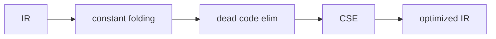

# Compilers 101 (7/10): optimization basics

> Compilers 101 series (7/10)

**Core question**: When the compiler sees `2 + 3 * 4`, does it compute it every time at runtime, or does it replace it with 14 ahead of time?

> An optimizer is a transformation from IR to IR. It produces faster, smaller code while preserving meaning. The starting points are constant folding and dead code elimination.

This is the 7th post in the Compilers 101 series.


*compilers 101 chapter 7 flow overview*

## Questions to Keep in Mind

- What is the most absolute rule in optimization?
- How does constant folding work?
- What information does dead code elimination rely on?

## Why It Matters

For the same algorithm, a compiler that reduces well makes code 10x faster or 1/10 the size. At the same time, a wrong optimization changes program meaning — the scariest kind of bug. Watching the optimizer is how you see where the compiler's trustworthiness comes from.

> "Make it faster + keep the meaning." Holding both lines at once is what an optimizer does.



Each step takes IR in and emits IR out. Every pass must preserve meaning.

## Key Terms

- **Pass**: one walk over the IR that transforms it.
- **Constant folding**: computing operations on constants at compile time.
- **Dead code elimination (DCE)**: removing instructions whose result is never used.
- **Common subexpression elimination (CSE)**: removing duplicate computation of the same expression.
- **Strength reduction**: replacing `x * 2` with `x + x` or `x << 1` (cheaper instruction).

## Before/After

**Before — naive IR**

```text
t1 = 2 * 3
t2 = 1 + t1
t3 = t2
return t3
```

**After — optimized**

```text
return 7
```

Same result, but instruction count goes from 4 to 1.

## Hands-on: a small optimizer

### Step 1 — Represent IR instructions

```python
# 1_inst.py
# work on tuples of (op, dst, src1, src2)
code = [
    ("LOAD", "t1", 2, None),
    ("LOAD", "t2", 3, None),
    ("*",    "t3", "t1", "t2"),
    ("LOAD", "t4", 1, None),
    ("+",    "t5", "t4", "t3"),
    ("RET",  None, "t5", None),
]
```

Every transformation works on a flat list.

### Step 2 — Constant folding

```python
# 2_fold.py
def fold(code):
    consts = {}
    out = []
    for op, dst, a, b in code:
        if op == "LOAD" and isinstance(a, int):
            consts[dst] = a; out.append((op, dst, a, b)); continue
        if op in "+-*/" and a in consts and b in consts:
            v = {"+":consts[a]+consts[b],"-":consts[a]-consts[b],
                 "*":consts[a]*consts[b],"/":consts[a]//consts[b]}[op]
            consts[dst] = v
            out.append(("LOAD", dst, v, None))
        else:
            out.append((op, dst, a, b))
    return out
```

Carry a constants environment and immediately compute arithmetic when both sides are constants.

### Step 3 — Dead code elimination

```python
# 3_dce.py
def dce(code):
    used = set()
    # gather use info from the bottom up
    for op, dst, a, b in reversed(code):
        if op == "RET":
            used.add(a)
        else:
            if dst in used:
                if isinstance(a, str): used.add(a)
                if isinstance(b, str): used.add(b)
    # one more pass keeps only live instructions
    return [(op, dst, a, b) for op, dst, a, b in code
            if op == "RET" or dst in used]
```

Sweep backwards collecting use info, then drop instructions whose dst is never used.

### Step 4 — Bundling passes

```python
# 4_pipeline.py
def optimize(code):
    code = fold(code)
    code = dce(code)
    return code

for inst in optimize(code): print(inst)
```

Compose passes as functions. Running the same pass twice may shrink further (fixed point).

### Step 5 — Common subexpression intuition

```python
# 5_cse.py
# the same right-hand side appearing twice
# t1 = a + b
# t2 = a + b   <- same expression
# replace the second line with t2 = t1
```

Carry a hash table `(op, src1, src2) → dst` and it is very simple. Especially clean in SSA.

## What to Notice in This Code

- Every pass is an IR → IR transformation.
- Each pass is small and simple (a few dozen lines).
- The order of passes affects result quality.
- The fixed-point pattern (run a pass repeatedly) is common.

## Five Common Mistakes

1. **Doing dead code elimination that ignores side effects.** I/O calls must stay even if their result is unused.
2. **Folding floating point freely.** Associativity may not hold and results change.
3. **Doing CSE that ignores branches.** The same expression may have different values in different basic blocks.
4. **Not thinking about pass order.** fold then dce is a common reliable order.
5. **Stopping after one round.** fold creates more dead code, and dce creates more folding opportunities.

## How This Shows Up in Production

LLVM has dozens of passes; compile flags like `-O2` and `-O3` describe which passes run in which order. JIT compilers select hot paths and apply more aggressive optimization. Profile-guided optimization (PGO) bases pass decisions on real execution data.

## How a Senior Engineer Thinks

- Before adding a new pass, they verify "meaning preservation" first.
- They keep passes small and single-purpose.
- They know the fixed-point pattern is common.
- They trust profile-driven decisions (no guessing).
- They always ask "on which architecture does this transformation pay off?"

## Checklist

- [ ] Have you accepted that meaning preservation is the absolute rule?
- [ ] Can you write constant folding on one page?
- [ ] Can you say that DCE comes from use analysis?
- [ ] Can you explain why pass order affects results?
- [ ] Do you have intuition for why CSE is simpler in SSA?

## Practice Problems

1. Add strength reduction (`x * 2 → x + x`) to the fold above.
2. Write a fixed-point loop that repeats `fold + dce` until nothing more shrinks.
3. Make a side-effecting instruction (`PRINT`, `STORE`) and confirm DCE keeps it alive.

## Wrap-up and Next Steps

Optimization is a series of meaning-preserving transformations on IR. The next post finally turns this IR into real machine code — code generation.

## Answering the Opening Questions

- **What is the most absolute rule in optimization?**
  - The absolute rule is: make it faster or smaller only within the range that preserves program meaning. Reducing `t1 = 2 * 3`, `t2 = 1 + t1`, `return t2` to `return 7` is justified only because the result stays the same.
- **How does constant folding work?**
  - `fold(code)` remembers constant values in a `consts` environment; when both operands of `+ - * /` resolve to constants, it computes in place and replaces with `LOAD`. So `("*", "t3", "t1", "t2")` becomes `("LOAD", "t3", 6, None)` when both inputs are constant.
- **What information does dead code elimination rely on?**
  - DCE relies on use information collected bottom-up — which values are actually read (similar to liveness). `dce(code)` starts from `RET`, fills a `used` set, then removes instructions whose results are never referenced in a second pass.

<!-- toc:begin -->
## In this series

- [Compilers 101 (1/10): What Is a Compiler?](./01-what-is-a-compiler.md)
- [Compilers 101 (2/10): lexical analysis](./02-lexical-analysis.md)
- [Compilers 101 (3/10): parsing and AST](./03-parsing-and-ast.md)
- [Compilers 101 (4/10): semantic analysis](./04-semantic-analysis.md)
- [Compilers 101 (5/10): symbol table and scope](./05-symbol-table-and-scope.md)
- [Compilers 101 (6/10): intermediate representation](./06-intermediate-representation.md)
- **optimization basics (current)**
- code generation (upcoming)
- JIT vs AOT (upcoming)
- Building a Tiny Interpreter (upcoming)

<!-- toc:end -->

## References

- Alfred V. Aho, Monica S. Lam, Ravi Sethi, Jeffrey D. Ullman, *Compilers: Principles, Techniques, and Tools* (2nd ed.), optimization chapters.
- Keith D. Cooper, Linda Torczon, *Engineering a Compiler* (2nd ed.), scalar-optimization and data-flow chapters.
- [LLVM’s Analysis and Transform Passes](https://llvm.org/docs/Passes.html)
- [LLVM — Using the New Pass Manager](https://llvm.org/docs/NewPassManager.html) — default optimization-pipeline structure.

Tags: Computer Science, Compilers, Optimization, ConstantFolding, DeadCode
