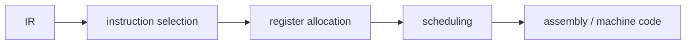

# Compilers 101 (8/10): code generation

> Compilers 101 series (8/10)

**Core question**: The IR has unlimited temporaries like `t1, t2, t3...`. The real CPU only has 16 registers. How do you fit them?

> Code generation turns IR into real instructions. The two core jobs are instruction selection (which instructions?) and register allocation (where do values live?).

This is post 8 in the Compilers 101 series.

## Questions to Keep in Mind

- What boundary should you inspect first when applying code generation?
- Which signal should the example or diagram make visible for code generation?
- What failure should be prevented first when code generation reaches a real system?

## Big Picture


*compilers 101 chapter 8 flow overview*

This picture places code generation inside an operating flow. The point is not to memorize the concept in isolation, but to see how input, processing, verification, and operational signals connect across boundaries.

> The core of code generation is not the feature name; it is deciding what to verify at each boundary and which signal to keep.

## What You Will Learn

- The two core problems code generation solves
- The pattern-matching intuition behind instruction selection
- Viewing register allocation as graph coloring
- Spill: deciding to use memory when registers run out
- Why calling conventions and ABIs exist

## Why It Matters

Even with everything before this done well, getting the last step wrong means the program does not run. And for the same IR, a poor backend produces code 2-10x slower. Code generation decides the compiler's reputation.

> Theory ends at the IR; skill shows in the backend.

## Concept at a Glance



These three steps are the skeleton of nearly every backend.

## Key Terms

- **Instruction selection**: choosing which CPU instruction to use for an IR node.
- **Register allocation**: mapping virtual registers (temporaries) to physical registers.
- **Spill**: storing a temporary to memory when registers run out.
- **Calling convention**: the agreement on which registers carry which values across a call.
- **ABI (application binary interface)**: the agreement that lets compiled code call into other compiled code.

## Before/After

**Before — IR with unlimited virtual registers**

```text
t1 = LOAD a
t2 = LOAD b
t3 = t1 + t2
RET t3
```

**After — real instructions (e.g., x86-64)**

```asm
mov rax, [a]
add rax, [b]
ret
```

Virtual registers collapse onto `rax`, and LOAD/ADD merge into one instruction.

## Hands-on: a small code generator

### Step 1 — Straight-line instruction selection

```python
# 1_select.py
# very simple 1:1 matching
def select(inst):
    op, dst, a, b = inst
    if op == "LOAD":  return [f"mov {dst}, {a}"]
    if op == "+":     return [f"mov {dst}, {a}", f"add {dst}, {b}"]
    if op == "*":     return [f"mov {dst}, {a}", f"imul {dst}, {b}"]
    if op == "RET":   return [f"mov rax, {a}", "ret"]
    return [f"; unknown {op}"]

for inst in [("LOAD","t1",2,None),("LOAD","t2",3,None),
             ("+","t3","t1","t2"),("RET",None,"t3",None)]:
    print("\n".join(select(inst)))
```

Start with very simple 1:1 matching. Better backends do tree-pattern matching.

### Step 2 — Interference graph

```python
# 2_interference.py
# two temporaries alive at the same time cannot share a register
# → an edge in the graph
def interferences(code):
    live = set(); edges = set()
    for op, dst, a, b in reversed(code):
        if op == "RET":
            live.add(a); continue
        if dst in live:
            live.discard(dst)
        for x in live:
            if isinstance(dst, str):
                edges.add(frozenset({dst, x}))
        if isinstance(a, str): live.add(a)
        if isinstance(b, str): live.add(b)
    return edges
```

Track liveness from bottom to top, and the edges of "simultaneously live" variables collect.

### Step 3 — Graph coloring intuition

```python
# 3_color.py
# given K colors (registers), color so adjacent nodes differ
def greedy_color(nodes, edges, k):
    color = {}
    for n in nodes:
        used = {color[m] for m in nodes if frozenset({n,m}) in edges and m in color}
        for c in range(k):
            if c not in used:
                color[n] = c; break
        else:
            color[n] = "SPILL"
    return color
```

Nodes that cannot be colored with K colors are spill candidates. Real algorithms are more refined (e.g., chordal graph properties).

### Step 4 — Spill: temporary storage in memory

```python
# 4_spill.py
# when registers run out, save to stack and reload
def spill(code, var):
    new = []
    for op, dst, a, b in code:
        if op != "RET" and a == var:
            new.append(("LOAD", "tmp", f"[stack:{var}]", None)); a = "tmp"
        if dst == var:
            new.append((op, "tmp", a, b))
            new.append(("STORE", None, "tmp", f"[stack:{var}]")); continue
        new.append((op, dst, a, b))
    return new
```

Slower but correct. A good backend minimizes spills.

### Step 5 — Calling convention

```python
# 5_call.py
# x86-64 System V: first 6 integer args go in rdi, rsi, rdx, rcx, r8, r9
# return value in rax
def emit_call(name, args):
    regs = ["rdi","rsi","rdx","rcx","r8","r9"]
    out = []
    for r, a in zip(regs, args):
        out.append(f"mov {r}, {a}")
    out.append(f"call {name}")
    return out

print("\n".join(emit_call("printf", ["fmt", "x"])))
```

Your function and the library must obey the same agreement for calls to work. That is the ABI.

## What to Notice in This Code

- Instruction selection is a kind of pattern matching.
- The essence of register allocation is graph coloring; production is more refined.
- Spill is not a defeat but a normal tool.
- Violating the calling convention always means a segfault.

## Five Common Mistakes

1. **Assigning registers without liveness analysis.** You overwrite a register already in use.
2. **Fearing spill so much that code explodes.** Some spill is necessary.
3. **Inventing your own calling convention.** You will never interoperate with external libraries.
4. **Forgetting implicit registers like the flag register (EFLAGS).** Instructions inserted between compare and jump break it.
5. **Optimizing instruction selection too early.** First make accurate 1:1 selection work.

## How This Shows Up in Production

LLVM's backend has two paths — SelectionDAG and GlobalISel — with different selection strategies. Register allocators are offered as options like LinearScan (fast) and Greedy (better quality). ABIs differ by OS and architecture, so the same function is called differently on Linux x86-64 and macOS ARM64.

## How a Senior Engineer Thinks

- They first check "which ABI does this backend follow?"
- For a new architecture, they check register count and calling convention first.
- They are not afraid of spill — correctness first, performance next.
- They make liveness analysis the starting point of every backend job.
- They always suspect "implicit things" like flags, exceptions, and atomics.

## Checklist

- [ ] Can you state the two core problems code generation solves?
- [ ] Do you understand register allocation as graph coloring?
- [ ] Can you explain what spill is and when it happens?
- [ ] Can you state the difference between calling convention and ABI?
- [ ] Can you say in one sentence why liveness analysis is needed?

## Practice Problems

1. Add comparison (`<`) and conditional branch (`jl`) to the select function above.
2. Draw an interference graph and find which node spills when k=2.
3. Imagine two function calls fighting for the same register, and reason about whether spill must go between them.

## Wrap-up and Next Steps

Code generation is the last bridge between the IR and a real CPU. The next post compares when this whole pipeline runs — at compile time or during execution — JIT vs AOT.

## Answering the Opening Questions

- **What boundary should you inspect first when applying code generation?**
  - The article treats code generation as a set of boundaries rather than one abstract idea, then separates input, processing, verification, and operational signals.
- **Which signal should the example or diagram make visible for code generation?**
  - The example and diagram should make visible what enters the system, where it changes, and which check decides pass or fail.
- **What failure should be prevented first when code generation reaches a real system?**
  - In production, keep that decision in checklists, logs, and tests so the same failure does not return after the next change.

<!-- toc:begin -->
## In this series

- [Compilers 101 (1/10): What Is a Compiler?](./01-what-is-a-compiler.md)
- [Compilers 101 (2/10): lexical analysis](./02-lexical-analysis.md)
- [Compilers 101 (3/10): parsing and AST](./03-parsing-and-ast.md)
- [Compilers 101 (4/10): semantic analysis](./04-semantic-analysis.md)
- [Compilers 101 (5/10): symbol table and scope](./05-symbol-table-and-scope.md)
- [Compilers 101 (6/10): intermediate representation](./06-intermediate-representation.md)
- [Compilers 101 (7/10): optimization basics](./07-optimization-basics.md)
- **code generation (current)**
- JIT vs AOT (upcoming)
- Building a Tiny Interpreter (upcoming)

<!-- toc:end -->

## References

- [Code generation (Wikipedia)](https://en.wikipedia.org/wiki/Code_generation_(compiler))
- [Register allocation (Wikipedia)](https://en.wikipedia.org/wiki/Register_allocation)
- [System V AMD64 ABI](https://gitlab.com/x86-psABIs/x86-64-ABI)
- [LLVM CodeGen overview](https://llvm.org/docs/CodeGenerator.html)

Tags: Computer Science, Compilers, CodeGen, RegisterAllocation, Assembly

> Compilers 101 series (8/10)

**Core question**: The IR has unlimited temporaries like `t1, t2, t3...`. The real CPU only has 16 registers. How do you fit them?

> Code generation turns IR into real instructions. The two core jobs are instruction selection (which instructions?) and register allocation (where do values live?).

## What You Will Learn

- The two core problems code generation solves
- The pattern-matching intuition behind instruction selection
- Viewing register allocation as graph coloring
- Spill: deciding to use memory when registers run out
- Why calling conventions and ABIs exist

## Why It Matters

Even with everything before this done well, getting the last step wrong means the program does not run. And for the same IR, a poor backend produces code 2-10x slower. Code generation decides the compiler's reputation.

> Theory ends at the IR; skill shows in the backend.

## Concept at a Glance


These three steps are the skeleton of nearly every backend.

## Key Terms

- **Instruction selection**: choosing which CPU instruction to use for an IR node.
- **Register allocation**: mapping virtual registers (temporaries) to physical registers.
- **Spill**: storing a temporary to memory when registers run out.
- **Calling convention**: the agreement on which registers carry which values across a call.
- **ABI (application binary interface)**: the agreement that lets compiled code call into other compiled code.

## Before/After

**Before — IR with unlimited virtual registers**

```text
t1 = LOAD a
t2 = LOAD b
t3 = t1 + t2
RET t3
```

**After — real instructions (e.g., x86-64)**

```asm
mov rax, [a]
add rax, [b]
ret
```

Virtual registers collapse onto `rax`, and LOAD/ADD merge into one instruction.

## Hands-on: a small code generator

### Step 1 — Straight-line instruction selection

```python
# 1_select.py
# very simple 1:1 matching
def select(inst):
    op, dst, a, b = inst
    if op == "LOAD":  return [f"mov {dst}, {a}"]
    if op == "+":     return [f"mov {dst}, {a}", f"add {dst}, {b}"]
    if op == "*":     return [f"mov {dst}, {a}", f"imul {dst}, {b}"]
    if op == "RET":   return [f"mov rax, {a}", "ret"]
    return [f"; unknown {op}"]

for inst in [("LOAD","t1",2,None),("LOAD","t2",3,None),
             ("+","t3","t1","t2"),("RET",None,"t3",None)]:
    print("\n".join(select(inst)))
```

Start with very simple 1:1 matching. Better backends do tree-pattern matching.

### Step 2 — Interference graph

```python
# 2_interference.py
# two temporaries alive at the same time cannot share a register
# → an edge in the graph
def interferences(code):
    live = set(); edges = set()
    for op, dst, a, b in reversed(code):
        if op == "RET":
            live.add(a); continue
        if dst in live:
            live.discard(dst)
        for x in live:
            if isinstance(dst, str):
                edges.add(frozenset({dst, x}))
        if isinstance(a, str): live.add(a)
        if isinstance(b, str): live.add(b)
    return edges
```

Track liveness from bottom to top, and the edges of "simultaneously live" variables collect.

### Step 3 — Graph coloring intuition

```python
# 3_color.py
# given K colors (registers), color so adjacent nodes differ
def greedy_color(nodes, edges, k):
    color = {}
    for n in nodes:
        used = {color[m] for m in nodes if frozenset({n,m}) in edges and m in color}
        for c in range(k):
            if c not in used:
                color[n] = c; break
        else:
            color[n] = "SPILL"
    return color
```

Nodes that cannot be colored with K colors are spill candidates. Real algorithms are more refined (e.g., chordal graph properties).

### Step 4 — Spill: temporary storage in memory

```python
# 4_spill.py
# when registers run out, save to stack and reload
def spill(code, var):
    new = []
    for op, dst, a, b in code:
        if op != "RET" and a == var:
            new.append(("LOAD", "tmp", f"[stack:{var}]", None)); a = "tmp"
        if dst == var:
            new.append((op, "tmp", a, b))
            new.append(("STORE", None, "tmp", f"[stack:{var}]")); continue
        new.append((op, dst, a, b))
    return new
```

Slower but correct. A good backend minimizes spills.

### Step 5 — Calling convention

```python
# 5_call.py
# x86-64 System V: first 6 integer args go in rdi, rsi, rdx, rcx, r8, r9
# return value in rax
def emit_call(name, args):
    regs = ["rdi","rsi","rdx","rcx","r8","r9"]
    out = []
    for r, a in zip(regs, args):
        out.append(f"mov {r}, {a}")
    out.append(f"call {name}")
    return out

print("\n".join(emit_call("printf", ["fmt", "x"])))
```

Your function and the library must obey the same agreement for calls to work. That is the ABI.

## What to Notice in This Code

- Instruction selection is a kind of pattern matching.
- The essence of register allocation is graph coloring; production is more refined.
- Spill is not a defeat but a normal tool.
- Violating the calling convention always means a segfault.

## Five Common Mistakes

1. **Assigning registers without liveness analysis.** You overwrite a register already in use.
2. **Fearing spill so much that code explodes.** Some spill is necessary.
3. **Inventing your own calling convention.** You will never interoperate with external libraries.
4. **Forgetting implicit registers like the flag register (EFLAGS).** Instructions inserted between compare and jump break it.
5. **Optimizing instruction selection too early.** First make accurate 1:1 selection work.

## How This Shows Up in Production

LLVM's backend has two paths — SelectionDAG and GlobalISel — with different selection strategies. Register allocators are offered as options like LinearScan (fast) and Greedy (better quality). ABIs differ by OS and architecture, so the same function is called differently on Linux x86-64 and macOS ARM64.

## How a Senior Engineer Thinks

- They first check "which ABI does this backend follow?"
- For a new architecture, they check register count and calling convention first.
- They are not afraid of spill — correctness first, performance next.
- They make liveness analysis the starting point of every backend job.
- They always suspect "implicit things" like flags, exceptions, and atomics.

## Checklist

- [ ] Can you state the two core problems code generation solves?
- [ ] Do you understand register allocation as graph coloring?
- [ ] Can you explain what spill is and when it happens?
- [ ] Can you state the difference between calling convention and ABI?
- [ ] Can you say in one sentence why liveness analysis is needed?

## Practice Problems

1. Add comparison (`<`) and conditional branch (`jl`) to the select function above.
2. Draw an interference graph and find which node spills when k=2.
3. Imagine two function calls fighting for the same register, and reason about whether spill must go between them.

## Wrap-up and Next Steps

Code generation is the last bridge between the IR and a real CPU. The next post compares when this whole pipeline runs — at compile time or during execution — JIT vs AOT.

<!-- toc:begin -->
## In this series

- [Compilers 101 (1/10): What Is a Compiler?](./01-what-is-a-compiler.md)
- [Compilers 101 (2/10): lexical analysis](./02-lexical-analysis.md)
- [Compilers 101 (3/10): parsing and AST](./03-parsing-and-ast.md)
- [Compilers 101 (4/10): semantic analysis](./04-semantic-analysis.md)
- [Compilers 101 (5/10): symbol table and scope](./05-symbol-table-and-scope.md)
- [Compilers 101 (6/10): intermediate representation](./06-intermediate-representation.md)
- [Compilers 101 (7/10): optimization basics](./07-optimization-basics.md)
- **code generation (current)**
- JIT vs AOT (upcoming)
- Building a Tiny Interpreter (upcoming)

<!-- toc:end -->

## References

- [Code generation (Wikipedia)](https://en.wikipedia.org/wiki/Code_generation_(compiler))
- [Register allocation (Wikipedia)](https://en.wikipedia.org/wiki/Register_allocation)
- [System V AMD64 ABI](https://gitlab.com/x86-psABIs/x86-64-ABI)
- [LLVM CodeGen overview](https://llvm.org/docs/CodeGenerator.html)

Tags: Computer Science, Compilers, CodeGen, RegisterAllocation, Assembly
