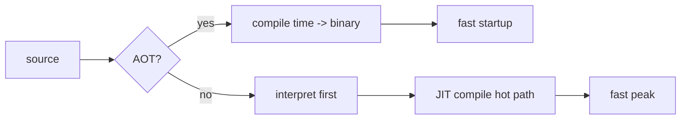

# Compilers 101 (9/10): JIT vs AOT

> Compilers 101 series (9/10)

**Core question**: Why does the same JavaScript code feel slow at first and then suddenly speed up?

> JIT (just-in-time) compiles during execution and AOT (ahead-of-time) compiles before it. That single difference shapes startup time, peak performance, and even how you ship the program.

This is post 9 in the Compilers 101 series.

## Questions to Keep in Mind

- What boundary should you inspect first when applying JIT vs AOT?
- Which signal should the example or diagram make visible for JIT vs AOT?
- What failure should be prevented first when JIT vs AOT reaches a real system?

## Big Picture


*compilers 101 chapter 9 flow overview*

This picture places JIT vs AOT inside an operating flow. The point is not to memorize the concept in isolation, but to see how input, processing, verification, and operational signals connect across boundaries.

## What You Will Learn

- The definitions and flow of AOT and JIT
- Why warmup happens and how to measure it
- The optimization opportunities each model unlocks
- How deployment models (binary vs runtime) differ
- How real systems blend the two

## Why It Matters

The same algorithm can run ten times faster or slower depending on the execution mode (JIT, AOT, interpreted). The startup vs peak balance can make the same language a great fit for servers and a poor fit for desktops. We are no longer choosing a compiler; we are choosing a compiler mode.

> When you compile is what users feel as performance.



AOT compiles once and starts fast every time. JIT starts slower but optimizes hot paths once it sees them.

## Key Terms

- **AOT (ahead-of-time)**: Compile before deployment. The output is a binary.
- **JIT (just-in-time)**: Compile during execution. The output lives in memory.
- **Warmup**: The slow window before JIT discovers and optimizes hot paths.
- **Tiered compilation**: A pipeline of interpreter -> baseline JIT -> optimizing JIT.
- **Profile-guided**: Optimize more aggressively using observed runtime data.

## Before/After

**Before — limits of a single mode**

```text
pure interpreter: fast startup, slow peak
pure AOT       : fast startup, fast peak, but blind to dynamic info
```

**After — modern blended runtime**

```text
JVM, V8, .NET: interpreter or baseline first -> optimizing JIT for hot code only
```

You get the best part of each stage.

## Hands-on: Measure the JIT Effect

### Step 1 — A pure Python loop

```python
# 1_naive.py
def sum_to(n):
    s = 0
    for i in range(n):
        s += i
    return s

import time
t = time.perf_counter()
sum_to(10**7)
print("python:", time.perf_counter()-t)
```

CPython runs bytecode through an interpreter. There is no JIT, so each call is dispatched one op at a time.

### Step 2 — JIT effect with PyPy or numba

```python
# 2_jit.py
# pip install numba
from numba import njit
import time

@njit
def sum_to(n):
    s = 0
    for i in range(n):
        s += i
    return s

# First call compiles and runs
t = time.perf_counter(); sum_to(10**7); print("first:", time.perf_counter()-t)
# Second call reuses the compiled code
t = time.perf_counter(); sum_to(10**7); print("warm :", time.perf_counter()-t)
```

The first call pays warmup cost. The second call runs at near-native speed.

### Step 3 — AOT (for example, C)

```c
// 3_aot.c
#include <stdio.h>
long sum_to(long n){ long s=0; for(long i=0;i<n;i++) s+=i; return s; }
int main(){ printf("%ld\n", sum_to(10000000)); return 0; }
```

```bash
gcc -O2 3_aot.c -o sum && ./sum
```

The binary already carries optimizations, so startup is fast and peak is fast. The downside is that it cannot adapt to dynamic types.

### Step 4 — Tiered compilation intuition

```python
# 4_tiered.py
# pseudocode
def execute(fn, args):
    if call_count(fn) < 10:    return interpret(fn, args)
    if not has_baseline(fn):   compile_baseline(fn)
    if call_count(fn) > 1000:  compile_optimized(fn)
    return run_compiled(fn, args)
```

JVM, V8, and .NET all look like this. Start with a fast-to-produce form, then upgrade hot functions to a slower-to-produce but faster-to-run form.

### Step 5 — Profile-guided optimization

```bash
# 5_pgo.sh
gcc -fprofile-generate -O2 prog.c -o prog
./prog                 # collect profile
gcc -fprofile-use -O2 prog.c -o prog
```

Knowing real call frequencies and branch directions lets the compiler inline and reorder more aggressively. PGO is how AOT borrows a slice of JIT's dynamic information.

## What to Notice in This Code

- The same source has different startup and peak depending on the mode.
- JIT's biggest weapon is the dynamic information it can collect.
- AOT's biggest strength is the simplicity of its deployment unit.
- Most real systems blend both modes.

## Five Common Mistakes

1. **Judging JIT from a single call.** You must subtract the warmup window before comparing.
2. **Assuming AOT always wins.** With heavy dynamic dispatch, JIT often comes out ahead.
3. **Ignoring JIT's memory cost.** Compiled code and profiling data both consume RAM.
4. **Ignoring AOT binary size.** Inlining and multiple architectures grow the binary fast.
5. **Treating PGO as free.** The profile-collection run itself costs time and infrastructure.

## How This Shows Up in Production

JVM, .NET, V8, and JavaScriptCore all use tiered JITs. Go, Rust, and C and C++ are pure AOT. Android's ART blends AOT with JIT. CPython is an interpreter, but PEP 744 is bringing in a copy-and-patch JIT. WebAssembly engines support both AOT and JIT.

## How a Senior Engineer Thinks

- They first measure the workload's startup vs peak ratio.
- They know short-lived processes (scripts) prefer AOT or an interpreter.
- They know long-running servers amortize JIT warmup well.
- They know memory-constrained environments (embedded) often rule out JIT.
- They never switch modes without measurements.

## Checklist

- [ ] Can you compare AOT and JIT in one sentence?
- [ ] Can you explain why warmup happens?
- [ ] Can you give an example of an optimization enabled by dynamic info?
- [ ] Can you sketch the flow of tiered compilation?
- [ ] Can you say which AOT weakness PGO addresses?

## Practice Problems

1. Run the same function under CPython and numba. Compare the first and warm timings.
2. For a short-lived CLI tool, decide in one minute whether AOT or JIT fits better and why.
3. In one paragraph, explain how a JIT uses inline caches to shrink dynamic dispatch costs.

## Wrap-up and Next Steps

JIT and AOT are two models born from one question: when do we compile? In the next post we assemble everything we have learned into a tiny interpreter that fits on one screen.

## Answering the Opening Questions

- **What boundary should you inspect first when applying JIT vs AOT?**
  - The article treats JIT vs AOT as a set of boundaries rather than one abstract idea, then separates input, processing, verification, and operational signals.
- **Which signal should the example or diagram make visible for JIT vs AOT?**
  - The example and diagram should make visible what enters the system, where it changes, and which check decides pass or fail.
- **What failure should be prevented first when JIT vs AOT reaches a real system?**
  - In production, keep that decision in checklists, logs, and tests so the same failure does not return after the next change.

<!-- toc:begin -->
## In this series

- [Compilers 101 (1/10): What Is a Compiler?](./01-what-is-a-compiler.md)
- [Compilers 101 (2/10): lexical analysis](./02-lexical-analysis.md)
- [Compilers 101 (3/10): parsing and AST](./03-parsing-and-ast.md)
- [Compilers 101 (4/10): semantic analysis](./04-semantic-analysis.md)
- [Compilers 101 (5/10): symbol table and scope](./05-symbol-table-and-scope.md)
- [Compilers 101 (6/10): intermediate representation](./06-intermediate-representation.md)
- [Compilers 101 (7/10): optimization basics](./07-optimization-basics.md)
- [Compilers 101 (8/10): code generation](./08-code-generation.md)
- **JIT vs AOT (current)**
- Building a Tiny Interpreter (upcoming)

<!-- toc:end -->

## References

- [Just-in-time compilation (Wikipedia)](https://en.wikipedia.org/wiki/Just-in-time_compilation)
- [Ahead-of-time compilation (Wikipedia)](https://en.wikipedia.org/wiki/Ahead-of-time_compilation)
- [V8 — Ignition and TurboFan](https://v8.dev/blog/launching-ignition-and-turbofan)
- [Profile-guided optimization (Wikipedia)](https://en.wikipedia.org/wiki/Profile-guided_optimization)

Tags: Computer Science, Compilers, JIT, AOT, Tradeoffs, Warmup

> Compilers 101 series (9/10)

**Core question**: Why does the same JavaScript code feel slow at first and then suddenly speed up?

> JIT (just-in-time) compiles during execution and AOT (ahead-of-time) compiles before it. That single difference shapes startup time, peak performance, and even how you ship the program.

## What You Will Learn

- The definitions and flow of AOT and JIT
- Why warmup happens and how to measure it
- The optimization opportunities each model unlocks
- How deployment models (binary vs runtime) differ
- How real systems blend the two

## Why It Matters

The same algorithm can run ten times faster or slower depending on the execution mode (JIT, AOT, interpreted). The startup vs peak balance can make the same language a great fit for servers and a poor fit for desktops. We are no longer choosing a compiler; we are choosing a compiler mode.

> When you compile is what users feel as performance.


AOT compiles once and starts fast every time. JIT starts slower but optimizes hot paths once it sees them.

## Key Terms

- **AOT (ahead-of-time)**: Compile before deployment. The output is a binary.
- **JIT (just-in-time)**: Compile during execution. The output lives in memory.
- **Warmup**: The slow window before JIT discovers and optimizes hot paths.
- **Tiered compilation**: A pipeline of interpreter -> baseline JIT -> optimizing JIT.
- **Profile-guided**: Optimize more aggressively using observed runtime data.

## Before/After

**Before — limits of a single mode**

```text
pure interpreter: fast startup, slow peak
pure AOT       : fast startup, fast peak, but blind to dynamic info
```

**After — modern blended runtime**

```text
JVM, V8, .NET: interpreter or baseline first -> optimizing JIT for hot code only
```

You get the best part of each stage.

## Hands-on: Measure the JIT Effect

### Step 1 — A pure Python loop

```python
# 1_naive.py
def sum_to(n):
    s = 0
    for i in range(n):
        s += i
    return s

import time
t = time.perf_counter()
sum_to(10**7)
print("python:", time.perf_counter()-t)
```

CPython runs bytecode through an interpreter. There is no JIT, so each call is dispatched one op at a time.

### Step 2 — JIT effect with PyPy or numba

```python
# 2_jit.py
# pip install numba
from numba import njit
import time

@njit
def sum_to(n):
    s = 0
    for i in range(n):
        s += i
    return s

# First call compiles and runs
t = time.perf_counter(); sum_to(10**7); print("first:", time.perf_counter()-t)
# Second call reuses the compiled code
t = time.perf_counter(); sum_to(10**7); print("warm :", time.perf_counter()-t)
```

The first call pays warmup cost. The second call runs at near-native speed.

### Step 3 — AOT (for example, C)

```c
// 3_aot.c
#include <stdio.h>
long sum_to(long n){ long s=0; for(long i=0;i<n;i++) s+=i; return s; }
int main(){ printf("%ld\n", sum_to(10000000)); return 0; }
```

```bash
gcc -O2 3_aot.c -o sum && ./sum
```

The binary already carries optimizations, so startup is fast and peak is fast. The downside is that it cannot adapt to dynamic types.

### Step 4 — Tiered compilation intuition

```python
# 4_tiered.py
# pseudocode
def execute(fn, args):
    if call_count(fn) < 10:    return interpret(fn, args)
    if not has_baseline(fn):   compile_baseline(fn)
    if call_count(fn) > 1000:  compile_optimized(fn)
    return run_compiled(fn, args)
```

JVM, V8, and .NET all look like this. Start with a fast-to-produce form, then upgrade hot functions to a slower-to-produce but faster-to-run form.

### Step 5 — Profile-guided optimization

```bash
# 5_pgo.sh
gcc -fprofile-generate -O2 prog.c -o prog
./prog                 # collect profile
gcc -fprofile-use -O2 prog.c -o prog
```

Knowing real call frequencies and branch directions lets the compiler inline and reorder more aggressively. PGO is how AOT borrows a slice of JIT's dynamic information.

## What to Notice in This Code

- The same source has different startup and peak depending on the mode.
- JIT's biggest weapon is the dynamic information it can collect.
- AOT's biggest strength is the simplicity of its deployment unit.
- Most real systems blend both modes.

## Five Common Mistakes

1. **Judging JIT from a single call.** You must subtract the warmup window before comparing.
2. **Assuming AOT always wins.** With heavy dynamic dispatch, JIT often comes out ahead.
3. **Ignoring JIT's memory cost.** Compiled code and profiling data both consume RAM.
4. **Ignoring AOT binary size.** Inlining and multiple architectures grow the binary fast.
5. **Treating PGO as free.** The profile-collection run itself costs time and infrastructure.

## How This Shows Up in Production

JVM, .NET, V8, and JavaScriptCore all use tiered JITs. Go, Rust, and C and C++ are pure AOT. Android's ART blends AOT with JIT. CPython is an interpreter, but PEP 744 is bringing in a copy-and-patch JIT. WebAssembly engines support both AOT and JIT.

## How a Senior Engineer Thinks

- They first measure the workload's startup vs peak ratio.
- They know short-lived processes (scripts) prefer AOT or an interpreter.
- They know long-running servers amortize JIT warmup well.
- They know memory-constrained environments (embedded) often rule out JIT.
- They never switch modes without measurements.

## Checklist

- [ ] Can you compare AOT and JIT in one sentence?
- [ ] Can you explain why warmup happens?
- [ ] Can you give an example of an optimization enabled by dynamic info?
- [ ] Can you sketch the flow of tiered compilation?
- [ ] Can you say which AOT weakness PGO addresses?

## Practice Problems

1. Run the same function under CPython and numba. Compare the first and warm timings.
2. For a short-lived CLI tool, decide in one minute whether AOT or JIT fits better and why.
3. In one paragraph, explain how a JIT uses inline caches to shrink dynamic dispatch costs.

## Wrap-up and Next Steps

JIT and AOT are two models born from one question: when do we compile? In the next post we assemble everything we have learned into a tiny interpreter that fits on one screen.

<!-- toc:begin -->
## In this series

- [Compilers 101 (1/10): What Is a Compiler?](./01-what-is-a-compiler.md)
- [Compilers 101 (2/10): lexical analysis](./02-lexical-analysis.md)
- [Compilers 101 (3/10): parsing and AST](./03-parsing-and-ast.md)
- [Compilers 101 (4/10): semantic analysis](./04-semantic-analysis.md)
- [Compilers 101 (5/10): symbol table and scope](./05-symbol-table-and-scope.md)
- [Compilers 101 (6/10): intermediate representation](./06-intermediate-representation.md)
- [Compilers 101 (7/10): optimization basics](./07-optimization-basics.md)
- [Compilers 101 (8/10): code generation](./08-code-generation.md)
- **JIT vs AOT (current)**
- Building a Tiny Interpreter (upcoming)

<!-- toc:end -->

## References

- [Just-in-time compilation (Wikipedia)](https://en.wikipedia.org/wiki/Just-in-time_compilation)
- [Ahead-of-time compilation (Wikipedia)](https://en.wikipedia.org/wiki/Ahead-of-time_compilation)
- [V8 — Ignition and TurboFan](https://v8.dev/blog/launching-ignition-and-turbofan)
- [Profile-guided optimization (Wikipedia)](https://en.wikipedia.org/wiki/Profile-guided_optimization)

Tags: Computer Science, Compilers, JIT, AOT, Tradeoffs, Warmup
