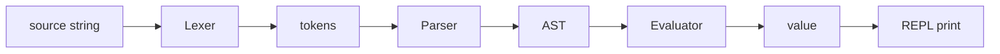

# Compilers 101 (10/10): Building a Tiny Interpreter

This is the final post in the Compilers 101 series.

> Compilers 101 series (10/10)

**Core question**: What does it look like when the lexer, parser, and evaluator we have studied all live in one file?

> In this post we build a small arithmetic interpreter in a single file. We tokenize input, lift it into an AST, evaluate it to a value, and wrap the whole thing in a REPL you can run yourself.


*compilers 101 chapter 10 flow overview*

## Questions to Keep in Mind

- How do you combine a lexer, parser, and evaluator into one file?
- What does the minimal implementation of a recursive descent parser look like?
- How does an interpreter walk the AST to produce values?

## Why It Matters

Stages you learned separately only click once you wire them together. The single-file program in this post is enough to check, at a glance, which compiler stages you can already operate. It is also a launchpad for adding variables, functions, and types.

> Putting all stages in one file makes every interface obvious.



Each arrow carries a clearly defined data type. The simplicity of those types is the whole point of this mini interpreter.

## Key Terms

- **Token**: The smallest unit produced by the lexer (`NUM`, `+`, `(`, etc.).
- **AST node**: A tree node produced by the parser (`Num`, `BinOp`).
- **Recursive descent**: A parser style where one function handles one grammar rule.
- **Evaluator**: The stage that walks the AST and reduces it to a value.
- **REPL**: Read-eval-print loop, the cycle of one input line, one result line.

## Before/After

**Before — stages scattered across files**

```text
lexer.py, parser.py, evaluator.py  -> the flow is hard to see at once
```

**After — one-file mini interpreter**

```text
mini.py: Lexer -> Parser -> Evaluator -> REPL
```

The flow and the type transitions live on a single screen.

## Hands-on: Build the Arithmetic Interpreter

### Step 1 — Lexer

```python
# mini.py (1)
import re

TOKEN = re.compile(r"\s*(?:(\d+(?:\.\d+)?)|(.))")

def tokenize(src):
    tokens = []
    for num, op in TOKEN.findall(src):
        if num:
            tokens.append(("NUM", float(num)))
        elif op.strip():
            tokens.append((op, op))
    tokens.append(("EOF", None))
    return tokens
```

`tokenize("1 + 2")` returns `[("NUM",1.0), ("+","+"), ("NUM",2.0), ("EOF",None)]`. A single regex carries the whole job.

### Step 2 — Parser (recursive descent)

```python
# mini.py (2)
class Parser:
    def __init__(self, tokens):
        self.tokens = tokens
        self.pos = 0

    def peek(self): return self.tokens[self.pos]
    def eat(self, kind):
        tok = self.tokens[self.pos]
        if tok[0] != kind:
            raise SyntaxError(f"expected {kind}, got {tok[0]}")
        self.pos += 1
        return tok

    def parse(self):
        node = self.expr()
        self.eat("EOF")
        return node

    def expr(self):
        node = self.term()
        while self.peek()[0] in ("+", "-"):
            op = self.eat(self.peek()[0])[0]
            node = ("BinOp", op, node, self.term())
        return node

    def term(self):
        node = self.factor()
        while self.peek()[0] in ("*", "/"):
            op = self.eat(self.peek()[0])[0]
            node = ("BinOp", op, node, self.factor())
        return node

    def factor(self):
        tok = self.peek()
        if tok[0] == "NUM":
            self.eat("NUM")
            return ("Num", tok[1])
        if tok[0] == "(":
            self.eat("(")
            node = self.expr()
            self.eat(")")
            return node
        raise SyntaxError(f"unexpected {tok}")
```

`expr -> term ((+|-) term)*` and `term -> factor ((*|/) factor)*`. Operator precedence falls out of this pair of rules naturally.

### Step 3 — Evaluator

```python
# mini.py (3)
def evaluate(node):
    kind = node[0]
    if kind == "Num":
        return node[1]
    if kind == "BinOp":
        op, l, r = node[1], evaluate(node[2]), evaluate(node[3])
        if op == "+": return l + r
        if op == "-": return l - r
        if op == "*": return l * r
        if op == "/": return l / r
    raise RuntimeError(f"unknown node {node}")
```

Tuples alone, without a Visitor, are clean enough at this size.

### Step 4 — REPL

```python
# mini.py (4)
def run(src):
    return evaluate(Parser(tokenize(src)).parse())

if __name__ == "__main__":
    while True:
        try:
            line = input("mini> ")
        except (EOFError, KeyboardInterrupt):
            break
        if not line.strip():
            continue
        try:
            print(run(line))
        except Exception as e:
            print("error:", e)
```

`mini> 1 + 2 * 3` prints `7.0`. One line in, one line out: the canonical read-eval-print loop.

### Step 5 — Try it yourself

```bash
python3 mini.py
mini> (1 + 2) * 3
9.0
mini> 10 / 4
2.5
mini> 1 +
error: expected NUM, got EOF
```

You can see every stage cooperating to deliver a one-line result to the user.

## What to Notice in This Code

- Types are explicit: `str -> list[token] -> tuple AST -> float`.
- Precedence is encoded in grammar functions (`expr` / `term` / `factor`).
- Errors are thrown close to their stage (lexer, parser, evaluator).
- Keeping the AST as tuples makes printing and debugging easy.

## Five Common Mistakes

1. **Stuffing lex, parse, and eval into one function.** Stage separation is what makes debugging tractable.
2. **Handling precedence in a single function.** Mixing additive and multiplicative ops gives the wrong answer.
3. **Skipping the EOF token.** The parser's terminator becomes ambiguous and you risk infinite loops.
4. **Errors without source position.** REPL users have no way to debug.
5. **Not catching division by zero.** The REPL crashes on the user.

## How This Shows Up in Production

Small DSLs (search queries, filter expressions, configuration expressions) almost always start from this exact layout. Expression evaluators in data tools, the WHERE-clause evaluator in SQL, and rule engines in game runtimes all share the same shape. Add variables and functions and you have a teaching toy language.

## How a Senior Engineer Thinks

- They write down the data type for each stage before coding.
- They encode precedence in the grammar, not in the evaluator.
- They carry source position from day one for error messages.
- They keep the AST as the simplest data structure that works.
- They defer extensions like variables and functions to the next iteration.

## Checklist

- [ ] Can you state the input/output type of the lexer, parser, and evaluator?
- [ ] Can you explain how recursive descent encodes precedence?
- [ ] Can you say why the EOF token is needed?
- [ ] Can you summarize the REPL cycle in one sentence?
- [ ] Have you picked one extension to add next?

## Practice Problems

1. Extend the parser and evaluator to handle unary minus (`-3`, `-(1+2)`).
2. Add an environment dict so that `x = 1 + 2` followed by `x * 3` evaluates correctly.
3. Add token positions (index or column) to the error messages.

## Wrap-up and Next Steps

We built a tiny interpreter in one file and used it to verify every stage from this series. The next steps are to grow it into a toy language with variables, functions, and types, or to translate the same AST into backend code for a real compiler. The series ends here.

## Answering the Opening Questions

- **How do you combine a lexer, parser, and evaluator into one file?**
  - Wire `tokenize(src) -> Parser(tokens).parse() -> evaluate(ast) -> print(result)` in sequence. `run(src)` joins the three stages in one line, and the REPL loop calls that function repeatedly to show the full flow.
- **What does the minimal implementation of a recursive descent parser look like?**
  - Five axes are enough: `peek`, `eat`, `expr`, `term`, `factor`. The `expr -> term`, `term -> factor` structure plus an `eat("EOF")` check handles precedence and input termination in one pass.
- **How does an interpreter walk the AST to produce values?**
  - `evaluate(node)` returns the value directly for `("Num", value)` and recursively computes children for `("BinOp", op, left, right)` before applying `+`, `-`, `*`, `/`. That is why `mini> 1 + 2 * 3` yields `7.0` and `(1 + 2) * 3` yields `9.0`.

<!-- toc:begin -->
## In this series

- [Compilers 101 (1/10): What Is a Compiler?](./01-what-is-a-compiler.md)
- [Compilers 101 (2/10): lexical analysis](./02-lexical-analysis.md)
- [Compilers 101 (3/10): parsing and AST](./03-parsing-and-ast.md)
- [Compilers 101 (4/10): semantic analysis](./04-semantic-analysis.md)
- [Compilers 101 (5/10): symbol table and scope](./05-symbol-table-and-scope.md)
- [Compilers 101 (6/10): intermediate representation](./06-intermediate-representation.md)
- [Compilers 101 (7/10): optimization basics](./07-optimization-basics.md)
- [Compilers 101 (8/10): code generation](./08-code-generation.md)
- [Compilers 101 (9/10): JIT vs AOT](./09-jit-vs-aot.md)
- **Building a Tiny Interpreter (current)**

<!-- toc:end -->

## References

- [Crafting Interpreters — Robert Nystrom](https://craftinginterpreters.com/)
- [Recursive descent parser (Wikipedia)](https://en.wikipedia.org/wiki/Recursive_descent_parser)
- [Read–eval–print loop (Wikipedia)](https://en.wikipedia.org/wiki/Read%E2%80%93eval%E2%80%93print_loop)
- [Abstract syntax tree (Wikipedia)](https://en.wikipedia.org/wiki/Abstract_syntax_tree)

Tags: Computer Science, Compilers, Interpreter, Capstone, AST, REPL
