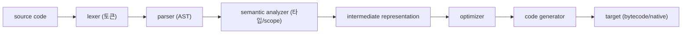

# 컴파일러란 무엇인가?

> Compilers 101 시리즈 (1/10)


## 이 글에서 다룰 문제

오류 메시지의 정체("이게 syntax error인지, semantic error인지"), 빌드가 느린 이유("최적화 단계가 비싸다"), 새 언어가 어떻게 만들어지는지 — 모두 파이프라인의 어느 단계 이야기입니다. 단계를 알면 도구를 더 잘 씁니다.

> 컴파일러를 안다는 것은 결국 "이 한 줄이 어디까지 변환됐다가 어디서 멈췄는지"를 답할 수 있다는 뜻입니다.

## 전체 흐름


위 6개 노드가 이 시리즈의 목차이기도 합니다. 한 단계씩 떼어서 보겠습니다.

## Before/After

**Before — "컴파일러는 마법"이라는 흐릿한 그림**

```text
.c → ??? → a.out
```

**After — 단계를 가진 파이프라인**

```text
.c → lex → parse → check → IR → optimize → codegen → a.out
```

각 단계가 입력과 출력이 분명한 함수처럼 동작합니다. 이게 분리의 힘입니다.

## 한 줄짜리 식의 여행

### 1단계 — 토큰화: 텍스트를 의미 있는 조각으로

```python
# 예제 파일: 1_lex.py
import re
from dataclasses import dataclass

@dataclass
class Token:
    kind: str
    text: str

PATTERNS = [
    ("NUM", r"\d+"),
    ("OP",  r"[+\-*/]"),
    ("WS",  r"\s+"),
]

def lex(src: str) -> list[Token]:
    tokens, i = [], 0
    while i < len(src):
        for kind, pat in PATTERNS:
            m = re.match(pat, src[i:])
            if m:
                if kind != "WS":
                    tokens.append(Token(kind, m.group()))
                i += m.end()
                break
        else:
            raise SyntaxError(src[i])
    return tokens

print(lex("2 + 3 * 4"))
```

문자열이 `[NUM 2, OP +, NUM 3, OP *, NUM 4]`라는 의미 있는 단위가 됐습니다.

### 2단계 — 파싱: 토큰에서 트리로

```python
# 예제 파일: 2_parse.py
from dataclasses import dataclass
@dataclass
class Num: value: int
@dataclass
class BinOp: op: str; left: object; right: object

# 입력: 2 + 3 * 4 (우선순위 무시한 단순 LR-ish 흉내)
def parse(tokens):
    def parse_expr(i):
        left = Num(int(tokens[i].text)); i += 1
        while i < len(tokens) and tokens[i].kind == "OP":
            op = tokens[i].text; i += 1
            right = Num(int(tokens[i].text)); i += 1
            left = BinOp(op, left, right)
        return left, i
    tree, _ = parse_expr(0)
    return tree

# 실제 우선순위 처리는 ep03에서. 여기선 트리가 만들어진다는 사실만.
```

이제 텍스트가 아니라 **나무**가 됐습니다. 의미를 따지기에 훨씬 좋은 모양입니다.

### 3단계 — 의미 분석: "이게 말이 되는가?"

```python
# 예제 파일: 3_check.py
def check(node):
    if isinstance(node, Num):
        return "int"
    t1 = check(node.left); t2 = check(node.right)
    if t1 != "int" or t2 != "int":
        raise TypeError("only int supported")
    return "int"
```

타입이 맞는지, 변수가 선언됐는지를 이 단계에서 확인합니다.

### 4단계 — 평가(작은 인터프리터)

```python
# 예제 파일: 4_eval.py
def evaluate(node):
    if isinstance(node, Num):
        return node.value
    a, b = evaluate(node.left), evaluate(node.right)
    return {"+": a+b, "-": a-b, "*": a*b, "/": a//b}[node.op]
```

여기서 멈추면 이 프로그램은 **인터프리터**입니다. 같은 트리를 코드 생성으로 보내면 컴파일러가 됩니다.

### 5단계 — 코드 생성(가짜 어셈블리)

```python
# 예제 파일: 5_codegen.py
def emit(node, out=None):
    out = out if out is not None else []
    if hasattr(node, "value"):
        out.append(f"PUSH {node.value}")
        return out
    emit(node.left, out)
    emit(node.right, out)
    out.append({"+":"ADD","-":"SUB","*":"MUL","/":"DIV"}[node.op])
    return out
```

같은 AST에서 어셈블리(또는 바이트코드)를 뽑아낼 수 있습니다 — 그게 컴파일러의 마지막 단계입니다.

## 이 코드에서 주목할 점

- 같은 AST를 **평가**하면 인터프리터, **코드를 뽑으면** 컴파일러입니다.
- 단계마다 입력·출력이 분명해서 단위 테스트가 가능합니다.
- 프론트엔드(lex~check)는 언어가 결정하고, 백엔드(IR~codegen)는 타깃이 결정합니다.
- 토큰/AST는 텍스트보다 **추론하기 좋은 표현**입니다.

## 자주 하는 실수 5가지

1. **lexer와 parser를 한 함수에 섞는다.** 디버깅 난이도가 폭발합니다 — 항상 단계로 나누세요.
2. **AST 없이 텍스트로 의미 분석을 한다.** 우선순위·중첩 구조가 무너집니다.
3. **타입 검사를 코드 생성에 섞는다.** 잘못된 입력의 오류가 너무 늦게 나옵니다.
4. **"인터프리터는 컴파일러보다 단순"하다고 본다.** 같은 프론트엔드를 공유하고, 마지막 단계만 다릅니다.
5. **에러 메시지에 위치 정보(line/column)를 안 넣는다.** 모든 단계는 위치 정보를 보존해야 합니다.

## 실무에서는 이렇게 쓰입니다

같은 파이프라인이 GCC, Clang, V8, CPython, Babel, TypeScript에 그대로 들어 있습니다. LLVM은 백엔드를 모듈화한 결정판으로, 여러 언어가 같은 백엔드를 공유합니다. 사내 DSL을 만들 때도 똑같이 — `tokenize → parse → AST → walk` 패턴이 표준입니다.

## 체크리스트

- [ ] 컴파일러를 한 줄로 정의할 수 있는가?
- [ ] 6단계 파이프라인을 그릴 수 있는가?
- [ ] 인터프리터가 같은 파이프라인의 어느 부분을 공유하는지 답할 수 있는가?
- [ ] AST가 왜 텍스트보다 다루기 좋은지 한 줄로 답할 수 있는가?
- [ ] 프론트엔드/백엔드 분리의 이점을 한 줄로 답할 수 있는가?

## 정리 및 다음 단계

컴파일러는 단계로 풀어야 보이는 시스템입니다. 다음 글에서는 그 첫 단계 — 텍스트를 토큰으로 자르는 lexical analysis — 를 자세히 봅니다.

<!-- toc:begin -->
- **컴파일러란 무엇인가? (현재 글)**
- lexical analysis (예정)
- parsing과 AST (예정)
- semantic analysis (예정)
- symbol table과 scope (예정)
- intermediate representation (예정)
- optimization 기초 (예정)
- code generation (예정)
- JIT vs AOT (예정)
- 작은 인터프리터 만들어 보기 (예정)
<!-- toc:end -->

## 참고 자료

- [Compilers: Principles, Techniques, and Tools (Aho et al.)](https://suif.stanford.edu/dragonbook/)
- [Crafting Interpreters (Robert Nystrom)](https://craftinginterpreters.com/)
- [LLVM Project](https://llvm.org/)
- [PEP 339 — Design of the CPython compiler](https://peps.python.org/pep-0339/)

Tags: Computer Science, Compilers, 컴파일러, 파이프라인, AST, 바이트코드
