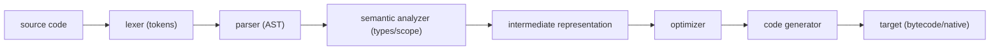

# Compilers 101 (1/10): 컴파일러란 무엇인가?

이 글은 Compilers 101 시리즈의 첫 번째 글입니다.

`2 + 3 * 4` 같은 짧은 식이 왜 바로 실행되지 않고 여러 단계를 거쳐 번역되는지 이해하면, 컴파일러를 더 이상 마법 상자가 아니라 단계별 변환 시스템으로 보게 됩니다.


*Compilers 101 1장 흐름 개요*

## 먼저 던지는 질문

- 컴파일러를 한 줄로 어떻게 정의할 수 있을까요?
- 표준적인 컴파일러 파이프라인은 어떤 단계로 나뉠까요?
- 인터프리터와 트랜스파일러는 이 파이프라인을 어디까지 공유할까요?

## 왜 중요한가

오류 메시지를 볼 때 “이건 문법 오류인가, 의미 오류인가?”, 빌드가 느릴 때 “최적화 단계가 병목인가?”, 새 언어가 어떻게 만들어지는지 이해할 때 “어느 단계가 추가되는가?” 같은 질문은 모두 파이프라인의 어느 지점에 서 있는지와 연결됩니다. 단계를 알아야 도구가 읽히고, 도구가 읽혀야 문제를 정확히 분해할 수 있습니다.

> 컴파일러를 안다는 것은 결국 “이 한 줄이 어디까지 번역됐고, 어디에서 멈췄는가?”를 답할 수 있다는 뜻입니다.

## 핵심 개념 한눈에 보기



위 여섯 단계는 그대로 이 시리즈의 목차이기도 합니다. 이후 글에서 각 단계를 하나씩 떼어 자세히 다룹니다.

## 핵심 용어

- **컴파일러**: 소스 언어를 타깃 언어로 번역하는 프로그램입니다.
- **인터프리터**: 소스 프로그램을 직접 실행하는 프로그램입니다. 보통 프런트엔드 단계는 컴파일러와 많이 겹칩니다.
- **트랜스파일러**: TypeScript → JavaScript처럼 추상화 수준이 비슷한 언어 사이를 번역하는 컴파일러입니다.
- **파이프라인**: 입력을 단계적으로 변환하는 구조입니다.
- **프런트엔드 / 백엔드**: 소스 언어에 가까운 단계 / 타깃에 가까운 단계입니다.

## 변경 전후

**Before — “컴파일은 마법”이라는 막연한 그림**

```text
.c → ??? → a.out
```

**After — 단계가 분리된 파이프라인**

```text
.c → lex → parse → check → IR → optimize → codegen → a.out
```

각 단계는 입력과 출력이 분명한 함수처럼 동작합니다. 이 분리가 바로 컴파일러를 이해하고 검증할 수 있게 만드는 힘입니다.

## 실습: 식 하나가 지나가는 전체 여정

### 1단계 — 토큰화: 텍스트를 의미 있는 조각으로 나누기

```python
# 1_lex.py
import re
from dataclasses import dataclass

@dataclass
class Token:
    kind: str
    text: str

PATTERNS = [
    ("NUM", r"\d+"),
    ("OP",  r"[+\-*/]"),
    ("WS",  r"\s+"),
]

def lex(src: str) -> list[Token]:
    tokens, i = [], 0
    while i < len(src):
        for kind, pat in PATTERNS:
            m = re.match(pat, src[i:])
            if m:
                if kind != "WS":
                    tokens.append(Token(kind, m.group()))
                i += m.end()
                break
        else:
            raise SyntaxError(src[i])
    return tokens

print(lex("2 + 3 * 4"))
```

문자열은 `[NUM 2, OP +, NUM 3, OP *, NUM 4]`처럼 의미 있는 단위로 바뀝니다.

### 2단계 — 파싱: 토큰을 트리로 바꾸기

```python
# 2_parse.py
from dataclasses import dataclass
@dataclass
class Num: value: int
@dataclass
class BinOp: op: str; left: object; right: object

# 입력: 2 + 3 * 4 (이 예시에서는 precedence를 무시)
def parse(tokens):
    def parse_expr(i):
        left = Num(int(tokens[i].text)); i += 1
        while i < len(tokens) and tokens[i].kind == "OP":
            op = tokens[i].text; i += 1
            right = Num(int(tokens[i].text)); i += 1
            left = BinOp(op, left, right)
        return left, i
    tree, _ = parse_expr(0)
    return tree

# 실제 precedence 처리는 ep03에서 다룹니다. 지금은 트리만 있으면 됩니다.
```

이제 입력은 텍스트가 아니라 트리가 됩니다. 의미를 묻고 타입을 따지고 최적화하기에 훨씬 좋은 형태입니다.

### 3단계 — 의미 분석: “이 표현은 말이 되는가?”

```python
# 3_check.py
def check(node):
    if isinstance(node, Num):
        return "int"
    t1 = check(node.left); t2 = check(node.right)
    if t1 != "int" or t2 != "int":
        raise TypeError("only int supported")
    return "int"
```

이 단계는 “타입이 맞는가?”, “변수가 선언됐는가?” 같은 질문을 처리합니다.

### 4단계 — 평가: 작은 인터프리터 만들기

```python
# 4_eval.py
def evaluate(node):
    if isinstance(node, Num):
        return node.value
    a, b = evaluate(node.left), evaluate(node.right)
    return {"+": a+b, "-": a-b, "*": a*b, "/": a//b}[node.op]
```

여기서 멈추면 이 프로그램은 **인터프리터**입니다. 같은 트리를 뒤 단계로 더 보내 코드로 내보내면 컴파일러가 됩니다.

### 5단계 — 코드 생성: 가짜 어셈블리 내보내기

```python
# 5_codegen.py
def emit(node, out=None):
    out = out if out is not None else []
    if hasattr(node, "value"):
        out.append(f"PUSH {node.value}")
        return out
    emit(node.left, out)
    emit(node.right, out)
    out.append({"+":"ADD","-":"SUB","*":"MUL","/":"DIV"}[node.op])
    return out
```

같은 AST에서 어셈블리나 바이트코드를 뽑아내는 순간이 바로 컴파일러의 마지막 단계입니다.

## 이 코드에서 먼저 봐야 할 점

- 같은 AST를 평가하면 인터프리터이고, 코드로 방출하면 컴파일러입니다.
- 각 단계의 입력과 출력이 분리돼 있어서 단위 테스트가 쉽습니다.
- 프런트엔드(lex → check)는 언어가 결정하고, 백엔드(IR → codegen)는 타깃이 결정합니다.
- 토큰과 AST는 텍스트보다 **추론하기 쉬운 형태**입니다.

## 자주 하는 실수 다섯 가지

1. **lexer와 parser를 한 함수에 섞는 것**입니다. 디버깅 난도가 급격히 올라갑니다.
2. **의미 분석을 원문 텍스트에서 바로 하려는 것**입니다. 우선순위와 중첩 구조가 무너집니다.
3. **타입 검사를 코드 생성에 섞는 것**입니다. 오류가 너무 늦게 드러납니다.
4. **인터프리터가 컴파일러보다 본질적으로 훨씬 단순하다고 믿는 것**입니다. 둘은 프런트엔드를 많이 공유합니다.
5. **에러에 line/column 정보를 붙이지 않는 것**입니다. 모든 단계는 원본 위치를 끝까지 들고 가야 합니다.

## 실무에서는 이렇게 나타납니다

같은 파이프라인은 GCC, Clang, V8, CPython, Babel, TypeScript 같은 실제 도구 안에 모두 들어 있습니다. LLVM은 이 구조를 백엔드 관점에서 가장 잘 모듈화한 대표 사례입니다. 사내 DSL을 만들 때도 패턴은 반복됩니다. `tokenize → parse → AST → walk`가 사실상 기본 골격입니다.

## 숙련된 엔지니어는 이렇게 봅니다

- 먼저 “프런트엔드는 어디서 끝나고 백엔드는 어디서 시작되는가?”를 묻습니다.
- 손수 파서를 쓰기 전에 PEG나 ANTLR 같은 도구를 검토합니다.
- 오류 메시지 품질을 단계 분리의 결과로 봅니다.
- AST 노드에 항상 위치 정보를 붙입니다.
- 인터프리터, 컴파일러, 트랜스파일러를 같은 그림의 변형으로 봅니다.

## 체크리스트

- [ ] 컴파일러를 한 줄로 정의할 수 있습니까?
- [ ] 여섯 단계 파이프라인을 직접 그릴 수 있습니까?
- [ ] 인터프리터가 어느 단계를 공유하는지 설명할 수 있습니까?
- [ ] AST가 왜 텍스트보다 다루기 쉬운지 한 줄로 말할 수 있습니까?
- [ ] 프런트엔드/백엔드 분리의 이점을 한 줄로 설명할 수 있습니까?

## 연습 문제

1. 위 1~5단계를 한 스크립트로 합쳐 `2 + 3 * 4`에 대해 토큰, AST, 계산 결과(`14`), 가짜 어셈블리를 모두 출력해 보세요.
2. 같은 코드에 CLI 플래그를 추가해서 인터프리터 모드와 코드 생성 모드를 전환해 보세요.
3. 자주 쓰는 언어 하나를 골라 프런트엔드/백엔드 경계가 어디인지 한 단락으로 설명해 보세요.

## 정리와 다음 글

컴파일러는 여러 단계를 분해해서 볼 때 비로소 구조가 보이는 시스템입니다. 다음 글에서는 그 첫 단계인 lexical analysis를 자세히 보며, 텍스트가 어떻게 토큰이 되는지 다룹니다.

## 처음 질문으로 돌아가기

- **컴파일러를 한 줄로 어떻게 정의할 수 있을까요?**
  - 본문의 기준은 컴파일러란 무엇인가?를 한 덩어리 개념으로 보지 않고 입력, 처리, 검증, 운영 신호가 만나는 경계로 나누어 확인하는 것입니다.
- **표준적인 컴파일러 파이프라인은 어떤 단계로 나뉠까요?**
  - 예제와 그림에서는 어떤 값이 들어오고, 어느 단계에서 바뀌며, 어떤 기준으로 통과 또는 실패하는지를 먼저 확인해야 합니다.
- **인터프리터와 트랜스파일러는 이 파이프라인을 어디까지 공유할까요?**
  - 운영에서는 이 판단을 체크리스트, 로그, 테스트로 남겨 다음 변경에서도 같은 실패가 반복되지 않게 막아야 합니다.

<!-- toc:begin -->
## 시리즈 목차

- **컴파일러란 무엇인가? (현재 글)**
- 렉시컬 분석 (예정)
- 파싱과 AST (예정)
- 시맨틱 분석 (예정)
- 심볼 테이블과 스코프 (예정)
- 중간 표현 (예정)
- 최적화 기초 (예정)
- 코드 생성 (예정)
- JIT vs AOT (예정)
- 작은 인터프리터 만들기 (예정)

<!-- toc:end -->

## 참고 자료

- [Compilers: Principles, Techniques, and Tools (Aho et al.)](https://suif.stanford.edu/dragonbook/)
- [Crafting Interpreters (Robert Nystrom)](https://craftinginterpreters.com/)
- [LLVM Project](https://llvm.org/)
- [PEP 339 — Design of the CPython compiler](https://peps.python.org/pep-0339/)

- [이 시리즈 예제 코드 (book-examples)](https://github.com/yeongseon-books/book-examples/tree/main/compilers-101/ko)

Tags: Computer Science, Compilers, Pipeline, AST, Bytecode, Frontend
