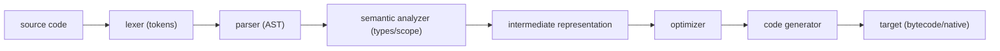

# Compilers 101 (1/10): 컴파일러란 무엇인가?

각 단계는 입력과 출력이 분명한 함수처럼 동작합니다. 이 분리가 바로 컴파일러를 이해하고 검증할 수 있게 만드는 힘입니다.

이 글은 Compilers 101 시리즈의 첫 번째 글입니다.

`2 + 3 * 4` 같은 짧은 식이 왜 바로 실행되지 않고 여러 단계를 거쳐 번역되는지 이해하면, 컴파일러를 더 이상 마법 상자가 아니라 단계별 변환 시스템으로 보게 됩니다.


*Compilers 101 1장 흐름 개요*

## 이 글에서 다룰 문제

- 컴파일러를 한 줄로 어떻게 정의할 수 있을까요?
- 표준적인 컴파일러 파이프라인은 어떤 단계로 나뉠까요?
- 인터프리터와 트랜스파일러는 이 파이프라인을 어디까지 공유할까요?
- 이 단계에서 발생하는 가장 흔한 오류는 어떤 형태일까요?
- 이 개념을 실무에서 잘못 적용하면 어떤 문제가 생길까요?

오류 메시지를 볼 때 "이건 문법 오류인가, 의미 오류인가?", 빌드가 느릴 때 "최적화 단계가 병목인가?", 새 언어가 어떻게 만들어지는지 이해할 때 "어느 단계가 추가되는가?" 같은 질문은 모두 파이프라인의 어느 지점에 서 있는지와 연결됩니다. 단계를 알아야 도구가 읽히고, 도구가 읽혀야 문제를 정확히 분해할 수 있습니다.

> 컴파일러를 안다는 것은 결국 "이 한 줄이 어디까지 번역됐고, 어디에서 멈췄는가?"를 답할 수 있다는 뜻입니다.


```mermaid
flowchart LR
    A["source code"] --> B["lexer (tokens)"]
    B --> C["parser (AST)"]
    C --> D["semantic analyzer (types/scope)"]
    D --> E["intermediate representation"]
    E --> F["optimizer"]
    F --> G["code generator"]
    G --> H["target (bytecode/native)"]
```

위 여섯 단계는 그대로 이 시리즈의 목차이기도 합니다. 이후 글에서 각 단계를 하나씩 떼어 자세히 다룹니다.

## 핵심 용어

- **컴파일러**: 소스 언어를 타깃 언어로 번역하는 프로그램입니다. 번역 자체가 목적이고, 실행은 별도 단계입니다.
- **인터프리터**: 소스 프로그램을 직접 실행하는 프로그램입니다. 보통 프런트엔드 단계는 컴파일러와 많이 겹칩니다.
- **트랜스파일러**: TypeScript → JavaScript처럼 추상화 수준이 비슷한 언어 사이를 번역하는 컴파일러입니다.
- **파이프라인**: 입력을 단계적으로 변환하는 구조입니다. 각 단계의 출력이 다음 단계의 입력이 됩니다.
- **프런트엔드 / 백엔드**: 소스 언어에 가까운 단계(lex, parse, semantic) 와 타깃에 가까운 단계(IR, optimize, codegen)입니다.

## 변경 전후

**Before — "컴파일은 마법"이라는 막연한 그림**

```text
.c → ??? → a.out
```

**After — 단계가 분리된 파이프라인**

```text
.c → lex → parse → check → IR → optimize → codegen → a.out
```

각 단계는 입력과 출력이 분명한 함수처럼 동작합니다. 이 분리가 바로 컴파일러를 이해하고 검증할 수 있게 만드는 힘입니다.

## 실습: 식 하나가 지나가는 전체 여정

`2 + 3 * 4`라는 식 하나가 컴파일러 파이프라인의 각 단계를 통과하는 과정을 코드로 따라가 봅니다. 각 단계를 별도 파일로 분리하면 테스트하기도 쉽고 이해하기도 쉽습니다.

### 1단계 — 토큰화: 텍스트를 의미 있는 조각으로 나누기

```python
# 1_lex.py
import re
from dataclasses import dataclass

@dataclass
class Token:
    kind: str
    text: str
    line: int = 1
    col: int = 1

PATTERNS = [
    ("NUM", r"\d+"),
    ("OP",  r"[+\-*/]"),
    ("WS",  r"\s+"),
]

def lex(src: str) -> list[Token]:
    tokens, i, line, col = [], 0, 1, 1
    while i < len(src):
        for kind, pat in PATTERNS:
            m = re.match(pat, src[i:])
            if m:
                text = m.group()
                if kind != "WS":
                    tokens.append(Token(kind, text, line, col))
                col += len(text)
                i += len(text)
                break
        else:
            raise SyntaxError(f"unexpected char {src[i]!r} at {line}:{col}")
    return tokens

tokens = lex("2 + 3 * 4")
for t in tokens:
    print(t)
# Token(kind='NUM', text='2', line=1, col=1)
# Token(kind='OP',  text='+', line=1, col=3)
# Token(kind='NUM', text='3', line=1, col=5)
# Token(kind='OP',  text='*', line=1, col=7)
# Token(kind='NUM', text='4', line=1, col=9)
```

문자열은 `[Token(NUM,'2'), Token(OP,'+'), ...]`처럼 의미 있는 단위로 바뀝니다. 위치 정보까지 함께 들고 가면 나중에 오류 메시지의 품질이 크게 달라집니다.

### 2단계 — 파싱: 토큰을 트리로 바꾸기

```python
# 2_parse.py
from dataclasses import dataclass
from typing import Union

@dataclass
class Num:
    value: int

@dataclass
class BinOp:
    op: str
    left: object
    right: object

# expr   := term  (("+"|"-") term)*
# term   := factor (("*"|"/") factor)*
# factor := NUM

def parse(tokens: list) -> Union[Num, BinOp]:
    i = [0]

    def peek():
        return tokens[i[0]] if i[0] < len(tokens) else None

    def eat():
        t = tokens[i[0]]
        i[0] += 1
        return t

    def factor():
        t = eat()
        if t.kind == "NUM":
            return Num(int(t.text))
        raise SyntaxError(f"expected NUM, got {t}")

    def term():
        node = factor()
        while peek() and peek().kind == "OP" and peek().text in "*/":
            op = eat().text
            node = BinOp(op, node, factor())
        return node

    def expr():
        node = term()
        while peek() and peek().kind == "OP" and peek().text in "+-":
            op = eat().text
            node = BinOp(op, node, term())
        return node

    return expr()

from 1_lex import lex
ast = parse(lex("2 + 3 * 4"))
print(ast)
# BinOp(op='+', left=Num(value=2), right=BinOp(op='*', left=Num(value=3), right=Num(value=4)))
```

이제 입력은 텍스트가 아니라 트리가 됩니다. 우선순위(`*`가 `+`보다 먼저)가 트리 모양에 그대로 반영됩니다. 의미를 묻고 타입을 따지고 최적화하기에 훨씬 좋은 형태입니다.

### 3단계 — 의미 분석: "이 표현은 말이 되는가?"

```python
# 3_check.py
def check(node) -> str:
    """AST 노드의 타입을 반환합니다. 오류가 있으면 TypeError를 던집니다."""
    if isinstance(node, Num):
        return "int"
    if isinstance(node, BinOp):
        t1 = check(node.left)
        t2 = check(node.right)
        if t1 != "int" or t2 != "int":
            raise TypeError(
                f"operator '{node.op}' requires int operands, "
                f"got {t1} and {t2}"
            )
        return "int"
    raise TypeError(f"unknown node type: {type(node)}")

# 정상 케이스
print(check(ast))  # "int"

# 오류 케이스 (타입 불일치를 잡습니다)
@dataclass
class Str:
    value: str

bad_ast = BinOp("+", Num(1), Str("hello"))
try:
    check(bad_ast)
except TypeError as e:
    print(f"TypeError: {e}")
# TypeError: operator '+' requires int operands, got int and str
```

이 단계는 "타입이 맞는가?", "변수가 선언됐는가?" 같은 질문을 처리합니다. 파서는 구조의 올바름만 확인하고, 이 단계가 의미의 올바름을 확인합니다.

### 4단계 — 평가: 작은 인터프리터 만들기

```python
# 4_eval.py
def evaluate(node) -> int:
    """AST를 순회하며 정수 값을 계산합니다."""
    if isinstance(node, Num):
        return node.value
    if isinstance(node, BinOp):
        a = evaluate(node.left)
        b = evaluate(node.right)
        ops = {"+": a + b, "-": a - b, "*": a * b, "/": a // b}
        if node.op not in ops:
            raise RuntimeError(f"unknown operator: {node.op}")
        return ops[node.op]
    raise RuntimeError(f"unknown node: {node}")

result = evaluate(ast)
print(result)  # 14  (2 + 3 * 4 = 2 + 12 = 14)
```

여기서 멈추면 이 프로그램은 **인터프리터**입니다. 같은 트리를 뒤 단계로 더 보내 코드로 내보내면 컴파일러가 됩니다. 두 방식이 AST까지는 완전히 같은 단계를 공유합니다.

### 5단계 — 코드 생성: 스택 기반 가상 머신 명령어 내보내기

```python
# 5_codegen.py
def emit(node: object, out: list = None) -> list:
    """AST를 스택 기반 VM 명령어 시퀀스로 변환합니다."""
    if out is None:
        out = []
    if isinstance(node, Num):
        out.append(f"PUSH {node.value}")
        return out
    if isinstance(node, BinOp):
        emit(node.left, out)    # 왼쪽 피연산자를 스택에 쌓습니다
        emit(node.right, out)   # 오른쪽 피연산자를 스택에 쌓습니다
        asm = {"+": "ADD", "-": "SUB", "*": "MUL", "/": "DIV"}
        out.append(asm[node.op])
        return out

instructions = emit(ast)
for instr in instructions:
    print(instr)
# PUSH 2
# PUSH 3
# PUSH 4
# MUL       <- 3 * 4 = 12
# ADD       <- 2 + 12 = 14
```

같은 AST에서 가상 머신 바이트코드를 뽑아내는 순간이 바로 컴파일러의 마지막 단계입니다. 스택에서 꺼내 계산하면 14가 나옵니다.

### 전체 파이프라인 연결

```python
# pipeline.py
import re
from dataclasses import dataclass

# --- 1. Lexer ---
@dataclass
class Token:
    kind: str; text: str

def lex(src):
    tokens = []
    for m in re.finditer(r"\d+|[+\-*/()]|\S", src):
        kind = "NUM" if m.group().isdigit() or m.group()[0].isdigit() else "OP"
        tokens.append(Token(kind, m.group()))
    return tokens

# --- 2. AST nodes ---
@dataclass
class Num: value: int
@dataclass
class BinOp: op: str; left: object; right: object

# --- 3. Parser (재귀 하강) ---
def parse(tokens):
    i = [0]
    def peek(): return tokens[i[0]] if i[0] < len(tokens) else Token("EOF","")
    def eat(): t = peek(); i[0] += 1; return t
    def factor():
        t = eat()
        if t.kind == "NUM": return Num(int(t.text))
        raise SyntaxError(f"unexpected {t.text}")
    def term():
        n = factor()
        while peek().text in "*/": n = BinOp(eat().text, n, factor())
        return n
    def expr():
        n = term()
        while peek().text in "+-": n = BinOp(eat().text, n, term())
        return n
    return expr()

# --- 4. Type checker ---
def check(node):
    if isinstance(node, Num): return "int"
    t1, t2 = check(node.left), check(node.right)
    if t1 != t2: raise TypeError(f"{node.op}: {t1} vs {t2}")
    return t1

# --- 5. Evaluator ---
def evaluate(node):
    if isinstance(node, Num): return node.value
    a, b = evaluate(node.left), evaluate(node.right)
    return {"+": a+b, "-": a-b, "*": a*b, "/": a//b}[node.op]

# --- 6. Code generator ---
def emit(node, out=None):
    out = out or []
    if isinstance(node, Num): out.append(f"PUSH {node.value}"); return out
    emit(node.left, out); emit(node.right, out)
    out.append({"+":"ADD","-":"SUB","*":"MUL","/":"DIV"}[node.op])
    return out

# --- 전체 실행 ---
src = "2 + 3 * 4"
tokens = lex(src)
ast    = parse(tokens)
ty     = check(ast)
val    = evaluate(ast)
code   = emit(ast)

print(f"tokens : {[t.text for t in tokens]}")
print(f"type   : {ty}")
print(f"value  : {val}")
print(f"code   : {code}")
# tokens : ['2', '+', '3', '*', '4']
# type   : int
# value  : 14
# code   : ['PUSH 2', 'PUSH 3', 'PUSH 4', 'MUL', 'ADD']
```

## 컴파일러 vs 인터프리터 vs 트랜스파일러

세 도구는 같은 프런트엔드를 공유하며, 백엔드에서 갈라집니다.

| 구분 | 프런트엔드 | 백엔드 | 실행 |
|---|---|---|---|
| 컴파일러 | lex → parse → check | IR → optimize → codegen | 별도 프로세스 |
| 인터프리터 | lex → parse → check | AST 순회(evaluate) | 즉시 |
| 트랜스파일러 | lex → parse → check | 타깃 소스 코드 생성 | 별도 도구 |

- 같은 AST를 평가하면 인터프리터이고, 코드로 방출하면 컴파일러입니다.
- 각 단계의 입력과 출력이 분리돼 있어서 단위 테스트가 쉽습니다.
- 프런트엔드(lex → check)는 언어가 결정하고, 백엔드(IR → codegen)는 타깃이 결정합니다.
- 토큰과 AST는 텍스트보다 **추론하기 쉬운 형태**입니다.

## 자주 하는 실수

1. **렉서와 파서를 한 함수에 섞는 것**입니다. 디버깅 난도가 급격히 올라갑니다. 각 단계는 반드시 분리해야 합니다.
2. **의미 분석을 원문 텍스트에서 바로 하려는 것**입니다. 우선순위와 중첩 구조가 무너집니다. AST가 있어야 의미 분석이 정확합니다.
3. **타입 검사를 코드 생성에 섞는 것**입니다. 오류가 너무 늦게 드러납니다. 타입 오류는 반드시 코드 생성 이전에 잡아야 합니다.
4. **인터프리터가 컴파일러보다 본질적으로 훨씬 단순하다고 믿는 것**입니다. 둘은 프런트엔드를 많이 공유하고, 백엔드 구현만 다릅니다.
5. **에러에 line/column 정보를 붙이지 않는 것**입니다. 모든 단계는 원본 위치를 끝까지 들고 가야 합니다. 위치 없는 오류 메시지는 사용자를 당혹스럽게 만듭니다.

## 실무에서는 이렇게 나타납니다

같은 파이프라인은 GCC, Clang, V8, CPython, Babel, TypeScript 같은 실제 도구 안에 모두 들어 있습니다. LLVM은 이 구조를 백엔드 관점에서 가장 잘 모듈화한 대표 사례입니다.

사내 DSL을 만들 때도 패턴은 반복됩니다. `tokenize → parse → AST → walk`가 사실상 기본 골격입니다. 간단한 설정 언어, 템플릿 엔진, 쿼리 빌더도 모두 이 구조를 따릅니다.

## 숙련된 엔지니어는 이렇게 봅니다

- 먼저 "프런트엔드는 어디서 끝나고 백엔드는 어디서 시작되는가?"를 묻습니다.
- 손수 파서를 쓰기 전에 PEG나 ANTLR 같은 도구를 검토합니다.
- 오류 메시지 품질을 단계 분리의 결과로 봅니다. 단계가 분리될수록 오류 메시지가 더 정확해집니다.
- AST 노드에 항상 위치 정보를 붙입니다.
- 인터프리터, 컴파일러, 트랜스파일러를 같은 그림의 변형으로 봅니다.

## 운영 체크리스트

- [ ] 컴파일러를 한 줄로 정의할 수 있습니까?
- [ ] 여섯 단계 파이프라인을 직접 그릴 수 있습니까?
- [ ] 인터프리터가 어느 단계를 공유하는지 설명할 수 있습니까?
- [ ] AST가 왜 텍스트보다 다루기 쉬운지 한 줄로 말할 수 있습니까?
- [ ] 프런트엔드/백엔드 분리의 이점을 한 줄로 설명할 수 있습니까?

## 연습 문제

1. 위 `pipeline.py`를 한 스크립트로 합쳐 `2 + 3 * 4`에 대해 토큰, AST, 계산 결과(`14`), 가짜 어셈블리를 모두 출력해 보세요.
2. 같은 코드에 CLI 플래그를 추가해서 인터프리터 모드와 코드 생성 모드를 전환해 보세요.
3. 자주 쓰는 언어 하나를 골라 프런트엔드/백엔드 경계가 어디인지 한 단락으로 설명해 보세요.

## 처음 질문으로 돌아가기

- **컴파일러를 한 줄로 어떻게 정의할 수 있을까요?**
  - 소스 언어를 타깃 언어로 번역하는 프로그램입니다. 핵심은 "번역"이고, 실행은 별도입니다. 인터프리터와 달리 컴파일러는 입력 전체를 처리한 뒤 출력을 내놓습니다.
- **표준적인 컴파일러 파이프라인은 어떤 단계로 나뉠까요?**
  - lex(토큰화) → parse(AST 구성) → semantic analysis(타입/이름 검사) → IR 생성 → optimization → code generation의 6단계입니다. 각 단계는 명확한 자료형을 주고받는 함수입니다.
- **인터프리터와 트랜스파일러는 이 파이프라인을 어디까지 공유할까요?**
  - 세 도구 모두 lex → parse → semantic analysis까지 프런트엔드를 공유합니다. 이후 컴파일러는 기계 코드로, 인터프리터는 AST를 직접 평가하는 방향으로, 트랜스파일러는 다른 소스 언어로 방향이 달라집니다.

## 정리와 다음 글

컴파일러는 여러 단계를 분해해서 볼 때 비로소 구조가 보이는 시스템입니다. 다음 글에서는 그 첫 단계인 lexical analysis를 자세히 보며, 텍스트가 어떻게 토큰이 되는지 다룹니다.

<!-- toc:begin -->
## 시리즈 목차

- **Compilers 101 (1/10): 컴파일러란 무엇인가? (현재 글)**
- [Compilers 101 (2/10): 렉시컬 분석](./02-lexical-analysis.md)
- [Compilers 101 (3/10): 파싱과 AST](./03-parsing-and-ast.md)
- [Compilers 101 (4/10): 시맨틱 분석](./04-semantic-analysis.md)
- [Compilers 101 (5/10): 심볼 테이블과 스코프](./05-symbol-table-and-scope.md)
- [Compilers 101 (6/10): 중간 표현](./06-intermediate-representation.md)
- [Compilers 101 (7/10): 최적화 기초](./07-optimization-basics.md)
- [Compilers 101 (8/10): 코드 생성](./08-code-generation.md)
- [Compilers 101 (9/10): JIT vs AOT](./09-jit-vs-aot.md)
- [작은 인터프리터 만들기](./10-building-a-tiny-interpreter.md)

<!-- toc:end -->

## 참고 자료

- [Compilers: Principles, Techniques, and Tools (Aho et al.)](https://suif.stanford.edu/dragonbook/)
- [Crafting Interpreters (Robert Nystrom)](https://craftinginterpreters.com/)
- [LLVM Project](https://llvm.org/)
- [PEP 339 — Design of the CPython compiler](https://peps.python.org/pep-0339/)

- [이 시리즈 예제 코드 (book-examples)](https://github.com/yeongseon-books/book-examples/tree/main/compilers-101/ko)

Tags: Computer Science, Compilers, Pipeline, AST, Bytecode, Frontend
