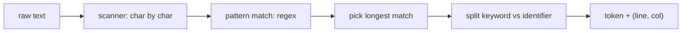

# Compilers 101 (2/10): 렉시컬 분석

이 글은 Compilers 101 시리즈의 두 번째 글입니다.

`print("hello")` 같은 한 줄을 컴파일러가 실제로 어떻게 잘게 나누는지 이해하면, `SyntaxError`가 왜 그 자리에서 생겼는지 훨씬 선명하게 보이기 시작합니다.


*Compilers 101 2장 흐름 개요*

## 먼저 던지는 질문

- 토큰은 정확히 무엇이고, 렉서는 어떤 문제를 해결할까요?
- 정규식 기반 렉서는 어떻게 동작할까요?
- longest-match 규칙은 왜 중요할까요?

## 왜 중요한가

`SyntaxError: unexpected token`이 어디에서 오는지 정확히 답할 수 있는 사람과 그렇지 못한 사람의 차이는 대개 lexical analysis를 실제로 들여다봤는지에 달려 있습니다. 좋은 렉서는 단지 토큰을 자르는 도구가 아니라, 좋은 오류 메시지의 시작점이기도 합니다.

> 토큰을 잘못 자르면, 그다음 모든 단계가 같은 잘못된 분할 위에 세워집니다.

## 핵심 개념 한눈에 보기



이 단계의 핵심은 두 가지입니다. **가장 긴 매치를 고르는 것**과 **위치 정보를 끝까지 들고 가는 것**입니다.

## 핵심 용어

- 토큰: 렉서가 만들어 내는 의미 있는 단위입니다. 보통 `(kind, text, position)`의 조합으로 생각합니다.
- **렉심(lexeme)**: 토큰 안의 실제 텍스트 부분입니다.
- **longest match**: 같은 위치에서 여러 패턴이 맞을 수 있을 때 가장 긴 매치를 고르는 규칙입니다.
- **키워드 vs 식별자**: `if`는 키워드이고 `iff`는 식별자입니다. 둘 다 같은 패턴에서 시작하므로 후처리로 분리합니다.
- **공백 / 주석**: 렉서는 인식하지만 토큰 스트림에서는 보통 제거합니다.

## 변경 전후

**Before — 문자 하나씩 분기하는 코드**

```python
# 문자마다 if/else를 쓰면 코드가 폭발합니다
def lex_naive(s):
    out, i = [], 0
    while i < len(s):
        if s[i].isdigit():
            j = i
            while j < len(s) and s[j].isdigit(): j += 1
            out.append(("NUM", s[i:j])); i = j
        elif s[i] in "+-*/":
            out.append(("OP", s[i])); i += 1
        else:
            i += 1
    return out
```

**After — 정규식 기반 테이블**

```python
SPEC = [("NUM", r"\d+"), ("OP", r"[+\-*/]"), ("WS", r"\s+")]
```

새 토큰을 추가할 때 한 행만 더 넣으면 됩니다. 유지보수성과 가독성이 훨씬 좋아집니다.

## 실습: 작은 렉서를 단계별로 만들기

### 1단계 — 정규식 기반 렉서

```python
# 1_regex_lex.py
import re
from dataclasses import dataclass

@dataclass
class Token:
    kind: str
    text: str
    line: int
    col: int

SPEC = [
    ("NUM",   r"\d+"),
    ("ID",    r"[A-Za-z_]\w*"),
    ("STR",   r'"[^"]*"'),
    ("OP",    r"[+\-*/=<>!]+"),
    ("LP",    r"\("),
    ("RP",    r"\)"),
    ("NL",    r"\n"),
    ("WS",    r"[ \t]+"),
]
KEYWORDS = {"if", "else", "while", "return", "True", "False"}

def lex(src: str) -> list[Token]:
    tokens, i, line, col = [], 0, 1, 1
    while i < len(src):
        for kind, pat in SPEC:
            m = re.match(pat, src[i:])
            if m:
                text = m.group()
                if kind == "ID" and text in KEYWORDS:
                    kind = "KW"
                if kind not in ("WS",):
                    tokens.append(Token(kind, text, line, col))
                if kind == "NL":
                    line += 1; col = 1
                else:
                    col += len(text)
                i += len(text)
                break
        else:
            raise SyntaxError(f"unexpected {src[i]!r} at {line}:{col}")
    return tokens

for t in lex('if x == 1\n  return "ok"\n'):
    print(t)
```

하나의 테이블이 모든 토큰 종류를 표현합니다. 위치 정보도 매 단계에서 함께 갱신됩니다.

### 2단계 — longest-match가 왜 중요한가

```python
# 2_longest.py
# == 와 = 를 모두 가진 언어를 떠올려 봅시다.
SPEC = [("EQ", r"=="), ("ASSIGN", r"=")]
import re
src = "=="
for kind, pat in SPEC:
    m = re.match(pat, src)
    if m:
        print("first match:", kind, m.group())
        break
```

순서를 뒤집으면 `=`가 먼저 잡혀서 `==`가 두 토큰으로 잘립니다. 그래서 SPEC 순서로 longest-match를 흉내 내거나, 정규식 대안을 길이 순으로 정렬해야 합니다.

### 3단계 — 키워드와 식별자 분리하기

```python
# 3_keywords.py
import re
KEYWORDS = {"if", "else", "while"}
src = "if iff while"
for m in re.finditer(r"[A-Za-z_]\w*", src):
    text = m.group()
    kind = "KW" if text in KEYWORDS else "ID"
    print(kind, text)
```

표준 패턴은 같습니다. 같은 정규식으로 먼저 잡고, 후처리 단계에서 키워드 집합과 비교합니다. 키워드를 정규식 안에 직접 박아 넣으면 변경이 불편해집니다.

### 4단계 — 위치 정보 유지하기

```python
# 4_position.py
# 1단계의 렉서가 이미 행/열 정보를 갖고 있습니다.
# 에러를 보고해야 할 때 그 정보로 좋은 메시지를 만들 수 있습니다.
def report(token, message):
    print(f"  File \"<src>\", line {token.line}, col {token.col}")
    print(f"    {token.text}")
    print(f"  SyntaxError: {message}")
```

좋은 컴파일러 오류 메시지는 위치를 절대 잃지 않는 렉서에서 시작합니다.

### 5단계 — Python 내장 `tokenize` 살펴보기

```python
# 5_python_tokenize.py
import tokenize, io

src = "x = 1 + 2  # add\n"
for tok in tokenize.generate_tokens(io.StringIO(src).readline):
    print(tok)
```

CPython의 렉서를 직접 볼 수 있습니다. `OP`, `NAME`, `NUMBER`, `NEWLINE`, `COMMENT` 같은 토큰이 line/column 정보와 함께 나옵니다.

## 이 코드에서 먼저 봐야 할 점

- 테이블 기반 렉서는 토큰 추가와 변경을 **데이터 수정**으로 바꿉니다.
- longest-match는 SPEC 순서나 명시적 길이 비교로 보장합니다.
- 키워드는 렉서의 정규식 자체가 아니라 후처리로 분리합니다.
- 위치 정보는 토큰의 부가 정보가 아니라 핵심 정보입니다.

## 자주 하는 실수 다섯 가지

1. **`==`와 `=`처럼 접두사가 겹치는 토큰에서 longest-match를 보장하지 않는 것**입니다.
2. **키워드를 정규식 안에 하드코딩하는 것**입니다.
3. **위치 정보를 들고 가지 않는 것**입니다. 오류 메시지가 “어딘가에서 syntax error” 수준으로 떨어집니다.
4. **공백이나 주석을 너무 일찍 버리는 것**입니다. 포매터와 린터는 그 정보가 필요합니다.
5. **에러 복구 전략이 전혀 없는 것**입니다. 첫 오류에서 바로 종료되면 사용자 경험이 나빠집니다.

## 실무에서는 이렇게 나타납니다

대부분의 언어 도구는 정규식 기반 렉서나 DFA 계열 변형을 사용합니다. PEG나 parser combinator는 렉서와 파서를 합쳐 scannerless parsing 형태를 쓰기도 합니다. LSP 서버도 가장 먼저 렉서를 호출하고, syntax highlighting은 사실상 렉서 출력의 시각화라고 볼 수 있습니다.

## 숙련된 엔지니어는 이렇게 봅니다

- 새 언어를 만나면 먼저 토큰 종류 표를 그립니다.
- 정규식 SPEC의 순서 자체를 언어 규칙의 일부로 봅니다.
- 위치 정보가 도구 품질의 핵심이라는 점을 알고 있습니다.
- 사내 DSL이라면 먼저 `re`와 표 하나로 충분한지 검토합니다.
- 오류 복구 전략을 렉서 단계부터 설계합니다.

## 체크리스트

- [ ] 토큰을 한 문장으로 정의할 수 있습니까?
- [ ] longest-match를 한 문장으로 설명할 수 있습니까?
- [ ] 키워드와 식별자를 분리하는 표준 패턴을 알고 있습니까?
- [ ] 렉서가 왜 위치 정보를 반드시 들고 가야 하는지 설명할 수 있습니까?
- [ ] Python `tokenize` 모듈의 출력을 직접 본 적이 있습니까?

## 연습 문제

1. 1단계 렉서에 `<=`, `>=`를 추가하고, 순서를 잘못 두면 무엇이 깨지는지 실험해 보세요.
2. 같은 렉서에 가장 단순한 에러 복구를 넣어 한 번에 여러 문법 오류를 보고하게 만들어 보세요.
3. `tokenize` 출력으로 키워드 빈도를 세는 작은 도구를 만들어 보세요.

## 정리와 다음 글

렉서는 텍스트를 의미 단위로 바꾸는 첫 번째 변환입니다. 다음 글에서는 이 토큰 스트림을 트리(AST)로 바꾸는 단계인 parsing을 다룹니다.

## 처음 질문으로 돌아가기

- **토큰은 정확히 무엇이고, 렉서는 어떤 문제를 해결할까요?**
  - 토큰은 `(kind, text, position)`처럼 종류, 원문, 위치를 함께 담아 다음 단계가 읽기 쉬운 단위로 만든 결과입니다. 이 글의 `Token(kind, text, line, col)` 구조와 `lex('if x == 1\n  return "ok"\n')` 출력이 렉서가 텍스트를 잘라 오류 위치까지 보존하는 일을 보여 줍니다.
- **정규식 기반 렉서는 어떻게 동작할까요?**
  - `SPEC` 테이블의 패턴을 현재 위치에서 순서대로 맞춰 보고, 맞은 조각을 토큰으로 만들면서 `line`, `col`을 함께 갱신하는 방식으로 동작합니다. `ID`를 먼저 잡은 뒤 `KEYWORDS` 집합으로 `if`, `while`을 `KW`로 바꾸는 후처리가 정규식 기반 렉서의 전형적인 구조입니다.
- **longest-match 규칙은 왜 중요할까요?**
  - `==`와 `=`처럼 접두사가 겹치는 토큰이 있을 때 가장 긴 매치를 보장하지 않으면 같은 입력이 완전히 다른 토큰 스트림으로 잘립니다. 본문의 `SPEC = [("EQ", r"=="), ("ASSIGN", r"=")]` 예제는 순서가 바뀌면 `==`가 두 개의 `=`로 깨진다는 점을 바로 보여 줍니다.

<!-- toc:begin -->
## 시리즈 목차

- [Compilers 101 (1/10): 컴파일러란 무엇인가?](./01-what-is-a-compiler.md)
- **렉시컬 분석 (현재 글)**
- 파싱과 AST (예정)
- 시맨틱 분석 (예정)
- 심볼 테이블과 스코프 (예정)
- 중간 표현 (예정)
- 최적화 기초 (예정)
- 코드 생성 (예정)
- JIT vs AOT (예정)
- 작은 인터프리터 만들기 (예정)

<!-- toc:end -->

## 참고 자료

- [Python — tokenize module](https://docs.python.org/3/library/tokenize.html)
- [Crafting Interpreters — Scanning](https://craftinginterpreters.com/scanning.html)
- [Lex (Wikipedia)](https://en.wikipedia.org/wiki/Lex_(software))
- [Regular language (Wikipedia)](https://en.wikipedia.org/wiki/Regular_language)

- [이 시리즈 예제 코드 (book-examples)](https://github.com/yeongseon-books/book-examples/tree/main/compilers-101/ko)

Tags: Computer Science, Compilers, Lexer, Tokens, Regex, Position
