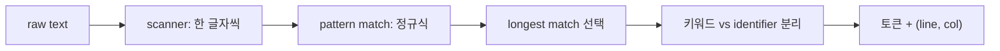

# lexical analysis

> Compilers 101 시리즈 (2/10)


## 이 글에서 다룰 문제

`SyntaxError: unexpected token`이 어디서 오는지를 답할 수 있는 사람과 못하는 사람의 차이는 lexical analysis를 봤느냐 안 봤느냐입니다. 좋은 lexer는 좋은 오류 메시지의 출발점입니다.

> 토큰을 잘못 자르면, 그다음 모든 단계가 같은 잘못 위에 쌓입니다.

## 개념 한눈에 보기



핵심은 "가장 긴 매칭을 고른다"와 "위치를 끝까지 들고 다닌다" 두 가지입니다.

## Before/After

**Before — 한 글자씩 분기 처리**

```python
# if/else로 글자별 처리 → 코드가 폭발한다
def lex_naive(s):
    out, i = [], 0
    while i < len(s):
        if s[i].isdigit():
            j = i
            while j < len(s) and s[j].isdigit(): j += 1
            out.append(("NUM", s[i:j])); i = j
        elif s[i] in "+-*/":
            out.append(("OP", s[i])); i += 1
        else:
            i += 1
    return out
```

**After — 정규식 기반 테이블**

```python
SPEC = [("NUM", r"\d+"), ("OP", r"[+\-*/]"), ("WS", r"\s+")]
```

테이블만 늘리면 새 토큰이 추가됩니다. 유지보수성과 가독성이 훨씬 좋습니다.

## 실습: 작은 lexer를 단계별로

### 1단계 — 정규식 기반 lexer

```python
# 1_regex_lex.py
import re
from dataclasses import dataclass

@dataclass
class Token:
    kind: str
    text: str
    line: int
    col: int

SPEC = [
    ("NUM",   r"\d+"),
    ("ID",    r"[A-Za-z_]\w*"),
    ("STR",   r'"[^"]*"'),
    ("OP",    r"[+\-*/=<>!]+"),
    ("LP",    r"\("),
    ("RP",    r"\)"),
    ("NL",    r"\n"),
    ("WS",    r"[ \t]+"),
]
KEYWORDS = {"if", "else", "while", "return", "True", "False"}

def lex(src: str) -> list[Token]:
    tokens, i, line, col = [], 0, 1, 1
    while i < len(src):
        for kind, pat in SPEC:
            m = re.match(pat, src[i:])
            if m:
                text = m.group()
                if kind == "ID" and text in KEYWORDS:
                    kind = "KW"
                if kind not in ("WS",):
                    tokens.append(Token(kind, text, line, col))
                if kind == "NL":
                    line += 1; col = 1
                else:
                    col += len(text)
                i += len(text)
                break
        else:
            raise SyntaxError(f"unexpected {src[i]!r} at {line}:{col}")
    return tokens

for t in lex('if x == 1\n  return "ok"\n'):
    print(t)
```

표 한 개로 모든 토큰 종류를 표현했습니다. 위치 정보는 매 단계 갱신됩니다.

### 2단계 — longest-match가 왜 필요한가

```python
# 2_longest.py
# == 와 = 가 같이 있는 언어를 본다고 하자
SPEC = [("EQ", r"=="), ("ASSIGN", r"=")]
import re
src = "=="
for kind, pat in SPEC:
    m = re.match(pat, src)
    if m:
        print("first match:", kind, m.group())
        break
```

순서를 거꾸로 두면 `=`가 먼저 매칭되어 `==`가 두 토큰으로 잘립니다. SPEC 순서로 longest-match를 흉내 내거나, 정규식 alternation을 길이 순으로 정렬해야 합니다.

### 3단계 — 키워드와 identifier 분리

```python
# 3_keywords.py
import re
KEYWORDS = {"if", "else", "while"}
src = "if iff while"
for m in re.finditer(r"[A-Za-z_]\w*", src):
    text = m.group()
    kind = "KW" if text in KEYWORDS else "ID"
    print(kind, text)
```

같은 정규식으로 잡고, 후처리로 키워드 집합과 비교하는 게 표준입니다. 정규식 안에 키워드를 박아 두면 추가/변경이 어려워집니다.

### 4단계 — 위치 정보 유지

```python
# 4_position.py
# 1단계의 lex가 이미 line/col을 들고 다닌다.
# 오류를 내야 할 때, 그 정보로 보기 좋은 메시지를 만들 수 있다
def report(token, message):
    print(f"  File \"<src>\", line {token.line}, col {token.col}")
    print(f"    {token.text}")
    print(f"  SyntaxError: {message}")
```

좋은 컴파일러 오류 메시지의 출발점은 lexer가 위치를 잃지 않는 것입니다.

### 5단계 — Python 내장 `tokenize`

```python
# 5_python_tokenize.py
import tokenize, io

src = "x = 1 + 2  # add\n"
for tok in tokenize.generate_tokens(io.StringIO(src).readline):
    print(tok)
```

CPython의 lexer가 직접 보입니다. `OP`, `NAME`, `NUMBER`, `NEWLINE`, `COMMENT` 같은 토큰들이 line/column 정보와 함께 나옵니다.

## 이 코드에서 주목할 점

- 테이블 기반 lexer는 추가/변경이 데이터 변경으로 끝납니다.
- longest-match는 SPEC 순서나 명시적 비교로 보장합니다.
- 키워드는 lexer가 직접 인식하지 않고, 후처리로 분리합니다.
- 위치 정보는 토큰의 1등 시민입니다.

## 자주 하는 실수 5가지

1. **`==`와 `=`처럼 prefix가 겹치는 토큰의 longest-match를 보장하지 않는다.** 가장 흔한 lexer 버그.
2. **키워드를 정규식에 박는다.** 키워드 추가가 정규식 수정이 됩니다.
3. **위치 정보를 안 들고 다닌다.** 오류 메시지가 "어딘가에서 syntax error" 수준이 됩니다.
4. **공백/주석을 너무 일찍 버린다.** code formatter나 linter에서는 그 정보가 필요합니다.
5. **에러 복구를 안 만든다.** 첫 syntax error 한 번에 lexer가 죽으면 사용자 경험이 나쁩니다.

## 실무에서는 이렇게 쓰입니다

대부분의 언어 도구는 정규식 기반 lexer 또는 그 변형(DFA)을 씁니다. PEG/parser combinator는 lexer와 parser를 합치기도 합니다 (scannerless parsing). LSP(language server)도 lexer를 가장 먼저 호출하고, syntax highlighting은 사실상 lexer 결과의 시각화입니다.

## 체크리스트

- [ ] 토큰을 한 줄로 정의할 수 있는가?
- [ ] longest-match를 한 줄로 설명할 수 있는가?
- [ ] 키워드와 identifier를 분리하는 표준 패턴을 아는가?
- [ ] lexer가 위치 정보를 들고 다녀야 하는 이유를 답할 수 있는가?
- [ ] Python `tokenize` 모듈로 한 번이라도 출력을 본 적이 있는가?

## 정리 및 다음 단계

Lexer는 텍스트를 의미 단위로 바꾸는 첫 변환입니다. 다음 글에서는 그 토큰 스트림으로 트리(AST)를 만드는 단계 — parsing — 를 살펴봅니다.

<!-- toc:begin -->
- [컴파일러란 무엇인가?](./01-what-is-a-compiler.md)
- **lexical analysis (현재 글)**
- parsing과 AST (예정)
- semantic analysis (예정)
- symbol table과 scope (예정)
- intermediate representation (예정)
- optimization 기초 (예정)
- code generation (예정)
- JIT vs AOT (예정)
- 작은 인터프리터 만들어 보기 (예정)
<!-- toc:end -->

## 참고 자료

- [Python — tokenize module](https://docs.python.org/3/library/tokenize.html)
- [Crafting Interpreters — Scanning](https://craftinginterpreters.com/scanning.html)
- [Lex (Wikipedia)](https://en.wikipedia.org/wiki/Lex_(software))
- [Regular language (Wikipedia)](https://en.wikipedia.org/wiki/Regular_language)

Tags: Computer Science, Compilers, Lexer, 토큰, 정규식, 위치정보
