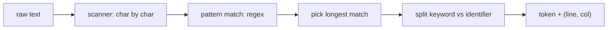

# Compilers 101 (2/10): 렉시컬 분석

이 글은 Compilers 101 시리즈의 두 번째 글입니다.

`print("hello")` 같은 한 줄을 컴파일러가 실제로 어떻게 잘게 나누는지 이해하면, `SyntaxError`가 왜 그 자리에서 생겼는지 훨씬 선명하게 보이기 시작합니다.

## 먼저 던지는 질문

- 토큰은 정확히 무엇이고, 렉서는 어떤 문제를 해결할까요?
- 정규식 기반 렉서는 어떻게 동작할까요?
- longest-match 규칙은 왜 중요할까요?

## 큰 그림


*Compilers 101 2장 흐름 개요*

## 왜 중요한가

`SyntaxError: unexpected token`이 어디에서 오는지 정확히 답할 수 있는 사람과 그렇지 못한 사람의 차이는 대개 lexical analysis를 실제로 들여다봤는지에 달려 있습니다. 좋은 렉서는 단지 토큰을 자르는 도구가 아니라, 좋은 오류 메시지의 시작점이기도 합니다.

> 토큰을 잘못 자르면, 그다음 모든 단계가 같은 잘못된 분할 위에 세워집니다.

## 핵심 개념 한눈에 보기



이 단계의 핵심은 두 가지입니다. **가장 긴 매치를 고르는 것**과 **위치 정보를 끝까지 들고 가는 것**입니다.

## 핵심 용어

- 토큰: 렉서가 만들어 내는 의미 있는 단위입니다. 보통 `(kind, text, position)`의 조합으로 생각합니다.
- **렉심(lexeme)**: 토큰 안의 실제 텍스트 부분입니다.
- **longest match**: 같은 위치에서 여러 패턴이 맞을 수 있을 때 가장 긴 매치를 고르는 규칙입니다.
- **키워드 vs 식별자**: `if`는 키워드이고 `iff`는 식별자입니다. 둘 다 같은 패턴에서 시작하므로 후처리로 분리합니다.
- **공백 / 주석**: 렉서는 인식하지만 토큰 스트림에서는 보통 제거합니다.

## 변경 전후

**Before — 문자 하나씩 분기하는 코드**

```python
# if/else per character makes the code explode
def lex_naive(s):
    out, i = [], 0
    while i < len(s):
        if s[i].isdigit():
            j = i
            while j < len(s) and s[j].isdigit(): j += 1
            out.append(("NUM", s[i:j])); i = j
        elif s[i] in "+-*/":
            out.append(("OP", s[i])); i += 1
        else:
            i += 1
    return out
```

**After — 정규식 기반 테이블**

```python
SPEC = [("NUM", r"\d+"), ("OP", r"[+\-*/]"), ("WS", r"\s+")]
```

새 토큰을 추가할 때 한 행만 더 넣으면 됩니다. 유지보수성과 가독성이 훨씬 좋아집니다.

## 실습: 작은 렉서를 단계별로 만들기

### 1단계 — 정규식 기반 렉서

```python
# 1_regex_lex.py
import re
from dataclasses import dataclass

@dataclass
class Token:
    kind: str
    text: str
    line: int
    col: int

SPEC = [
    ("NUM",   r"\d+"),
    ("ID",    r"[A-Za-z_]\w*"),
    ("STR",   r'"[^"]*"'),
    ("OP",    r"[+\-*/=<>!]+"),
    ("LP",    r"\("),
    ("RP",    r"\)"),
    ("NL",    r"\n"),
    ("WS",    r"[ \t]+"),
]
KEYWORDS = {"if", "else", "while", "return", "True", "False"}

def lex(src: str) -> list[Token]:
    tokens, i, line, col = [], 0, 1, 1
    while i < len(src):
        for kind, pat in SPEC:
            m = re.match(pat, src[i:])
            if m:
                text = m.group()
                if kind == "ID" and text in KEYWORDS:
                    kind = "KW"
                if kind not in ("WS",):
                    tokens.append(Token(kind, text, line, col))
                if kind == "NL":
                    line += 1; col = 1
                else:
                    col += len(text)
                i += len(text)
                break
        else:
            raise SyntaxError(f"unexpected {src[i]!r} at {line}:{col}")
    return tokens

for t in lex('if x == 1\n  return "ok"\n'):
    print(t)
```

하나의 테이블이 모든 토큰 종류를 표현합니다. 위치 정보도 매 단계에서 함께 갱신됩니다.

### 2단계 — longest-match가 왜 중요한가

```python
# 2_longest.py
# imagine a language that has both == and =
SPEC = [("EQ", r"=="), ("ASSIGN", r"=")]
import re
src = "=="
for kind, pat in SPEC:
    m = re.match(pat, src)
    if m:
        print("first match:", kind, m.group())
        break
```

순서를 뒤집으면 `=`가 먼저 잡혀서 `==`가 두 토큰으로 잘립니다. 그래서 SPEC 순서로 longest-match를 흉내 내거나, 정규식 대안을 길이 순으로 정렬해야 합니다.

### 3단계 — 키워드와 식별자 분리하기

```python
# 3_keywords.py
import re
KEYWORDS = {"if", "else", "while"}
src = "if iff while"
for m in re.finditer(r"[A-Za-z_]\w*", src):
    text = m.group()
    kind = "KW" if text in KEYWORDS else "ID"
    print(kind, text)
```

표준 패턴은 같습니다. 같은 정규식으로 먼저 잡고, 후처리 단계에서 키워드 집합과 비교합니다. 키워드를 정규식 안에 직접 박아 넣으면 변경이 불편해집니다.

### 4단계 — 위치 정보 유지하기

```python
# 4_position.py
# the lex from step 1 already carries line/col.
# When we need to report an error, that info builds a nice message.
def report(token, message):
    print(f"  File \"<src>\", line {token.line}, col {token.col}")
    print(f"    {token.text}")
    print(f"  SyntaxError: {message}")
```

좋은 컴파일러 오류 메시지는 위치를 절대 잃지 않는 렉서에서 시작합니다.

### 5단계 — Python 내장 `tokenize` 살펴보기

```python
# 5_python_tokenize.py
import tokenize, io

src = "x = 1 + 2  # add\n"
for tok in tokenize.generate_tokens(io.StringIO(src).readline):
    print(tok)
```

CPython의 렉서를 직접 볼 수 있습니다. `OP`, `NAME`, `NUMBER`, `NEWLINE`, `COMMENT` 같은 토큰이 line/column 정보와 함께 나옵니다.

## 이 코드에서 먼저 봐야 할 점

- 테이블 기반 렉서는 토큰 추가와 변경을 **데이터 수정**으로 바꿉니다.
- longest-match는 SPEC 순서나 명시적 길이 비교로 보장합니다.
- 키워드는 렉서의 정규식 자체가 아니라 후처리로 분리합니다.
- 위치 정보는 토큰의 부가 정보가 아니라 핵심 정보입니다.

## 자주 하는 실수 다섯 가지

1. **`==`와 `=`처럼 접두사가 겹치는 토큰에서 longest-match를 보장하지 않는 것**입니다.
2. **키워드를 정규식 안에 하드코딩하는 것**입니다.
3. **위치 정보를 들고 가지 않는 것**입니다. 오류 메시지가 “어딘가에서 syntax error” 수준으로 떨어집니다.
4. **공백이나 주석을 너무 일찍 버리는 것**입니다. 포매터와 린터는 그 정보가 필요합니다.
5. **에러 복구 전략이 전혀 없는 것**입니다. 첫 오류에서 바로 종료되면 사용자 경험이 나빠집니다.

## 실무에서는 이렇게 나타납니다

대부분의 언어 도구는 정규식 기반 렉서나 DFA 계열 변형을 사용합니다. PEG나 parser combinator는 렉서와 파서를 합쳐 scannerless parsing 형태를 쓰기도 합니다. LSP 서버도 가장 먼저 렉서를 호출하고, syntax highlighting은 사실상 렉서 출력의 시각화라고 볼 수 있습니다.

## 숙련된 엔지니어는 이렇게 봅니다

- 새 언어를 만나면 먼저 토큰 종류 표를 그립니다.
- 정규식 SPEC의 순서 자체를 언어 규칙의 일부로 봅니다.
- 위치 정보가 도구 품질의 핵심이라는 점을 알고 있습니다.
- 사내 DSL이라면 먼저 `re`와 표 하나로 충분한지 검토합니다.
- 오류 복구 전략을 렉서 단계부터 설계합니다.

## 체크리스트

- [ ] 토큰을 한 문장으로 정의할 수 있습니까?
- [ ] longest-match를 한 문장으로 설명할 수 있습니까?
- [ ] 키워드와 식별자를 분리하는 표준 패턴을 알고 있습니까?
- [ ] 렉서가 왜 위치 정보를 반드시 들고 가야 하는지 설명할 수 있습니까?
- [ ] Python `tokenize` 모듈의 출력을 직접 본 적이 있습니까?

## 연습 문제

1. 1단계 렉서에 `<=`, `>=`를 추가하고, 순서를 잘못 두면 무엇이 깨지는지 실험해 보세요.
2. 같은 렉서에 가장 단순한 에러 복구를 넣어 한 번에 여러 문법 오류를 보고하게 만들어 보세요.
3. `tokenize` 출력으로 키워드 빈도를 세는 작은 도구를 만들어 보세요.

## 정리와 다음 글

렉서는 텍스트를 의미 단위로 바꾸는 첫 번째 변환입니다. 다음 글에서는 이 토큰 스트림을 트리(AST)로 바꾸는 단계인 parsing을 다룹니다.

## 확장 실습: 프런트엔드부터 LLVM IR 직전까지 한 번에 검증하기

이 시점부터는 단계별 조각 실습을 넘어, 한 입력이 토큰, AST, 타입 정보, IR, 최적화 결과, 코드 생성 결과로 어떻게 이어지는지 한 번에 추적하는 연습이 필요합니다. 핵심은 코드 길이가 아니라 **변환 경계가 보이는 출력**을 남기는 것입니다. 아래 예시는 시리즈 전체를 관통하는 최소 골격입니다.

### 문법 고정: BNF 표기 먼저 확정하기

문법이 흔들리면 파서와 의미 분석 경계도 함께 흔들립니다. 구현 전에 BNF를 먼저 잠그면 우선순위, 결합성, 허용 구문을 팀 단위로 공유할 수 있습니다.

```bnf
<program> ::= <stmt_list>
<stmt_list> ::= <stmt> | <stmt> <stmt_list>
<stmt> ::= "let" <ident> "=" <expr> ";" | "print" <expr> ";"
<expr> ::= <term> | <expr> "+" <term> | <expr> "-" <term>
<term> ::= <factor> | <term> "*" <factor> | <term> "/" <factor>
<factor> ::= <number> | <ident> | "(" <expr> ")"
```

### 렉서 출력 고정: 토큰과 위치 정보를 함께 기록하기

```python
from dataclasses import dataclass
import re

@dataclass
class Token:
    kind: str
    text: str
    line: int
    col: int

SPEC = [
    ("KW", r"\b(let|print)\b"),
    ("IDENT", r"[A-Za-z_][A-Za-z0-9_]*"),
    ("NUMBER", r"\d+"),
    ("OP", r"[+\-*/=]"),
    ("LPAREN", r"\("),
    ("RPAREN", r"\)"),
    ("SEMI", r";"),
    ("WS", r"[ \t\n]+"),
]

def lex(src: str) -> list[Token]:
    out: list[Token] = []
    i, line, col = 0, 1, 1
    while i < len(src):
        for kind, pat in SPEC:
            m = re.match(pat, src[i:])
            if not m:
                continue
            text = m.group(0)
            if kind != "WS":
                out.append(Token(kind, text, line, col))
            for ch in text:
                if ch == "
":
                    line += 1
                    col = 1
                else:
                    col += 1
            i += len(text)
            break
        else:
            raise SyntaxError(f"unexpected character {src[i]!r} at {line}:{col}")
    return out
```

이 출력은 이후 단계에서 오류 메시지 기준 좌표가 됩니다. line/col 정보가 없으면 파서와 의미 분석 품질을 끝까지 올리기 어렵습니다.

### AST 노드 정의: 구조를 명시적으로 분리하기

```python
from dataclasses import dataclass

@dataclass
class Number:
    value: int

@dataclass
class Identifier:
    name: str

@dataclass
class Binary:
    op: str
    left: object
    right: object

@dataclass
class LetStmt:
    name: str
    expr: object

@dataclass
class PrintStmt:
    expr: object
```

여기서 중요한 점은 문법 요소와 실행 요소를 섞지 않는 것입니다. AST는 실행기가 아니라 구조 표현이어야 하며, 해석/타입/코드 생성은 별도 단계로 분리하는 편이 장기적으로 안정적입니다.

### 의미 분석 골격: 선언, 참조, 타입을 한 번에 점검하기

```python
class Scope:
    def __init__(self, parent=None):
        self.parent = parent
        self.table: dict[str, str] = {}

    def define(self, name: str, ty: str):
        if name in self.table:
            raise TypeError(f"redeclared variable: {name}")
        self.table[name] = ty

    def resolve(self, name: str) -> str:
        if name in self.table:
            return self.table[name]
        if self.parent:
            return self.parent.resolve(name)
        raise NameError(f"undefined variable: {name}")

def type_of_expr(node, scope: Scope) -> str:
    if isinstance(node, Number):
        return "int"
    if isinstance(node, Identifier):
        return scope.resolve(node.name)
    if isinstance(node, Binary):
        lt = type_of_expr(node.left, scope)
        rt = type_of_expr(node.right, scope)
        if lt != "int" or rt != "int":
            raise TypeError(f"binary op expects int/int, got {lt}/{rt}")
        return "int"
    raise TypeError(f"unknown node: {node}")
```

시맨틱 단계에서 타입과 이름 해석을 확정하면, 뒤 단계(IR/최적화/코드 생성)는 오류 복구 부담을 크게 줄일 수 있습니다.

### IR 생성과 최적화 패스: 변환 파이프라인 분리하기

```python
def lower_expr(node, out, new_temp):
    if isinstance(node, Number):
        t = new_temp()
        out.append(("const", t, node.value))
        return t
    if isinstance(node, Identifier):
        t = new_temp()
        out.append(("load", t, node.name))
        return t
    if isinstance(node, Binary):
        l = lower_expr(node.left, out, new_temp)
        r = lower_expr(node.right, out, new_temp)
        t = new_temp()
        out.append((node.op, t, l, r))
        return t
    raise RuntimeError("unsupported node")

def constant_folding(ir):
    const = {}
    out = []
    for inst in ir:
        if inst[0] == "const":
            const[inst[1]] = inst[2]
            out.append(inst)
            continue
        if inst[0] in {"+", "-", "*", "/"} and inst[2] in const and inst[3] in const:
            a, b = const[inst[2]], const[inst[3]]
            v = {"+": a+b, "-": a-b, "*": a*b, "/": a//b}[inst[0]]
            const[inst[1]] = v
            out.append(("const", inst[1], v))
        else:
            out.append(inst)
    return out
```

`IR -> 최적화 패스 -> IR` 형태를 유지하면 패스를 안전하게 합성할 수 있고, 결과 비교 테스트도 단순해집니다.

### 코드 생성 스니펫: 단순 스택 머신 또는 어셈블리로 내리기

```python
def emit_stack_vm(ir):
    out = []
    for inst in ir:
        op = inst[0]
        if op == "const":
            out.append(f"PUSH {inst[2]}")
        elif op == "load":
            out.append(f"LOAD {inst[2]}")
        elif op == "+":
            out.append("ADD")
        elif op == "-":
            out.append("SUB")
        elif op == "*":
            out.append("MUL")
        elif op == "/":
            out.append("DIV")
    out.append("HALT")
    return out
```

이 수준의 생성기만 있어도 파서/의미 분석/최적화의 결과가 실제 실행 지시어로 어떻게 바뀌는지 빠르게 검증할 수 있습니다.

### LLVM IR 샘플 읽기: SSA 감각 익히기

```llvm
; 입력 소스의 개념: let x = 2 * 3; print x + 1;
define i32 @main() {
entry:
  %x = mul i32 2, 3
  %y = add i32 %x, 1
  ret i32 %y
}
```

SSA에서 `%x`, `%y`처럼 버전이 분리되면 데이터 흐름 분석과 레지스터 할당 전 단계가 단순해집니다. 시리즈 후반 주제(최적화, 코드 생성, JIT/AOT)를 이해할 때 이 표현이 공통 언어가 됩니다.

### 검증 기준: 단계별 스냅샷을 항상 남기기

실전에서는 정답 코드보다 검증 루틴이 먼저입니다. 최소한 다음 다섯 가지를 파일로 남기면 회귀를 추적하기 쉽습니다.

1. 토큰 덤프 (`tokens.json`)
2. AST 덤프 (`ast.json`)
3. 시맨틱 결과 (`symbols.json`, 타입 오류 목록)
4. 최적화 전후 IR (`ir_before.txt`, `ir_after.txt`)
5. 최종 코드 생성 결과 (`out.asm` 또는 `out.vm`)

이렇게 하면 “어디서 깨졌는지”가 즉시 분리되고, 팀 협업에서도 디버깅 비용이 크게 줄어듭니다.


### 단계별 실패 시나리오와 복구 전략

실제 프로젝트에서는 정답 입력보다 실패 입력이 더 많이 들어옵니다. 따라서 각 단계가 실패했을 때 **다음 단계로 무엇을 전달할지**를 먼저 정해야 합니다. 다음 표는 최소 운영 기준입니다.

| 단계 | 실패 예시 | 즉시 조치 | 다음 단계 전달 |
| --- | --- | --- | --- |
| 렉서 | 알 수 없는 문자 | 위치 포함 오류 생성 | 복구 가능한 토큰만 전달 |
| 파서 | 괄호 누락, 세미콜론 누락 | 동기화 토큰 기준으로 재시작 | 부분 AST와 오류 목록 전달 |
| 시맨틱 | 미선언 변수, 타입 불일치 | 심볼/타입 오류 축적 | 오류 수가 기준치 이하면 IR 생성 계속 |
| IR 생성 | 미지원 구문 | 노드 단위 경고와 스킵 | 분석 가능한 블록만 전달 |
| 최적화 | 패스 전제 위반 | 패스 비활성화 후 원본 IR 유지 | 코드 생성은 계속 |
| 코드 생성 | 레지스터 부족 | spill 강제, 속도 저하 허용 | 실행 가능한 바이너리 우선 |

이 기준은 "완벽한 컴파일"보다 "재현 가능한 컴파일"에 가깝습니다. 품질이 높은 컴파일러는 한 번에 많은 오류를 보여 주되, 어디까지 복구했는지 명확히 보고합니다.

### 테스트 입력 세트: 경계 조건을 먼저 고정하기

아래 입력 세트는 단계별 회귀를 빠르게 잡는 최소 묶음입니다.

```text
# 정상
let x = 2 + 3 * 4;
print x;

# 문법 오류
let x = (2 + 3;

# 의미 오류
print y;

# 최적화 검증
let z = 1 + 2 + 3 + 4;
print z;
```

각 입력에 대해 토큰, AST, 시맨틱 결과, IR, 최종 코드를 별도 파일로 남기면 변경 전후 차이를 기계적으로 비교할 수 있습니다.

### 간단한 골든 출력 비교 스크립트

```python
import json
from pathlib import Path

def save_snapshot(name: str, payload):
    out_dir = Path("artifacts")
    out_dir.mkdir(exist_ok=True)
    p = out_dir / f"{name}.json"
    p.write_text(json.dumps(payload, ensure_ascii=False, indent=2))

# 예시 사용
save_snapshot("tokens_case1", [{"kind": "NUMBER", "text": "2", "line": 1, "col": 1}])
save_snapshot("ast_case1", {"kind": "Binary", "op": "+"})
```

스냅샷 파일을 Git에 남기면 리팩터링 이후에도 파이프라인의 의미가 바뀌었는지 즉시 검출할 수 있습니다.

### 최적화 패스 예시: 상수 전파와 불필요 대입 제거

```python
def constant_propagation(ir):
    env = {}
    out = []
    for inst in ir:
        op = inst[0]
        if op == "const":
            env[inst[1]] = inst[2]
            out.append(inst)
        elif op in {"+", "-", "*", "/"}:
            a = env.get(inst[2], inst[2])
            b = env.get(inst[3], inst[3])
            if isinstance(a, int) and isinstance(b, int):
                v = {"+": a+b, "-": a-b, "*": a*b, "/": a//b}[op]
                env[inst[1]] = v
                out.append(("const", inst[1], v))
            else:
                out.append((op, inst[1], a, b))
        else:
            out.append(inst)
    return out

def remove_trivial_moves(ir):
    return [inst for inst in ir if not (inst[0] == "mov" and inst[1] == inst[2])]
```

최적화는 큰 패스 하나보다 작은 패스 여러 개가 유지보수에 유리합니다. 실패하면 해당 패스만 끄고 원본 IR로 복구할 수 있기 때문입니다.

### 코드 생성 검증: 간단한 레지스터 할당 로그 남기기

```python
REGS = ["r1", "r2", "r3"]

def assign_registers(temporaries):
    mapping = {}
    spill = []
    for t in temporaries:
        if len(mapping) < len(REGS):
            mapping[t] = REGS[len(mapping)]
        else:
            spill.append(t)
    return mapping, spill

m, s = assign_registers(["t1", "t2", "t3", "t4", "t5"])
print("reg-map", m)
print("spill ", s)
```

이 정도 로그만 있어도 특정 입력에서 왜 성능이 급락했는지 원인을 좁히기 쉽습니다. 특히 spill 급증은 코드 생성 병목의 대표 신호입니다.

### LLVM IR 비교 기준: 변경 전후를 줄 단위로 확인하기

```llvm
; before optimization
%t1 = mul i32 3, 4
%t2 = add i32 2, %t1
ret i32 %t2

; after optimization
ret i32 14
```

최적화가 의미를 보존하는지 검증할 때는 사람이 읽는 설명보다 IR diff가 더 신뢰할 수 있습니다. 동일 입력에서 `ret i32 14`로 바뀌면 folding이 실제로 적용되었음을 바로 확인할 수 있습니다.

### 팀 운영 체크포인트

1. 파서 변경 PR에는 반드시 BNF 변경 diff를 포함합니다.
2. 시맨틱 규칙 변경 PR에는 실패 사례 3개 이상을 테스트에 추가합니다.
3. 최적화 패스 추가 PR에는 비활성화 플래그를 함께 제공합니다.
4. 코드 생성 변경 PR에는 최소 두 아키텍처 이상의 스냅샷을 첨부합니다.
5. 릴리스 전에는 동일 입력에 대해 인터프리터 결과와 컴파일 결과를 교차 검증합니다.

이 체크포인트를 유지하면 기능 추가 속도보다 품질 일관성을 더 안정적으로 가져갈 수 있습니다.


### 마무리 점검: 단계 경계를 말로 설명해 보기

마지막으로, 구현을 잠시 멈추고 다음 질문에 답해 보기를 권합니다. 이 질문은 코드량이 아니라 이해도를 검증합니다.

- 렉서가 실패했을 때 파서가 받는 입력은 무엇입니까?
- 파서가 복구한 부분 AST를 시맨틱 단계에서 어디까지 신뢰합니까?
- 시맨틱 오류가 있어도 IR 생성을 계속할 조건은 무엇입니까?
- 최적화 패스를 껐을 때도 결과의 의미가 유지되는지 어떻게 확인합니까?
- 코드 생성 이후 실행 결과를 어떤 기준값과 비교합니까?

이 다섯 질문에 팀이 같은 답을 할 수 있으면, 파이프라인 확장 시 품질이 급격히 흔들릴 가능성이 크게 줄어듭니다. 반대로 답이 제각각이면, 새로운 문법이나 최적화 패스를 추가할 때 같은 종류의 회귀가 반복됩니다.

실무에서는 기능 추가보다 경계 합의가 먼저입니다. 경계를 합의한 다음 기능을 추가하면, 동일한 투자로 더 안정적인 컴파일러를 만들 수 있습니다.

## 처음 질문으로 돌아가기

- **토큰은 정확히 무엇이고, 렉서는 어떤 문제를 해결할까요?**
  - 본문의 기준은 렉시컬 분석를 한 덩어리 개념으로 보지 않고 입력, 처리, 검증, 운영 신호가 만나는 경계로 나누어 확인하는 것입니다.
- **정규식 기반 렉서는 어떻게 동작할까요?**
  - 예제와 그림에서는 어떤 값이 들어오고, 어느 단계에서 바뀌며, 어떤 기준으로 통과 또는 실패하는지를 먼저 확인해야 합니다.
- **longest-match 규칙은 왜 중요할까요?**
  - 운영에서는 이 판단을 체크리스트, 로그, 테스트로 남겨 다음 변경에서도 같은 실패가 반복되지 않게 막아야 합니다.

<!-- toc:begin -->
## 시리즈 목차

- [Compilers 101 (1/10): 컴파일러란 무엇인가?](./01-what-is-a-compiler.md)
- **렉시컬 분석 (현재 글)**
- 파싱과 AST (예정)
- 시맨틱 분석 (예정)
- 심볼 테이블과 스코프 (예정)
- 중간 표현 (예정)
- 최적화 기초 (예정)
- 코드 생성 (예정)
- JIT vs AOT (예정)
- 작은 인터프리터 만들기 (예정)

<!-- toc:end -->

## 참고 자료

- [Python — tokenize module](https://docs.python.org/3/library/tokenize.html)
- [Crafting Interpreters — Scanning](https://craftinginterpreters.com/scanning.html)
- [Lex (Wikipedia)](https://en.wikipedia.org/wiki/Lex_(software))
- [Regular language (Wikipedia)](https://en.wikipedia.org/wiki/Regular_language)

- [이 시리즈 예제 코드 (book-examples)](https://github.com/yeongseon-books/book-examples/tree/main/compilers-101/ko)

Tags: Computer Science, Compilers, Lexer, Tokens, Regex, Position
